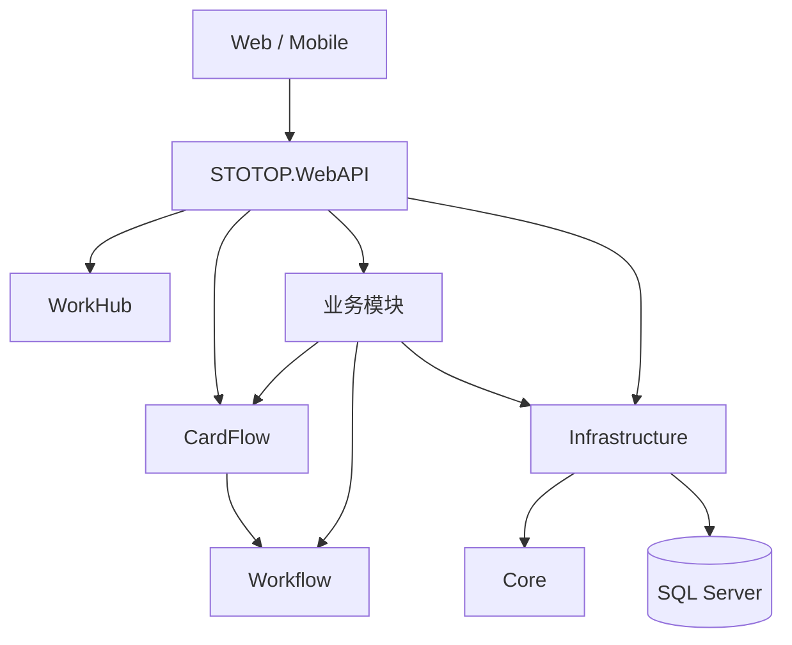

# STOTOP 系统总览

## 1. 项目定位

STOTOP 是一个模块化企业管理系统，覆盖快递计费、财务、CRM、任务目标、质量、合同、会议、宿舍、车辆、供应商、积分、薪酬等业务。当前运行时的核心协作入口是 WorkHub，审批与动态卡片流转统一由 CardFlow 承接。

历史 OA/BPM 文档已移除。代码中仍保留 `STOTOP.Module.OA` 与 `OASeeder`，但它们只用于旧数据兼容、引用迁移和退役清理；`Program.cs` 会移除 `STOTOP.Module.OA` 的 MVC ApplicationPart，不再暴露 OA 控制器作为新入口。

## 2. 技术栈

| 层级 | 技术 |
|------|------|
| 后端 | .NET 10、ASP.NET Core、EF Core、SQL Server |
| 后台任务 | Hangfire、SQL Server Storage |
| 实时通信 | SignalR |
| 前端 | Vue 3、Vite、TypeScript、Pinia |
| PC UI | Ant Design Vue |
| 移动端 UI | Vant |

## 3. 本地运行约定

| 项目 | 默认值 |
|------|--------|
| 后端地址 | `http://localhost:9000` |
| 前端地址 | `http://localhost:9001` |
| 前端代理 | `/api`、`/hangfire`、`/hubs` 到后端 |
| 后端健康检查 | `/health` |
| 版本信息 | `/api/version` |

## 4. 模块注册现状

`STOTOP.WebAPI` 是组合根，当前按 `Program.cs` 注册下列模块和服务：

| 顺序 | 模块/服务 | 说明 |
|------|-----------|------|
| 1 | System | 用户、角色、组织、权限、菜单 |
| 2 | Finance | 财务、账套、凭证、报表、预算相关能力 |
| 3 | Supplier | 供应商与银行账户 |
| 4 | HR | 员工与人事基础资料 |
| 5 | Dormitory | 宿舍、房间、床位 |
| 6 | Vehicle | 车辆、租赁、维保 |
| 7 | Insurance | 保险、保单、理赔 |
| 8 | CardFlow | 卡片流转、动态表单、审批、导入校验、自动插件 |
| 9 | Express | 快递计费、报价、运单、账单 |
| 10 | Points | 积分、兑换、排名 |
| 11 | KSF | KSF 业务模块 |
| 12 | PPV | PPV 业务模块 |
| 13 | Salary | 薪酬业务模块 |
| 14 | Task | 目标、项目、任务、工作协作 |
| 15 | CRM | 客户、线索、跟进、报价联动 |
| 16 | Contract | 合同、模板、提醒 |
| 17 | Quality | 质量异常、知识库、派发处理 |
| 18 | Conference | 会议、活动、餐饮、场地 |
| 19 | Workflow | 事件、派发、质量处理等底层协作能力 |
| 20 | WorkHub | 跨模块待办、通知、工作入口聚合 |

CardFlow 必须早于 Express 注册，因为 Express 依赖导入服务与自动插件进度能力。

## 5. 架构边界

关键约束：

- 新审批、动态表单、节点流转、卡片待办默认进入 CardFlow。
- Task、CRM、Finance、Quality 等业务页只负责发起、追踪或展示业务上下文，不复制 CardFlow 运行时。
- Workflow 保留为派发、事件、质量处理等底层能力，不替代 CardFlow 审批运行时。
- 旧 DataCenter 设计不再作为独立模块推进，导入和校验能力集中在 CardFlow/Express 相关服务中。

## 6. 数据库命名约定

- 数据库名称使用小写。
- 所有数据库字段名以 `F` 开头，后面跟汉字或英文。
- 自增数字主键统一命名为 `FID`。
- 字符串编号主键统一命名为 `F编号`。

## 7. 文档索引

| 文档 | 说明 |
|------|------|
| [01-core.md](01-core.md) | Core 基础抽象、实体、接口 |
| [02-infrastructure.md](02-infrastructure.md) | Infrastructure、DbContext、Repository、迁移初始化 |
| [03-system.md](03-system.md) | System 用户、权限、组织、菜单 |
| [04-express.md](04-express.md) | Express 快递、运单、计费、报价 |
| [05-finance.md](05-finance.md) | Finance 凭证、科目、资产、报表 |
| [06-crm.md](06-crm.md) | CRM 客户、拜访、订单、商机 |
| [09-task.md](09-task.md) | Task 目标、项目、任务、绩效 |
| [10-quality.md](10-quality.md) | Quality 质量、异常、知识库 |
| [11-hr.md](11-hr.md) | HR 员工管理 |
| [12-contract.md](12-contract.md) | Contract 合同、模板、提醒 |
| [13-insurance.md](13-insurance.md) | Insurance 保险、保单、理赔 |
| [14-supplier.md](14-supplier.md) | Supplier 供应商、银行账户 |
| [15-points.md](15-points.md) | Points 积分、兑换、排名 |
| [16-conference.md](16-conference.md) | Conference 会议、活动、餐饮 |
| [17-dormitory.md](17-dormitory.md) | Dormitory 宿舍、楼栋、房间 |
| [18-vehicle.md](18-vehicle.md) | Vehicle 车辆、租赁、维保 |
| [19-webapi.md](19-webapi.md) | WebAPI 启动配置、中间件、模块注册 |
| [20-frontend.md](20-frontend.md) | 前端架构、路由、状态管理 |

新增设计文档默认使用中文，并优先记录当前运行边界而不是历史计划。
