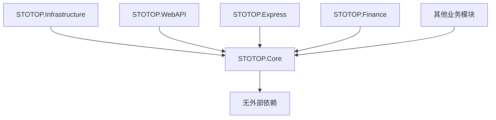

# 核心层设计文档（STOTOP.Core）

## 1. 模块职责与边界

核心层定义项目的基础抽象和公共契约，不依赖任何具体实现。职责包括：

- 定义实体基类，统一主键策略
- 定义组织隔离接口，支撑多租户数据过滤
- 定义泛型仓储接口，解耦数据访问
- 定义统一API响应模型，规范前后端通信格式

**边界原则**：Core层零外部依赖，仅包含接口、抽象类、DTO和枚举，不包含任何实现逻辑。

---

## 2. 核心类设计

### 2.1 实体基类

| 类名 | 主键字段 | 主键类型 | 说明 |
|------|----------|----------|------|
| `BaseEntity` | FID | long | 自增长整型主键，适用于系统内部表 |
| `BaseGuidEntity` | FUID | string (GUID) | 全局唯一标识符，适用于业务实体表 |

**文件路径**：`src/STOTOP.Core/Models/BaseEntity.cs`

```csharp
public abstract class BaseEntity
{
    public long FID { get; set; }
}

public abstract class BaseGuidEntity
{
    public string FUID { get; set; } = Guid.NewGuid().ToString();
}
```

### 2.2 组织隔离接口

| 接口 | 字段 | 说明 |
|------|------|------|
| `IOrgScoped` | FOrgId (long) | 标记实体按组织隔离，FOrgId=0表示全局共享数据 |
| `IOrgOwned` | FOwnerOrgId (long) | 基于所属组织进行过滤，不含共享语义 |

**文件路径**：
- `src/STOTOP.Core/Models/IOrgScoped.cs`
- `src/STOTOP.Core/Models/IOrgOwned.cs`

```csharp
public interface IOrgScoped
{
    long FOrgId { get; set; }
}

public interface IOrgOwned
{
    long FOwnerOrgId { get; set; }
}
```

**过滤规则对比**：

| 接口 | 过滤条件 | 适用场景 |
|------|----------|----------|
| IOrgScoped | `WHERE FOrgId = @CurrentOrgId OR FOrgId = 0` | 需要共享数据的表（如系统配置） |
| IOrgOwned | `WHERE FOwnerOrgId = @CurrentOrgId` | 严格属于某组织的数据（如业务单据） |

### 2.3 泛型仓储接口

**文件路径**：`src/STOTOP.Core/Interfaces/IRepository.cs`

```csharp
public interface IRepository<T> where T : class
{
    Task<T?> GetByIdAsync(object id);
    Task<List<T>> GetAllAsync();
    Task AddAsync(T entity);
    Task UpdateAsync(T entity);
    Task DeleteAsync(T entity);
    IQueryable<T> Query();
}
```

| 方法 | 返回类型 | 说明 |
|------|----------|------|
| GetByIdAsync | Task<T?> | 按主键查询单个实体 |
| GetAllAsync | Task<List<T>> | 获取全部实体列表 |
| AddAsync | Task | 新增实体并持久化 |
| UpdateAsync | Task | 更新实体并持久化 |
| DeleteAsync | Task | 删除实体并持久化 |
| Query() | IQueryable<T> | 返回可组合查询，支持延迟执行 |

### 2.4 统一响应模型

**文件路径**：`src/STOTOP.Core/Models/ApiResult.cs`

#### 泛型版本 `ApiResult<T>`

| 属性 | 类型 | 说明 |
|------|------|------|
| Code | int | 状态码：200成功/400参数错误/401未认证/500服务端错误 |
| Message | string | 提示信息 |
| Data | T | 业务数据载荷 |

静态方法：
- `Success(T data, string message = "操作成功")` → Code=200
- `Fail(string message, int code = 400)` → 指定错误码

#### 无泛型版本 `ApiResult`

静态方法：
- `Ok(string message = "操作成功")` → Code=200, Data=null
- `Fail(string message, int code = 400)` → 指定错误码

---

## 3. 依赖关系图



---

## 4. 设计决策

| 决策 | 原因 |
|------|------|
| 双主键策略(long/GUID) | long用于系统内部高性能表，GUID用于业务实体防止ID猜测和分布式冲突 |
| IOrgScoped支持FOrgId=0 | 系统级共享数据（如权限菜单）无需按组织复制 |
| 仓储接口暴露IQueryable | 允许上层灵活组合查询条件，避免方法爆炸 |
| ApiResult统一响应 | 前端统一拦截处理，减少重复判断逻辑 |
