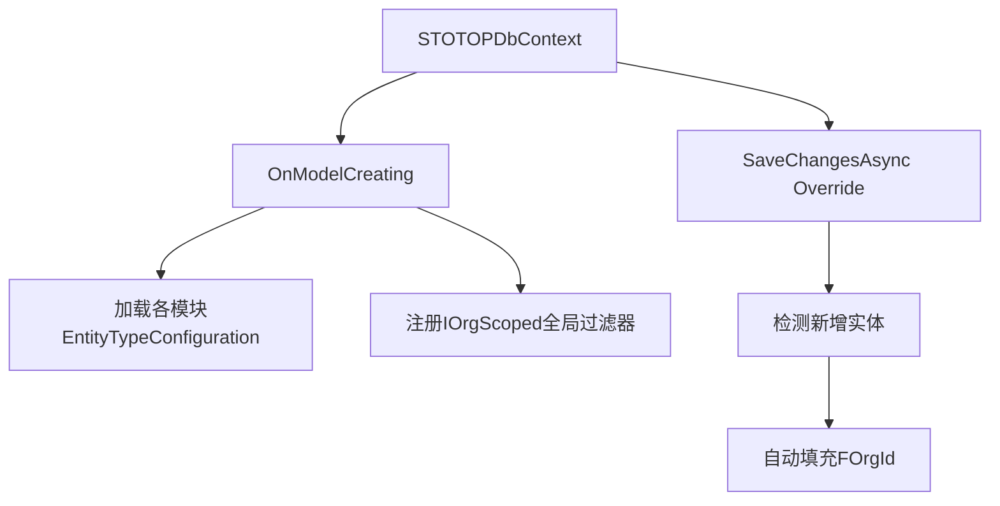
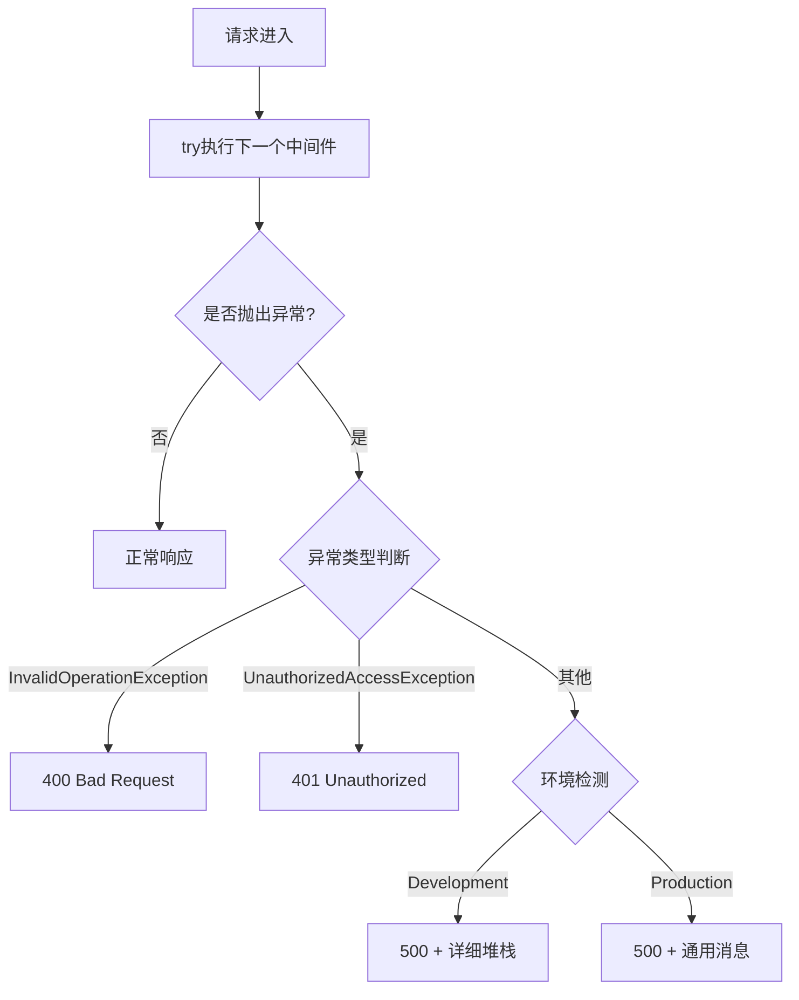
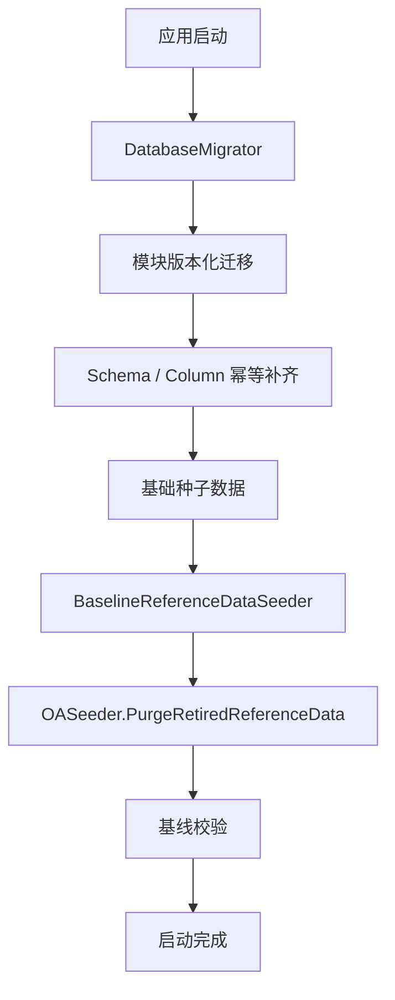

# 基础设施层设计文档（STOTOP.Infrastructure）

## 1. 模块职责与边界

基础设施层负责所有技术实现细节，包括：

- 数据访问（EF Core DbContext、仓储实现）
- 中间件管道（异常处理、组织上下文注入）
- 数据库初始化（DataSeeder幂等种子）
- 跨模块基础服务（数据库工厂、适配器）

**边界原则**：实现Core层定义的接口，不包含业务逻辑，仅提供技术能力。

---

## 2. 核心组件设计

### 2.1 STOTOPDbContext

**文件路径**：`src/STOTOP.Infrastructure/Data/STOTOPDbContext.cs`

| 特性 | 说明 |
|------|------|
| 动态配置程序集 | AddConfigurationAssembly()方法允许各业务模块注册自己的EntityTypeConfiguration |
| 组织隔离全局过滤器 | 自动为实现IOrgScoped的实体添加 `WHERE FOrgId = CurrentOrgId OR FOrgId = 0` |
| SaveChanges自动填充 | 新增/修改实体时自动设置FOrgId为当前组织ID |
| 查询行为 | 默认NoTrackingWithIdentityResolution，兼顾性能与引用一致性 |



### 2.2 Repository\<T\> 泛型仓储

**文件路径**：`src/STOTOP.Infrastructure/Repositories/Repository.cs`

| 方法 | 实现细节 |
|------|----------|
| GetByIdAsync | FindAsync(id) |
| GetAllAsync | ToListAsync() |
| AddAsync | Add + 立即SaveChangesAsync |
| UpdateAsync | Update + SaveChangesAsync |
| DeleteAsync | Remove + SaveChangesAsync |
| Query() | Set\<T\>().AsQueryable()，返回IQueryable供上层组合 |

**设计要点**：AddAsync立即持久化，确保调用方获得数据库生成的主键值。

### 2.3 GlobalExceptionMiddleware

**文件路径**：`src/STOTOP.Infrastructure/Middleware/GlobalExceptionMiddleware.cs`

| 异常类型 | HTTP状态码 | 响应行为 |
|----------|-----------|----------|
| InvalidOperationException | 400 | 返回业务错误信息 |
| UnauthorizedAccessException | 401 | 返回认证失败 |
| 其他Exception | 500 | 生产环境返回通用错误，开发环境透出详细堆栈 |



### 2.4 DynamicDbContextFactory

| 配置项 | 值 |
|--------|-----|
| 数据库提供者 | SQL Server |
| 重试次数 | 5次 |
| 最大延迟 | 10秒 |
| 重试策略 | EnableRetryOnFailure |

### 2.5 OrgContextMiddleware

| 步骤 | 说明 |
|------|------|
| 1 | 从请求头读取 `X-Org-Context` |
| 2 | 解析为组织ID (long) |
| 3 | 注入到 `IOrgContextAccessor.CurrentOrgId` |
| 4 | DbContext全局过滤器使用此值 |

### 2.6 DatabaseSeederAdapter

适配器模式，将DataSeeder适配为IDatabaseSeeder接口，供依赖注入容器统一管理。

---

## 3. DataSeeder机制

**文件路径**：`src/STOTOP.WebAPI/Data/DatabaseSeederAdapter.cs`

### 3.1 设计原则

| 原则 | 实现方式 |
|------|----------|
| 幂等性 | 所有操作使用 `IF NOT EXISTS` 检查 |
| 增量迁移 | 按需补建新表和新字段，已存在则跳过 |
| IDENTITY_INSERT | 需要指定ID的种子数据使用 SET IDENTITY_INSERT ON/OFF |
| 执行顺序 | 先建表 → 再补字段 → 最后插数据 |

### 3.2 种子数据内容

| 类别 | 数据内容 |
|------|----------|
| 管理员账户 | admin / admin123 (SHA256哈希) |
| 管理员角色 | 系统管理员角色，关联全部权限 |
| 默认组织 | 总公司（ID=1），作为根组织节点 |
| 系统权限菜单 | 模块/页面/按钮三级菜单权限 |
| 财务初始化 | 会计期间、默认账套、凭证模板、辅助核算类型 |
| 组织类型 | 9种：集团/子公司/中心/分公司/部门/团组/快递网点/承包区/末端驿站 |

### 3.3 执行流程



---

## 4. 数据库表设计

基础设施层本身不定义业务表，但管理以下基础设施相关配置：

| 表名 | 用途 | 管理方式 |
|------|------|----------|
| 各业务表 | 由各模块定义 | DataSeeder幂等创建 |

---

## 5. 多数据库支持

| 提供者 | 用途 | 配置方式 |
|--------|------|----------|
| SQL Server | 生产环境主库 | appsettings.json ConnectionStrings |
| MySQL | 备选方案 | Provider配置切换 |
| SQLite | 轻量级本地开发 | Provider配置切换 |
| InMemory | 单元测试 | 测试项目专用 |

---

## 6. 文件结构

```
src/STOTOP.Infrastructure/
├── Data/
│   └── STOTOPDbContext.cs
├── Repositories/
│   └── Repository.cs
├── Middleware/
│   ├── GlobalExceptionMiddleware.cs
│   └── OrgContextMiddleware.cs
├── Factories/
│   └── DynamicDbContextFactory.cs
└── Adapters/
    └── DatabaseSeederAdapter.cs

src/STOTOP.WebAPI/
└── Data/
    └── DataSeeder.cs
```
