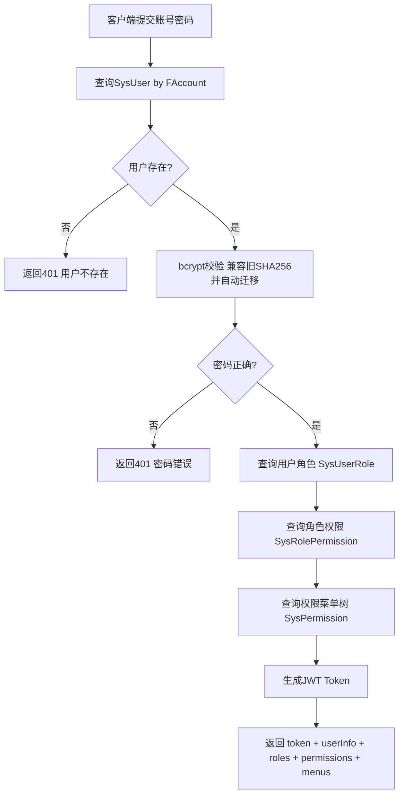
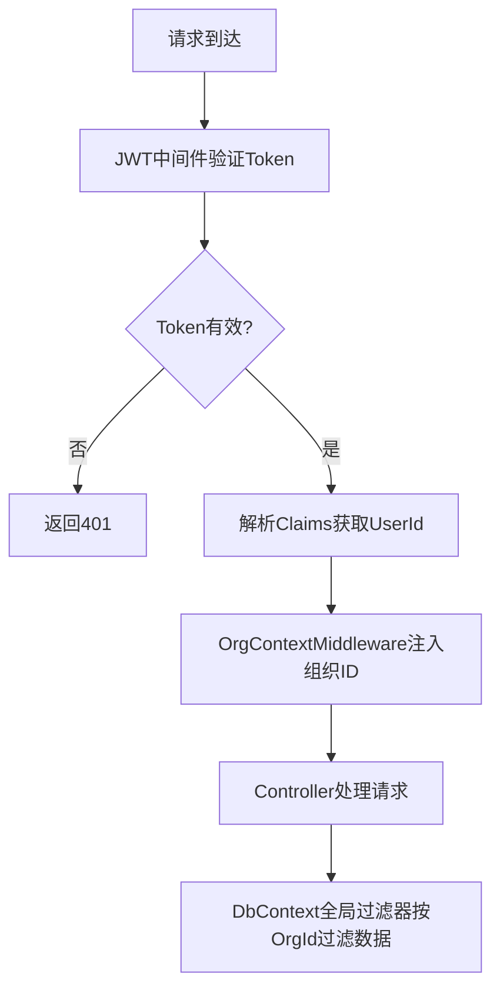
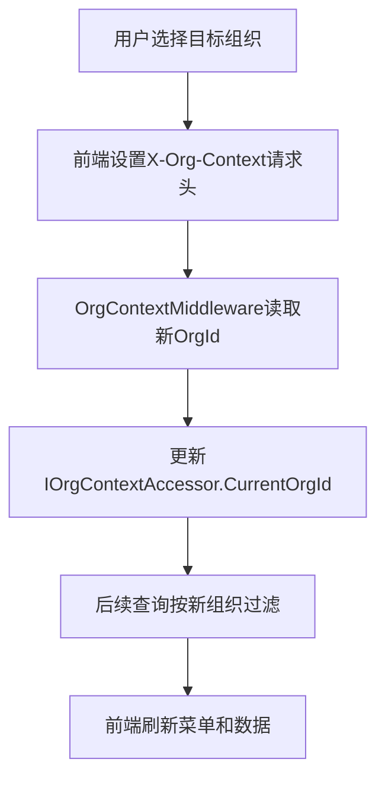
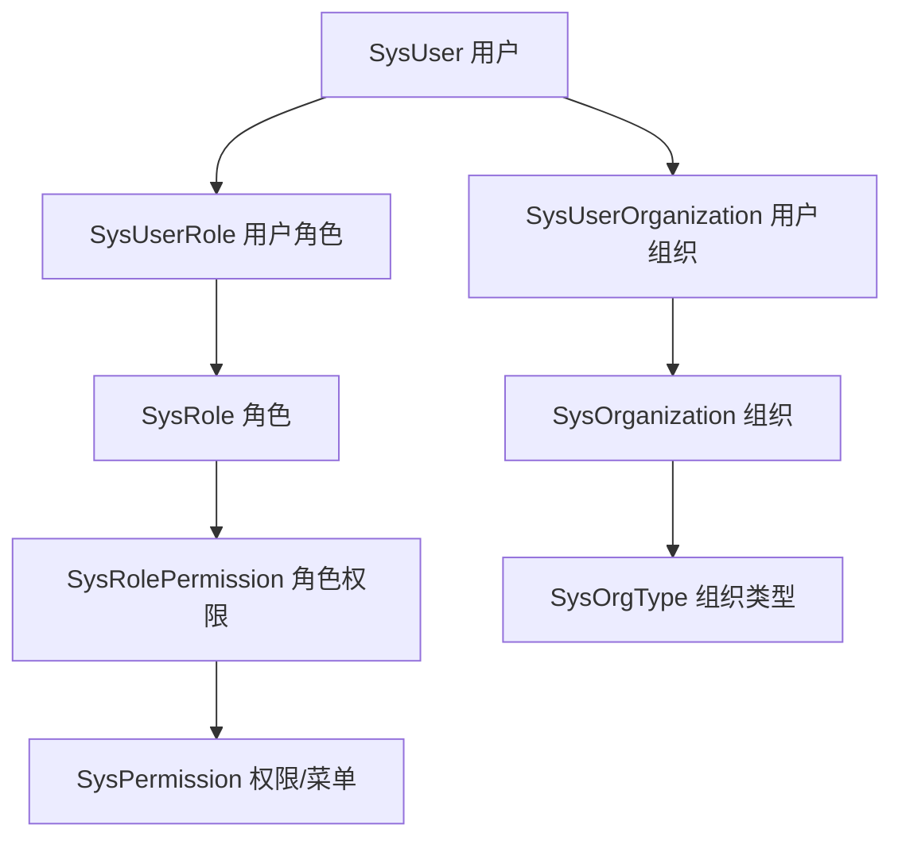

# 系统管理模块设计文档（STOTOP.System）

## 1. 模块职责与边界

系统管理模块负责平台级基础能力：

- 用户认证与授权（JWT）
- 权限管理（RBAC角色-权限模型）
- 组织架构（树形多层级）
- 岗位管理
- 系统配置与审计日志
- 编号规则管理

**边界原则**：系统模块为所有业务模块提供认证和权限基础，不包含任何业务领域逻辑。

---

## 2. 数据库表设计（20张表）

### 2.1 SysOrgType — 组织类型

| 字段名 | 类型 | 说明 |
|--------|------|------|
| FID | bigint PK | 主键 |
| FCode | nvarchar(50) | 类型编码 |
| FName | nvarchar(100) | 类型名称 |
| FLevel | int | 层级 |
| FCanBindLedger | bit | 是否可关联账套 |
| FCanSwitch | bit | 是否可切换 |
| FSortOrder | int | 排序 |
| FOrgId | bigint | 组织ID |

预置类型：集团、子公司、中心、分公司、部门、团组、快递网点、承包区、末端驿站

### 2.2 SysOrganization — 组织架构

| 字段名 | 类型 | 说明 |
|--------|------|------|
| FUID | nvarchar(50) PK | GUID主键 |
| FName | nvarchar(200) | 组织名称 |
| FCode | nvarchar(50) | 组织编码 |
| FParentId | nvarchar(50) | 父组织ID |
| FTypeId | bigint FK | 组织类型ID |
| FDingDeptId | nvarchar(100) | 钉钉部门ID |
| FSortOrder | int | 排序 |
| FStatus | int | 状态(1启用/0禁用) |
| FOrgId | bigint | 所属组织 |

### 2.3 SysUser — 系统用户

| 字段名 | 类型 | 说明 |
|--------|------|------|
| FUID | nvarchar(50) PK | GUID主键 |
| FName | nvarchar(100) | 用户姓名 |
| FAccount | nvarchar(100) | 登录账号（唯一索引） |
| FPasswordHash | nvarchar(256) | bcrypt密码哈希（旧SHA256哈希登录时自动迁移） |
| FPhone | nvarchar(20) | 手机号（唯一索引） |
| FEmail | nvarchar(200) | 邮箱（唯一索引） |
| FDingUserId | nvarchar(100) | 钉钉用户ID |
| FStatus | int | 状态(1启用/0禁用) |
| FAvatar | nvarchar(500) | 头像URL |
| FOrgId | bigint | 所属组织 |
| FCreateTime | datetime2 | 创建时间 |

### 2.4 SysRole — 系统角色

| 字段名 | 类型 | 说明 |
|--------|------|------|
| FID | bigint PK | 主键 |
| FName | nvarchar(100) | 角色名称 |
| FCode | nvarchar(50) | 角色编码（唯一） |
| FDescription | nvarchar(500) | 角色描述 |
| FStatus | int | 状态(1启用/0禁用) |
| FOrgId | bigint | 所属组织 |

### 2.5 SysUserRole — 用户角色关联

| 字段名 | 类型 | 说明 |
|--------|------|------|
| FID | bigint PK | 主键 |
| FUserId | nvarchar(50) FK | 用户ID |
| FRoleId | bigint FK | 角色ID |
| FOrgId | bigint | 组织ID |

### 2.6 SysPermission — 功能权限

| 字段名 | 类型 | 说明 |
|--------|------|------|
| FID | bigint PK | 主键 |
| FName | nvarchar(100) | 权限名称 |
| FCode | nvarchar(100) | 权限编码 |
| FType | int | 类型(1模块/2菜单/3按钮) |
| FParentId | bigint | 父节点ID |
| FRoute | nvarchar(200) | 前端路由路径 |
| FComponent | nvarchar(200) | 组件文件路径 |
| FIcon | nvarchar(100) | 图标名称 |
| FSortOrder | int | 排序号 |
| FVisible | bit | 是否可见 |
| FOrgId | bigint | 所属组织 |

### 2.7 SysRolePermission — 角色权限关联

| 字段名 | 类型 | 说明 |
|--------|------|------|
| FID | bigint PK | 主键 |
| FRoleId | bigint FK | 角色ID |
| FPermissionId | bigint FK | 权限ID |

### 2.8 SysPosition — 岗位

| 字段名 | 类型 | 说明 |
|--------|------|------|
| FID | bigint PK | 主键 |
| FName | nvarchar(100) | 岗位名称 |
| FCode | nvarchar(50) | 岗位编码 |
| FDescription | nvarchar(500) | 岗位说明 |
| FOrgId | bigint | 所属组织 |

### 2.9 SysPositionDepartment — 岗位组织关联

| 字段名 | 类型 | 说明 |
|--------|------|------|
| FID | bigint PK | 主键 |
| FPositionId | bigint FK | 岗位ID |
| FOrgId | bigint FK | 组织ID |

### 2.10 SysUserPosition — 用户岗位关联

| 字段名 | 类型 | 说明 |
|--------|------|------|
| FID | bigint PK | 主键 |
| FUserId | nvarchar(50) FK | 用户ID |
| FPositionId | bigint FK | 岗位ID |

### 2.11 SysUserOrganization — 用户组织关联

| 字段名 | 类型 | 说明 |
|--------|------|------|
| FID | bigint PK | 主键 |
| FUserId | nvarchar(50) FK | 用户ID |
| FOrgId | bigint FK | 组织ID |
| FDirectSuperiorId | nvarchar(50) | 直接上级用户ID |

### 2.12 SysChangeLog — 变更记录

| 字段名 | 类型 | 说明 |
|--------|------|------|
| FID | bigint PK | 主键 |
| FEntityType | nvarchar(100) | 实体类型 |
| FEntityId | nvarchar(50) | 实体ID |
| FAction | nvarchar(20) | 操作类型(Create/Update/Delete) |
| FChanges | nvarchar(max) | 变更内容JSON |
| FOperatorId | nvarchar(50) | 操作人ID |
| FOperatorName | nvarchar(100) | 操作人姓名 |
| FOperateTime | datetime2 | 操作时间 |
| FOrgId | bigint | 所属组织 |

### 2.13 SysConfig — 系统配置

| 字段名 | 类型 | 说明 |
|--------|------|------|
| FID | bigint PK | 主键 |
| FKey | nvarchar(200) | 配置键（唯一） |
| FValue | nvarchar(max) | 配置值 |
| FDescription | nvarchar(500) | 说明 |
| FOrgId | bigint | 所属组织 |

### 2.14 SysDbConnection — 数据库连接

| 字段名 | 类型 | 说明 |
|--------|------|------|
| FID | bigint PK | 主键 |
| FName | nvarchar(100) | 连接名称 |
| FConnectionString | nvarchar(1000) | 连接字符串 |
| FProvider | nvarchar(50) | 数据库提供者 |
| FDescription | nvarchar(500) | 说明 |
| FOrgId | bigint | 所属组织 |

### 2.15 SysCodeRule — 编号规则

| 字段名 | 类型 | 说明 |
|--------|------|------|
| FID | bigint PK | 主键 |
| FName | nvarchar(100) | 规则名称 |
| FCode | nvarchar(50) | 规则编码 |
| FPrefix | nvarchar(20) | 前缀 |
| FDateFormat | nvarchar(20) | 日期格式(yyyyMMdd等) |
| FSeqLength | int | 序号位数 |
| FCurrentSeq | bigint | 当前序号 |
| FOrgId | bigint | 所属组织 |

### 2.16 SysCodeSequence — 编号序列

| 字段名 | 类型 | 说明 |
|--------|------|------|
| FID | bigint PK | 主键 |
| FRuleId | bigint FK | 规则ID |
| FDateKey | nvarchar(20) | 日期键(如20260505) |
| FCurrentSeq | bigint | 当前序号 |
| FOrgId | bigint | 所属组织 |

### 2.17 SysUserNetworkPermission — 用户网点权限

| 字段名 | 类型 | 说明 |
|--------|------|------|
| FID | bigint PK | 主键 |
| FUserId | nvarchar(50) FK | 用户ID |
| FNetworkId | nvarchar(50) | 网点ID |
| FPermissionType | int | 权限类型 |
| FOrgId | bigint | 所属组织 |

### 2.18 SysThemeSetting — 主题设置

| 字段名 | 类型 | 说明 |
|--------|------|------|
| FID | bigint PK | 主键 |
| FUserId | nvarchar(50) FK | 用户ID |
| FThemeData | nvarchar(max) | 主题配置JSON |
| FOrgId | bigint | 所属组织 |

---

## 3. 认证机制

### 3.1 JWT配置

| 配置项 | 值 |
|--------|-----|
| 算法 | HS256 |
| 过期时间 | 480分钟（8小时） |
| Issuer | STOTOP |
| Audience | STOTOP-Client |

### 3.2 JWT Claims

| Claim | 来源 | 说明 |
|-------|------|------|
| NameIdentifier | 用户FUID | 标准用户标识 |
| Name | FAccount | 登录账号 |
| userName | FName | 用户姓名 |
| userId | FUID | 用户ID（冗余） |
| jti | Guid.NewGuid() | 令牌唯一ID，防重放 |

### 3.3 密码策略

- 存储方式：bcrypt（BCrypt.Net-Next，自带盐）
- 历史兼容：存量 SHA256 哈希（64位十六进制）在用户首次登录验证通过后自动重哈希为 bcrypt
- 默认密码：admin123
- 重置密码：管理员操作，重置为默认密码（bcrypt 存储）

### 3.4 登录流程

---

## 4. API接口清单

### 4.1 认证接口

| 方法 | 路径 | 说明 |
|------|------|------|
| POST | /api/auth/login | 用户登录，返回JWT |
| POST | /api/auth/logout | 用户登出（客户端清除token） |
| GET | /api/auth/userinfo | 获取当前用户信息 |

### 4.2 用户管理

| 方法 | 路径 | 说明 |
|------|------|------|
| GET | /api/system/users | 用户列表（分页） |
| POST | /api/system/users | 新增用户 |
| PUT | /api/system/users/{id} | 修改用户 |
| DELETE | /api/system/users/{id} | 删除用户 |
| POST | /api/system/users/{id}/reset-password | 重置密码 |
| GET | /api/system/users/{id}/organizations | 用户关联的组织 |

### 4.3 角色管理

| 方法 | 路径 | 说明 |
|------|------|------|
| GET | /api/system/roles | 角色列表 |
| POST | /api/system/roles | 新增角色 |
| PUT | /api/system/roles/{id} | 修改角色 |
| DELETE | /api/system/roles/{id} | 删除角色 |
| POST | /api/system/roles/{id}/permissions | 分配角色权限 |

### 4.4 权限管理

| 方法 | 路径 | 说明 |
|------|------|------|
| GET | /api/system/permissions/tree | 全量权限树 |
| GET | /api/system/permissions/menu-tree | 菜单权限树（不含按钮） |
| GET | /api/system/permissions/current | 当前用户权限 |

### 4.5 组织架构

| 方法 | 路径 | 说明 |
|------|------|------|
| GET | /api/system/organizations/tree | 组织树形结构 |
| POST | /api/system/organizations | 新增组织 |
| PUT | /api/system/organizations/{id} | 修改组织 |
| DELETE | /api/system/organizations/{id} | 删除组织 |

### 4.6 其他接口

| 方法 | 路径 | 说明 |
|------|------|------|
| GET | /api/system/org-types | 组织类型列表 |
| GET/POST/PUT/DELETE | /api/system/positions | 岗位管理CRUD |
| GET | /api/system/change-logs | 变更记录查询 |
| GET/POST/PUT/DELETE | /api/system/db-connections | 数据库连接管理 |
| POST | /api/system/database/execute | 执行SQL |
| GET/PUT | /api/system/settings | 系统配置 |
| POST | /api/system/dingtalk/sync | 钉钉组织同步 |
| GET/POST/PUT/DELETE | /api/system/code-rules | 编号规则管理 |

---

## 5. 业务流程

### 5.1 权限校验流程

### 5.2 组织切换流程

### 5.3 RBAC权限模型

