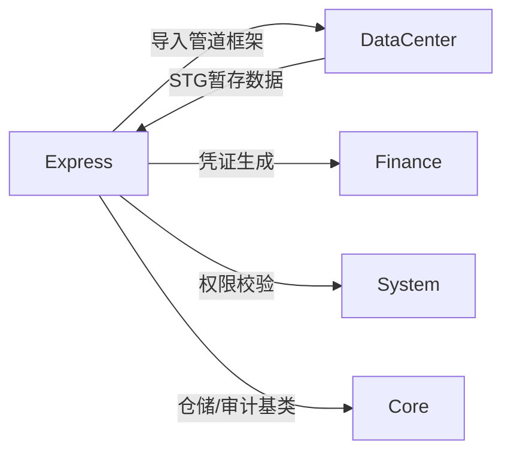
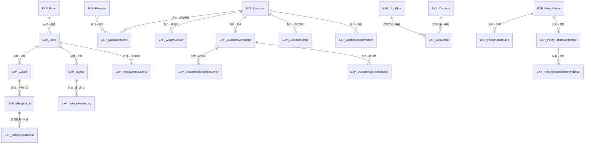
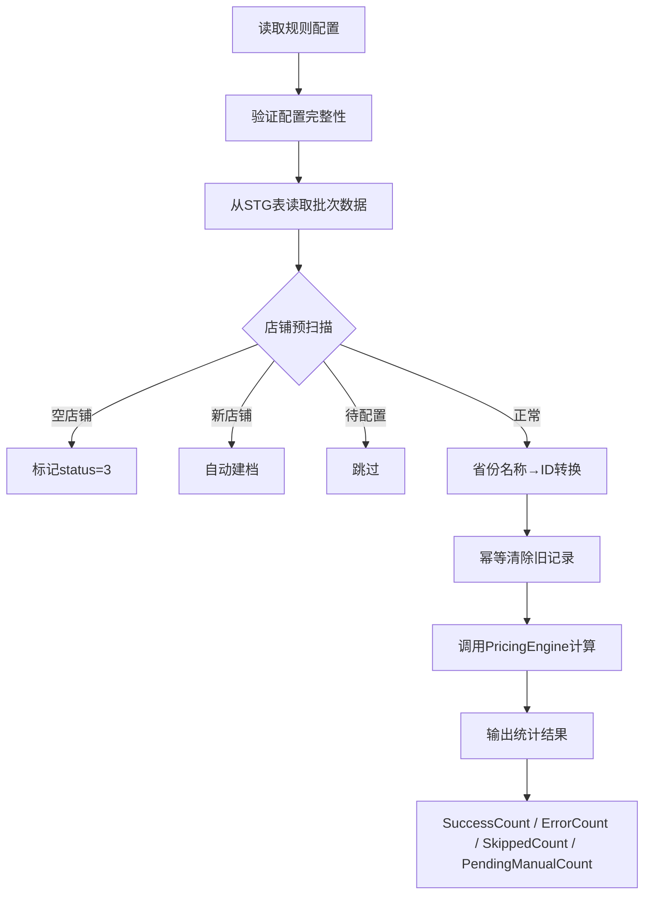
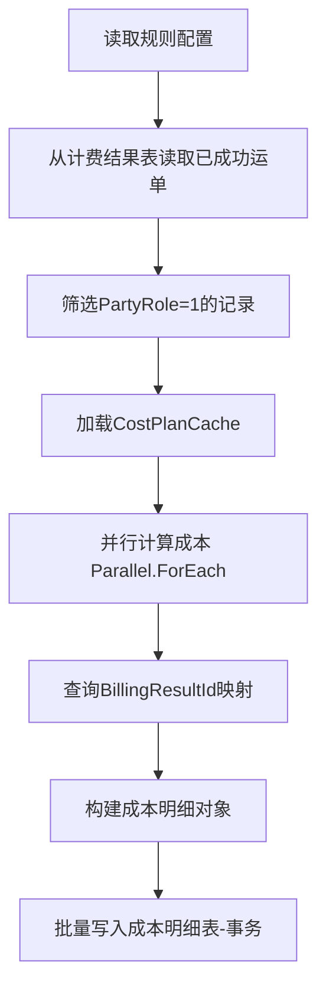
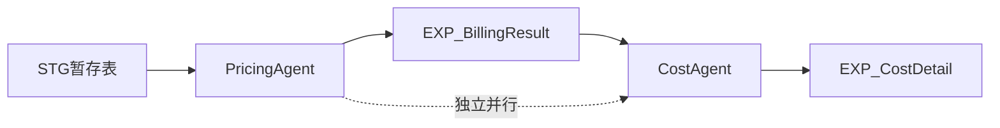
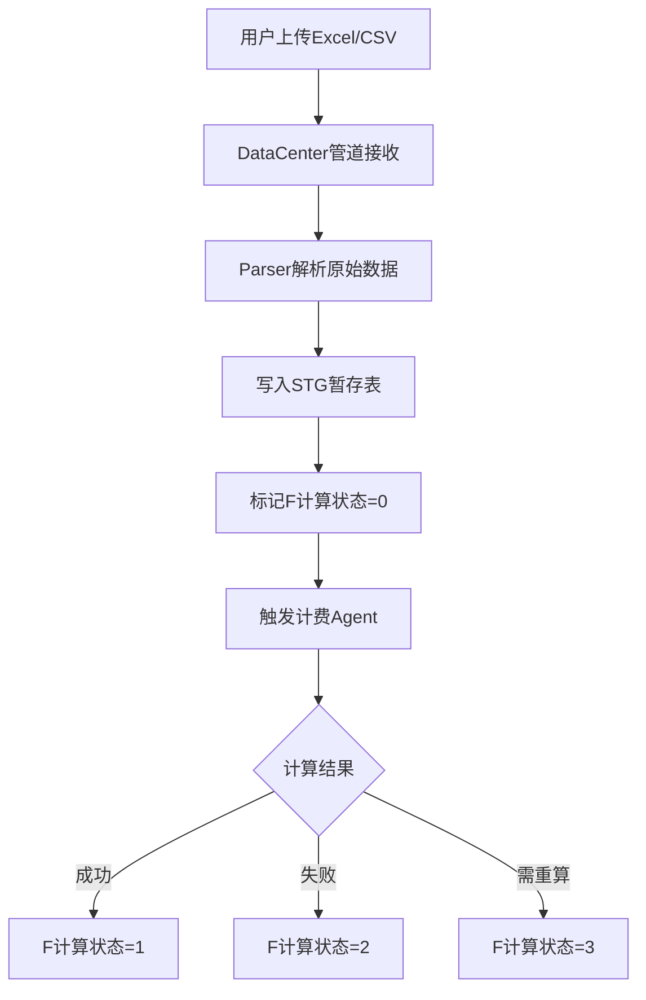
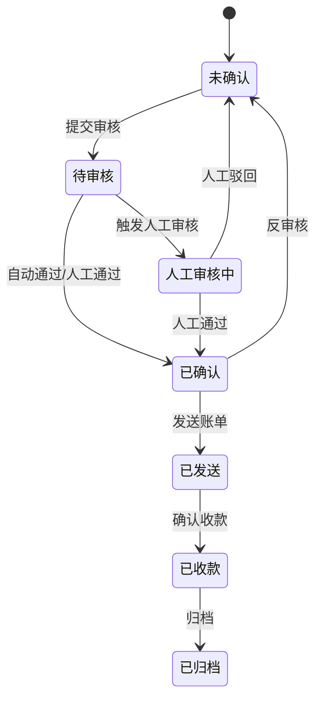
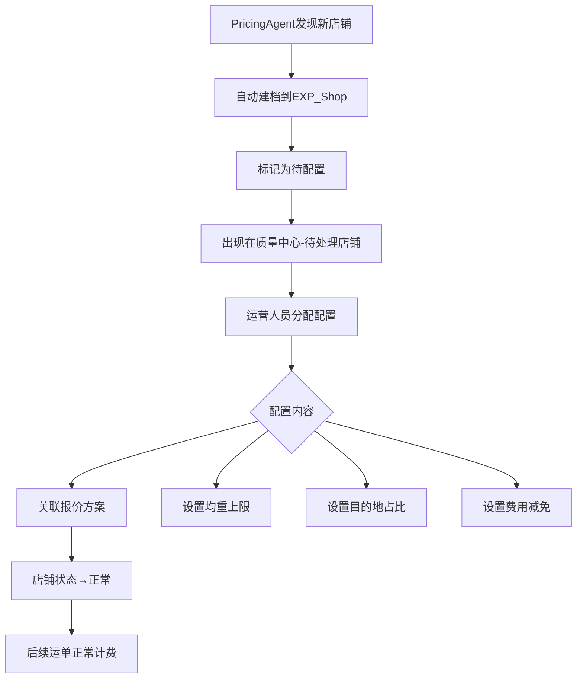

# Express 快递业务模块设计文档

## 1. 模块职责与边界

### 1.1 核心职责

- **计费管理**：基于多层级报价体系，对出港运单执行自动化价格计算与成本核算
- **报价管理**：维护品牌×省份×重量段的报价矩阵，支持加收、佣金、共享别名等扩展配置
- **账单管理**：按批次/周期聚合计费结果，生成账单并驱动审核→确认→收款全生命周期
- **店铺与网点管理**：管理快递业务基础组织结构（品牌、店铺、网点、承包区、末端驿站）
- **运单号管理**：号段分配、客户余额、交易流水
- **政策返利**：阶梯返利规则配置与周期结算
- **预付款**：客户预付款余额管理与流水记录
- **报表分析**：利润、重量、流量多维分析

### 1.2 不负责的内容（明确边界）

| 边界外内容 | 归属模块 |
|---|---|
| 原始数据文件解析、暂存表清洗管道框架 | DataCenter |
| 财务凭证生成与会计账务 | Finance |
| 用户权限、角色、菜单管理 | System |
| 仓储基类、审计字段、多租户 | Core |
| CRM 客户主数据维护 | CRM |

### 1.3 与其他模块的依赖关系

- **DataCenter**：Express 复用其导入管道框架（FileType注册、批次管理、进度通知），STG暂存表由DataCenter管道写入，Express的Agent从中读取
- **Finance**：账单确认后可触发凭证生成
- **System**：接口鉴权与菜单权限
- **Core**：Entity基类、IRepository<T>、UnitOfWork

---

## 2. 数据库表设计

### 2.1 核心实体表清单

#### 基础数据（8张）

| 表名 | 说明 | 主键 | 关键字段 |
|---|---|---|---|
| EXP_Brand | 快递品牌 | GUID | Code, Name, IsActive |
| EXP_Shop | 店铺 | GUID | BrandId, Name, Code, ClientId, Status |
| EXP_Province | 省份（34个） | BIGINT | Name, Code, RegionGroup |
| EXP_Agent | 业务代理 | GUID | Name, Code, ShopId |
| EXP_NetworkPoint | 快递网点 | GUID | Name, Code, BrandId, Province |
| EXP_FranchiseArea | 承包区 | GUID | Name, NetworkPointId |
| EXP_LastMileStation | 末端驿站 | GUID | Name, NetworkPointId |
| EXP_Salesman | 业务员 | GUID | Name, Code, ShopId |

#### 报价体系（10张）

| 表名 | 说明 | 主键 | 关键字段 |
|---|---|---|---|
| EXP_Quotation | 快递报价（聚合根） | BIGINT | BrandId, Name, EffectiveDate, Status |
| EXP_WeightSection | 重量段定义 | BIGINT | QuotationId, MinWeight, MaxWeight |
| EXP_QuotationMatrix | 报价矩阵明细 | BIGINT | QuotationId, ProvinceId, WeightSectionId, FirstPrice, ContinuePrice |
| EXP_QuotationSurcharge | 出港加收 | BIGINT | QuotationId, Name, Type |
| EXP_QuotationSurchargeConfig | 出港加收配置项 | BIGINT | SurchargeId, Key, Value |
| EXP_QuotationSurchargeDest | 出港加收目的地 | BIGINT | SurchargeId, ProvinceId |
| EXP_QuotationShop | 报价关联店铺 | BIGINT | QuotationId, ShopId |
| EXP_QuotationAlias | 报价共享别名 | BIGINT | QuotationId, AliasName |
| EXP_QuotationSurchargeLink | 加收关联（多对多） | BIGINT | QuotationId, SurchargeId |
| EXP_QuotationCommission | 佣金配置 | BIGINT | QuotationId, Role, Rate |

#### 成本体系（3张）

| 表名 | 说明 | 主键 | 关键字段 |
|---|---|---|---|
| EXP_CostItem | 成本项目（9种标准项） | BIGINT | Code, Name, Category |
| EXP_CostPlan | 成本方案 | BIGINT | Name, BrandId, EffectiveDate |
| EXP_CostDetail | 成本方案明细 | BIGINT | CostPlanId, CostItemId, ProvinceId, Price |

#### 运单与计费（5张）

| 表名 | 说明 | 主键 | 关键字段 |
|---|---|---|---|
| EXP_Waybill | 出港运单基础信息 | BIGINT | WaybillNo, ShopId, ProvinceId, Weight, BatchId |
| EXP_BillingResult | 出港运单计费结果 | BIGINT | WaybillId, PartyRole(1应收/2层级/3佣金), Amount |
| EXP_BillingResultDetail | 计费结果明细 | BIGINT | BillingResultId, CostItemId, Amount |
| EXP_WaybillHistory | 出港运单历史 | BIGINT | WaybillId, OperationType, Timestamp |
| EXP_BillingResultHistory | 计费结果历史 | BIGINT | BillingResultId, OperationType, Timestamp |

#### 账单与预付款（6张）

| 表名 | 说明 | 主键 | 关键字段 |
|---|---|---|---|
| EXP_Invoice | 出港账单 | GUID | ShopId, Period, Status, TotalAmount, TotalCost, TotalProfit |
| EXP_InvoiceReviewRule | 账单审核规则 | BIGINT | RuleName, Condition, AutoPass |
| EXP_InvoiceReviewLog | 账单审核日志 | BIGINT | InvoiceId, ReviewStatus, Reviewer, Remark |
| EXP_Prepayment | 预付款记录 | BIGINT | ShopId, Amount, Date |
| EXP_PrepaymentBalance | 预付款余额 | BIGINT | ShopId, Balance |
| EXP_PrepaymentTransaction | 预付款流水 | BIGINT | BalanceId, Type, Amount, Timestamp |

#### 政策返利（6张）

| 表名 | 说明 | 主键 | 关键字段 |
|---|---|---|---|
| EXP_PolicyRebate | 政策返利 | BIGINT | Name, BrandId, Period, Status |
| EXP_PolicyRebateStep | 返利阶梯 | BIGINT | PolicyRebateId, MinVolume, MaxVolume, Rate |
| EXP_PolicyRebateReward | 奖罚规则 | BIGINT | PolicyRebateId, Type, Condition, Amount |
| EXP_PolicyRebateCondition | 规则条件 | BIGINT | PolicyRebateId, Field, Operator, Value |
| EXP_PolicyRebateSettlement | 返利结算 | BIGINT | PolicyRebateId, ShopId, Period, SettledAmount |
| EXP_PolicyRebateSettlementDetail | 结算明细 | BIGINT | SettlementId, WaybillId, RebateAmount |

#### 运单号管理（3张）

| 表名 | 说明 | 主键 | 关键字段 |
|---|---|---|---|
| EXP_WaybillNumberPool | 运单号段 | BIGINT | BrandId, StartNo, EndNo, AllocatedCount |
| EXP_WaybillNumberTransaction | 运单号交易 | BIGINT | PoolId, ShopId, Quantity, Date |
| EXP_CustomerWaybillBalance | 客户运单号余额 | BIGINT | ShopId, BrandId, Balance |

#### 特殊配置（6张）

| 表名 | 说明 | 主键 | 关键字段 |
|---|---|---|---|
| EXP_CustomerRebate | 客户返利 | BIGINT | ShopId, Period, Rate |
| EXP_CustomerRebateStep | 客户返利阶梯 | BIGINT | CustomerRebateId, MinVolume, Rate |
| EXP_AvgWeightLimit | 均重上限 | BIGINT | ShopId, ProvinceId, MaxAvgWeight |
| EXP_DestinationRatio | 目的地占比 | BIGINT | ShopId, ProvinceId, Ratio |
| EXP_FeeReduction | 费用减免 | BIGINT | ShopId, CostItemId, ReductionType, Value |
| EXP_MonthlyAdjustment | 月度调整 | BIGINT | ShopId, Period, AdjustType, Amount |

#### 暂存表

| 表名 | 说明 | 主键 | 关键字段 |
|---|---|---|---|
| STG_STO_Outbound_TC | 申通出港数据(太仓) | BIGINT | BatchId, WaybillNo, F计算状态 |
| STG_JT_Transaction_TC | 极兔交易明细(太仓) | BIGINT | BatchId, WaybillNo, F计算状态 |

### 2.2 关键字段说明

- **PartyRole（参与方角色）**：1=应收（客户层）、2=层级应收（代理/网代等中间层）、3=佣金
- **F计算状态**：0=待计算、1=计算成功、2=计算失败待重试、3=需重算
- **Status（账单状态）**：未确认→待审核→已确认→已发送→已收款→已归档
- **ReviewStatus（审核状态）**：0=待审核、1=自动通过、2=人工通过、3=人工驳回、4=反审核

### 2.3 表间关系（ER图）

---

## 3. API 接口清单

### 3.1 计费管理

| 方法 | 路径 | 功能 |
|---|---|---|
| POST | /api/express/billing/execute | 执行计费（触发PricingAgent/CostAgent） |
| GET | /api/express/billing/results | 查询计费结果列表 |
| GET | /api/express/billing/errors | 查询计费错误列表 |
| POST | /api/express/billing/retry | 重试失败运单 |

### 3.2 报价管理

| 方法 | 路径 | 功能 |
|---|---|---|
| GET | /api/express/quotations | 报价方案列表 |
| GET | /api/express/quotations/{id} | 报价方案详情 |
| POST | /api/express/quotations | 新建报价方案 |
| PUT | /api/express/quotations/{id} | 更新报价方案 |
| DELETE | /api/express/quotations/{id} | 删除报价方案 |
| POST | /api/express/quotations/{id}/copy | 复制报价方案 |
| GET | /api/express/quotations/template | 下载导入模板 |
| POST | /api/express/quotations/import | 导入报价数据 |

### 3.3 账单管理

| 方法 | 路径 | 功能 |
|---|---|---|
| GET | /api/express/invoice | 账单列表 |
| GET | /api/express/invoice/{id} | 账单详情 |
| POST | /api/express/invoice/generate | 生成账单 |
| POST | /api/express/invoice/{id}/review | 提交审核 |
| POST | /api/express/invoice/{id}/export | 导出账单 |
| POST | /api/express/invoice/{id}/archive | 归档账单 |

### 3.4 账单审核

| 方法 | 路径 | 功能 |
|---|---|---|
| GET | /api/express/invoice-review/rules | 审核规则列表 |
| POST | /api/express/invoice-review/auto | 执行自动审核 |
| POST | /api/express/invoice-review/manual | 人工审核操作 |

### 3.5 店铺管理

| 方法 | 路径 | 功能 |
|---|---|---|
| GET | /api/express/shops | 店铺列表 |
| GET | /api/express/shops/{id} | 店铺详情 |
| POST | /api/express/shops | 新建店铺 |
| PUT | /api/express/shops/{id} | 更新店铺 |
| GET | /api/express/shops/pending | 待配置店铺列表 |
| POST | /api/express/shops/{id}/assign | 分配店铺配置 |

### 3.6 网点管理

| 方法 | 路径 | 功能 |
|---|---|---|
| GET | /api/express/network-points | 网点列表 |
| POST | /api/express/network-points | 新建网点 |
| PUT | /api/express/network-points/{id} | 更新网点 |
| DELETE | /api/express/network-points/{id} | 删除网点 |

### 3.7 运单管理

| 方法 | 路径 | 功能 |
|---|---|---|
| GET | /api/express/waybill | 运单列表 |
| GET | /api/express/waybill/{id} | 运单详情 |
| POST | /api/express/waybill/import | 导入运单 |
| POST | /api/express/waybill/archive | 归档运单 |

### 3.8 运单号管理

| 方法 | 路径 | 功能 |
|---|---|---|
| GET | /api/express/waybill-number/pool | 号段列表 |
| POST | /api/express/waybill-number/allocate | 分配号段 |
| POST | /api/express/waybill-number/return | 回收号段 |
| GET | /api/express/waybill-number/balance | 客户余额查询 |

### 3.9 加收管理

| 方法 | 路径 | 功能 |
|---|---|---|
| GET | /api/express/surcharge | 加收配置列表 |
| POST | /api/express/surcharge | 新建加收配置 |
| PUT | /api/express/surcharge/{id} | 更新加收配置 |
| DELETE | /api/express/surcharge/{id} | 删除加收配置 |

### 3.10 成本方案

| 方法 | 路径 | 功能 |
|---|---|---|
| GET | /api/express/cost-plan | 成本方案列表 |
| POST | /api/express/cost-plan | 新建成本方案 |
| PUT | /api/express/cost-plan/{id} | 更新成本方案 |
| DELETE | /api/express/cost-plan/{id} | 删除成本方案 |

### 3.11 政策返利

| 方法 | 路径 | 功能 |
|---|---|---|
| GET | /api/express/policy-rebate | 返利政策列表 |
| POST | /api/express/policy-rebate | 新建返利政策 |
| PUT | /api/express/policy-rebate/{id} | 更新返利政策 |
| POST | /api/express/policy-rebate/settle | 执行返利结算 |

### 3.12 预付款

| 方法 | 路径 | 功能 |
|---|---|---|
| GET | /api/express/prepayment/balance | 预付款余额查询 |
| GET | /api/express/prepayment/transaction | 流水记录查询 |
| POST | /api/express/prepayment/recharge | 充值 |

### 3.13 报表分析

| 方法 | 路径 | 功能 |
|---|---|---|
| GET | /api/express/report/profit | 利润分析报表 |
| GET | /api/express/report/weight | 重量分析报表 |
| GET | /api/express/report/flow | 流量分析报表 |

### 3.14 质量中心

| 方法 | 路径 | 功能 |
|---|---|---|
| GET | /api/express/quality-center/errors | 异常运单列表 |
| GET | /api/express/quality-center/pending-shops | 待处理店铺 |
| POST | /api/express/quality-center/resolve | 处理异常 |

### 3.15 基础数据

| 方法 | 路径 | 功能 |
|---|---|---|
| GET | /api/express/provinces | 省份列表 |
| GET | /api/express/brands | 品牌列表 |
| GET | /api/express/clients | 客户列表 |
| GET | /api/express/salesmen | 业务员列表 |
| GET | /api/express/last-mile-stations | 末端驿站列表 |
| GET | /api/express/franchise-areas | 承包区列表 |

---

## 4. 业务流程

### 4.1 计费Agent流程

#### PricingAgent（价格计算）

#### CostAgent（成本计算）

#### Agent协作关系

> PricingAgent 和 CostAgent 完全独立，互不依赖，可并行执行。

### 4.2 数据导入管道

### 4.3 账单生命周期

**账单聚合字段**：总单量、总重量、平均重量、总应收、总成本、总利润、均重追补、占比追补

### 4.4 店铺配置流程

### 4.5 业务对象层级链

每层可独立配置：报价方案、均重上限、目的地占比、返利政策。

计费结果按 **PartyRole** 为每层生成独立记录：
- PartyRole=1：应收（客户层）
- PartyRole=2：层级应收（代理/网代等中间层）
- PartyRole=3：佣金
