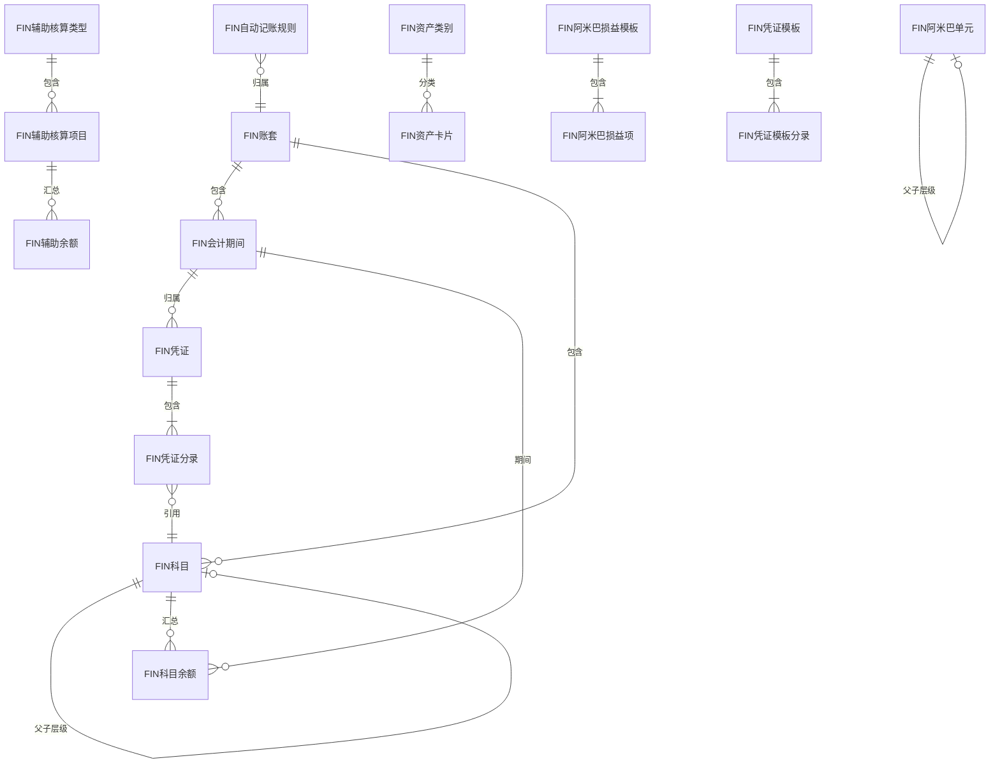
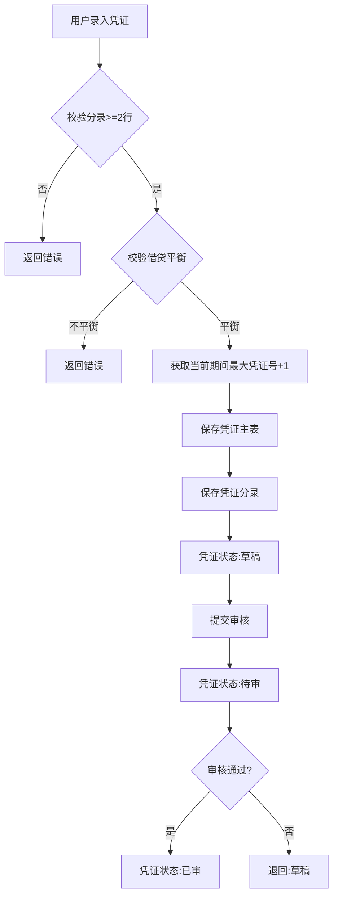
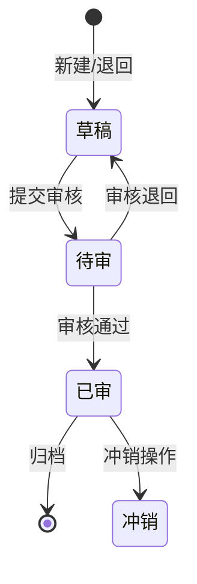
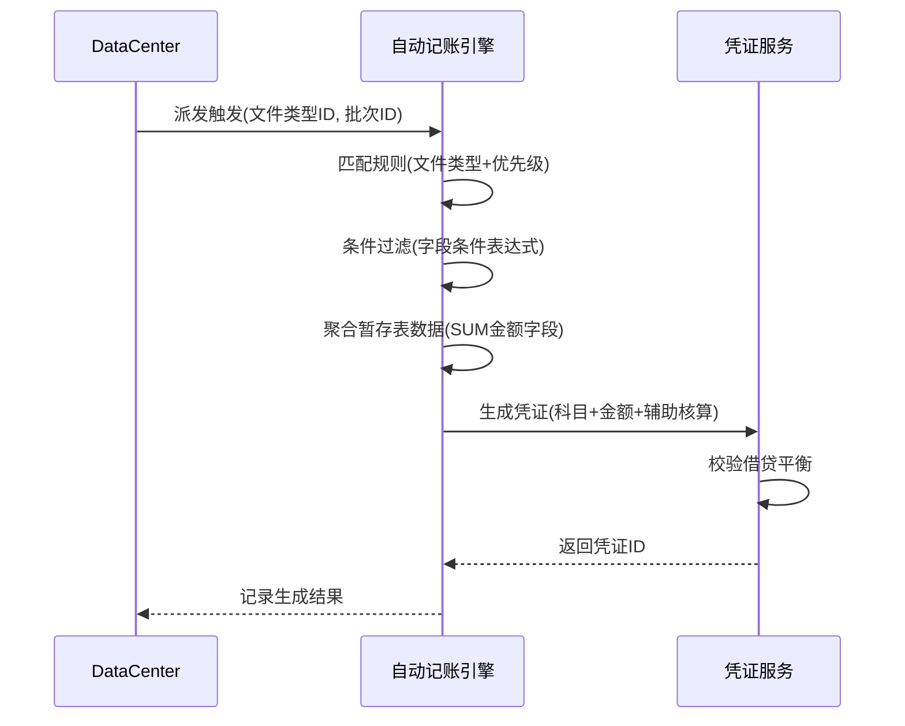
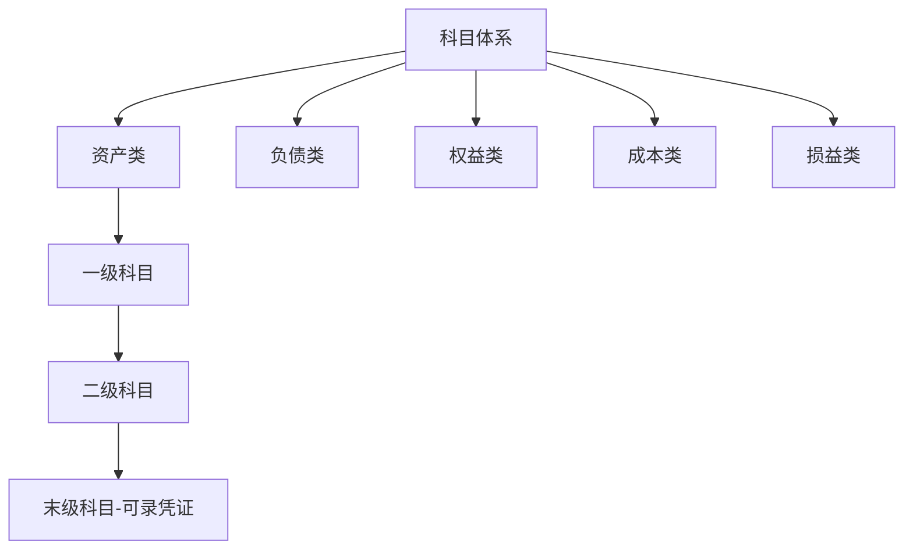

# Finance 模块设计文档

## 1. 模块职责与边界

### 核心职责
- 会计科目体系管理（三层科目、辅助核算）
- 凭证全生命周期（录入、审核、冲销、重排号）
- 多账套隔离与期间管理
- 财务报表生成（利润表、资产负债表、现金流量表、试算平衡）
- 自动记账规则引擎（基于导入数据自动生成凭证）
- 固定资产管理与折旧
- 阿米巴损益核算
- 银行对账与发票管理

### 不负责的内容
- 原始业务数据的采集与导入（由 DataCenter 模块负责）
- 客户/供应商基础档案维护（由 CRM / 基础模块负责）
- 快递业务费用的计算逻辑（由 Express 模块负责）

### 依赖关系
| 方向 | 模块 | 说明 |
|------|------|------|
| 依赖 | DataCenter | 自动记账从暂存表聚合数据生成凭证 |
| 依赖 | 基础模块 | 组织、员工、部门等基础数据 |
| 被依赖 | DataCenter | 派发规则的 AutoVoucher 处理器调用 Finance 生成凭证 |

## 2. 数据库表设计

### 核心实体表清单

| 表名 | 中文说明 | 主键 | 关键字段 |
|------|----------|------|----------|
| FIN账套 | 账套管理 | GUID | F名称, F编码, F公司名称, F是否默认, F起始年份 |
| FIN会计期间 | 期间管理 | GUID | F年度, F期间号, F开始日期, F结束日期, F是否结账 |
| FIN科目 | 会计科目 | GUID | F编码(unique), F名称, F类别, F余额方向, F级次, F父ID, F是否末级 |
| FIN辅助核算类型 | 核算维度 | GUID | F名称(unique), F状态 |
| FIN辅助核算项目 | 核算明细 | GUID | F编码, F名称, F来源类型, F来源ID |
| FIN凭证 | 会计凭证 | GUID | F凭证字, F凭证号, F日期, F期间ID, F状态, F来源 |
| FIN凭证分录 | 凭证行 | GUID | F凭证ID, F行号, F科目ID, F借方金额, F贷方金额, F辅助核算JSON |
| FIN科目余额 | 余额表 | GUID | F期间ID, F科目ID, F期初余额, F本期余额, F期末余额 |
| FIN辅助余额 | 辅助余额 | GUID | F期间ID, F辅助项ID, F借方合计, F贷方合计 |
| FIN凭证模板 | 模板管理 | GUID | F名称, F描述 |
| FIN凭证模板分录 | 模板行 | GUID | F模板ID, F行号, F科目ID, F方向 |
| FIN自动记账规则 | 自动凭证 | GUID | F文件类型ID, F规则组名, F账套ID, F方向, F金额字段, F条件字段 |
| FIN资产类别 | 资产分类 | GUID | F编码, F名称, F折旧方法, F使用年限, F残值率 |
| FIN资产卡片 | 资产台账 | GUID | F编码, F类别ID, F原值, F累计折旧, F净值, F状态 |
| FIN阿米巴单元 | 利润中心 | GUID | F编码, F名称, F父ID, F负责人ID |
| FIN阿米巴损益模板 | 损益模板 | GUID | F名称, F描述 |
| FIN阿米巴损益项 | 模板项目 | GUID | F模板ID, F项目名, F取数规则 |
| FIN汇率 | 外币汇率 | GUID | F币种编码, F兑换率, F生效日期 |
| FIN银行交易 | 银行流水 | GUID | F交易日期, F金额, F摘要 |
| FIN对账单 | 银行对账单 | GUID | F银行, F期间, F余额 |
| FIN银行对账 | 对账记录 | GUID | F交易ID, F对账单ID, F状态 |
| FIN发票 | 增值税发票 | GUID | F发票号, F类型, F金额, F税额 |
| FIN支付渠道 | 支付方式 | GUID | F名称, F类型, F状态 |
| FIN操作日志 | 审计日志 | GUID | F操作类型, F操作人, F时间 |
| FIN变更历史 | 变更记录 | GUID | F实体类型, F实体ID, F变更内容 |

### 表间关系

## 3. API 接口清单

### 凭证管理

| 方法 | 路径 | 功能 | 权限 |
|------|------|------|------|
| GET | /api/fin/voucher | 凭证列表(分页) | fin:voucher:view |
| GET | /api/fin/voucher/{id} | 凭证详情 | fin:voucher:view |
| POST | /api/fin/voucher | 新增凭证 | fin:voucher:create |
| PUT | /api/fin/voucher/{id} | 修改凭证 | fin:voucher:edit |
| DELETE | /api/fin/voucher/{id} | 删除凭证 | fin:voucher:delete |
| POST | /api/fin/voucher/{id}/audit | 审核凭证 | fin:voucher:audit |
| POST | /api/fin/voucher/{id}/reverse | 冲销凭证 | fin:voucher:reverse |
| POST | /api/fin/voucher/renumber | 重排凭证号 | fin:voucher:renumber |

### 科目管理

| 方法 | 路径 | 功能 | 权限 |
|------|------|------|------|
| GET | /api/fin/account | 科目树 | fin:account:view |
| POST | /api/fin/account | 新增科目 | fin:account:create |
| PUT | /api/fin/account/{id} | 修改科目 | fin:account:edit |
| DELETE | /api/fin/account/{id} | 删除科目 | fin:account:delete |

### 期间管理

| 方法 | 路径 | 功能 | 权限 |
|------|------|------|------|
| GET | /api/fin/period | 期间列表 | fin:period:view |
| POST | /api/fin/period/init | 初始化年度期间 | fin:period:create |
| POST | /api/fin/period/{id}/close | 期间结账 | fin:period:close |
| POST | /api/fin/period/{id}/reopen | 反结账 | fin:period:close |

### 报表

| 方法 | 路径 | 功能 | 权限 |
|------|------|------|------|
| GET | /api/fin/report/balance | 科目余额表 | fin:report:view |
| GET | /api/fin/report/auxiliary | 辅助核算余额 | fin:report:view |
| GET | /api/fin/report/profit | 利润表 | fin:report:view |
| GET | /api/fin/report/balance-sheet | 资产负债表 | fin:report:view |
| GET | /api/fin/report/cashflow | 现金流量表 | fin:report:view |
| GET | /api/fin/report/trial-balance | 试算平衡表 | fin:report:view |
| GET | /api/fin/report/amoeba | 阿米巴损益 | fin:report:view |

### 自动记账规则

| 方法 | 路径 | 功能 | 权限 |
|------|------|------|------|
| GET | /api/fin/auto-voucher-rule | 规则列表 | fin:autorule:view |
| POST | /api/fin/auto-voucher-rule | 新增规则 | fin:autorule:create |
| PUT | /api/fin/auto-voucher-rule/{id} | 修改规则 | fin:autorule:edit |
| DELETE | /api/fin/auto-voucher-rule/{id} | 删除规则 | fin:autorule:delete |
| POST | /api/fin/auto-voucher-rule/import | 导入规则 | fin:autorule:import |
| GET | /api/fin/auto-voucher-rule/export | 导出规则 | fin:autorule:export |

### 辅助核算

| 方法 | 路径 | 功能 | 权限 |
|------|------|------|------|
| GET | /api/fin/auxiliary-type | 核算类型列表 | fin:auxiliary:view |
| POST | /api/fin/auxiliary-type | 新增类型 | fin:auxiliary:create |
| GET | /api/fin/auxiliary-item | 核算项目列表 | fin:auxiliary:view |
| POST | /api/fin/auxiliary-item | 新增项目 | fin:auxiliary:create |

### 账套管理

| 方法 | 路径 | 功能 | 权限 |
|------|------|------|------|
| GET | /api/fin/account-set | 账套列表 | fin:accountset:view |
| POST | /api/fin/account-set | 新增账套 | fin:accountset:create |
| PUT | /api/fin/account-set/{id} | 修改账套 | fin:accountset:edit |
| POST | /api/fin/account-set/{id}/default | 设为默认 | fin:accountset:edit |

### 资产管理

| 方法 | 路径 | 功能 | 权限 |
|------|------|------|------|
| GET | /api/fin/asset | 资产卡片列表 | fin:asset:view |
| POST | /api/fin/asset | 新增资产 | fin:asset:create |
| POST | /api/fin/asset/depreciate | 计提折旧 | fin:asset:depreciate |

## 4. 业务流程

### 凭证生成流程

### 凭证状态转换

### 自动记账流程

### 科目体系结构

