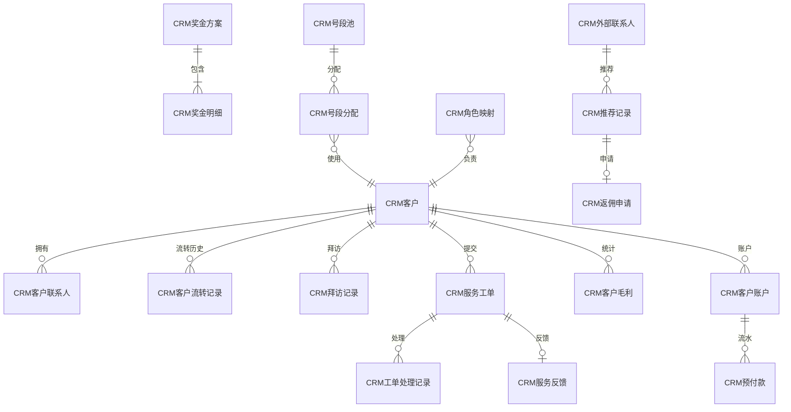
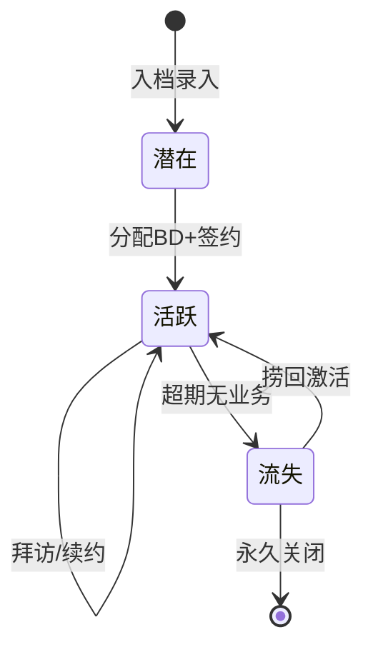
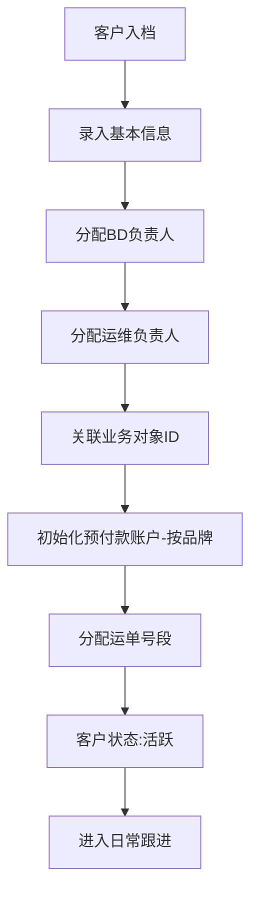
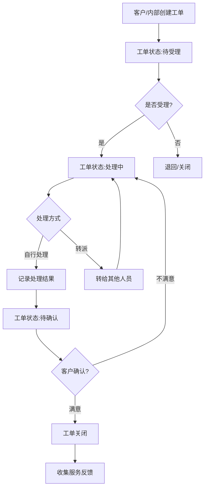
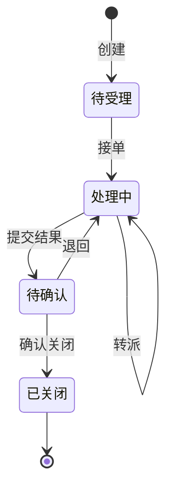
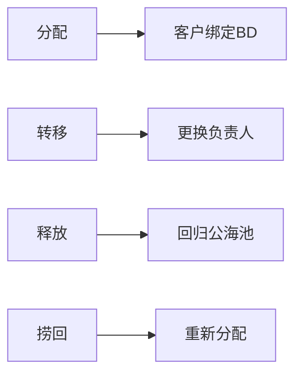

# CRM 模块设计文档

## 1. 模块职责与边界

### 核心职责
- 客户全生命周期管理（入档、分配、跟进、流失预警）
- BD/运维人员角色分配与客户绑定
- 服务工单全流程（创建→受理→处理→关闭→反馈）
- 客户毛利统计与奖金核算
- 预付款账户管理（按品牌隔离）
- 运单号段池分配
- 推荐佣金管理

### 不负责的内容
- 快递运单的实际业务处理（由 Express 模块负责）
- 财务凭证生成（由 Finance 模块负责）
- 数据文件导入解析（由 DataCenter 模块负责）

### 依赖关系
| 方向 | 模块 | 说明 |
|------|------|------|
| 依赖 | 基础模块 | 员工、部门、组织等基础数据 |
| 依赖 | Express | 客户编号与业务对象ID关联，获取业务数据计算毛利 |
| 被依赖 | Express | 提供客户档案、预付款余额、号段分配 |
| 被依赖 | Finance | 辅助核算项目来源(客户维度) |

## 2. 数据库表设计

### 核心实体表清单

| 表名 | 中文说明 | 主键 | 关键字段 |
|------|----------|------|----------|
| CRM客户 | 客户主档 | F编号(String) | F简称, F全称, F状态, FBD员工ID, F运维员工ID |
| CRM客户联系人 | 联系人信息 | GUID | F客户ID, F姓名, F电话, F职务, F角色标签 |
| CRM角色映射 | 员工角色 | GUID | F员工ID, F角色(1-BD/2-运维), F组织ID |
| CRM客户流转记录 | 流转历史 | GUID | F客户ID, F流转类型, F操作人, F时间 |
| CRM拜访记录 | 客户拜访 | GUID | F客户ID, F拜访人ID, F拜访方式, F内容, F时间 |
| CRM服务工单 | 工单管理 | GUID | F工单号(unique), F客户ID, F分类, F状态, F优先级 |
| CRM工单处理记录 | 工单流转 | GUID | F工单ID, F操作类型, F操作人, F备注 |
| CRM客户毛利 | 毛利统计 | GUID | F客户ID, F期间(YYYYMM), F收入, F成本, F毛利, F毛利率 |
| CRM奖金方案 | 奖金规则 | GUID | F名称, F类型, F生效期间, F状态 |
| CRM奖金明细 | 奖金发放 | GUID | F方案ID, F员工ID, F客户ID, F金额 |
| CRM服务反馈 | 客户反馈 | GUID | F工单ID, F评分, F内容, F时间 |
| CRM推荐记录 | 客户推荐 | GUID | F推荐人ID, F被推荐客户ID, F状态 |
| CRM返佣申请 | 佣金管理 | GUID | F推荐记录ID, F金额, F状态 |
| CRM号段池 | 号段管理 | GUID | F起始号, F结束号, F品牌, F状态 |
| CRM号段分配 | 号段使用 | GUID | F号段池ID, F客户ID, F分配量, F已用量 |
| CRM客户账户 | 预付款账户 | GUID | F客户ID, F品牌, F余额, F信用额度 |
| CRM预付款 | 充值记录 | GUID | F账户ID, F金额, F类型(充值/消费/退款) |
| CRM外部联系人 | 推荐人 | GUID | F姓名, F电话, F关系类型 |

### 表间关系

## 3. API 接口清单

### 客户管理

| 方法 | 路径 | 功能 | 权限 |
|------|------|------|------|
| GET | /api/crm/customer | 客户列表(分页+筛选) | crm:customer:view |
| GET | /api/crm/customer/{id} | 客户详情 | crm:customer:view |
| POST | /api/crm/customer | 新增客户 | crm:customer:create |
| PUT | /api/crm/customer/{id} | 修改客户 | crm:customer:edit |
| PUT | /api/crm/customer/{id}/status | 变更客户状态 | crm:customer:edit |
| POST | /api/crm/customer/{id}/transfer | 客户转移(BD/运维) | crm:customer:transfer |
| GET | /api/crm/customer/{id}/timeline | 客户时间线 | crm:customer:view |

### 联系人

| 方法 | 路径 | 功能 | 权限 |
|------|------|------|------|
| GET | /api/crm/contact | 联系人列表 | crm:contact:view |
| POST | /api/crm/contact | 新增联系人 | crm:contact:create |
| PUT | /api/crm/contact/{id} | 修改联系人 | crm:contact:edit |
| DELETE | /api/crm/contact/{id} | 删除联系人 | crm:contact:delete |

### 服务工单

| 方法 | 路径 | 功能 | 权限 |
|------|------|------|------|
| GET | /api/crm/ticket | 工单列表 | crm:ticket:view |
| POST | /api/crm/ticket | 创建工单 | crm:ticket:create |
| POST | /api/crm/ticket/{id}/accept | 受理工单 | crm:ticket:process |
| POST | /api/crm/ticket/{id}/process | 处理工单 | crm:ticket:process |
| POST | /api/crm/ticket/{id}/transfer | 转派工单 | crm:ticket:transfer |
| POST | /api/crm/ticket/{id}/close | 关闭工单 | crm:ticket:close |
| POST | /api/crm/ticket/{id}/feedback | 提交反馈 | crm:ticket:feedback |

### 拜访记录

| 方法 | 路径 | 功能 | 权限 |
|------|------|------|------|
| GET | /api/crm/visit | 拜访记录列表 | crm:visit:view |
| POST | /api/crm/visit | 新增拜访 | crm:visit:create |

### 毛利分析

| 方法 | 路径 | 功能 | 权限 |
|------|------|------|------|
| GET | /api/crm/profit | 客户毛利列表 | crm:profit:view |
| GET | /api/crm/profit/summary | 毛利汇总 | crm:profit:view |
| POST | /api/crm/profit/calculate | 触发毛利计算 | crm:profit:calc |

### 预付款管理

| 方法 | 路径 | 功能 | 权限 |
|------|------|------|------|
| GET | /api/crm/prepay/account | 账户列表 | crm:prepay:view |
| POST | /api/crm/prepay/recharge | 充值 | crm:prepay:recharge |
| GET | /api/crm/prepay/flow | 流水记录 | crm:prepay:view |

### 奖金/佣金

| 方法 | 路径 | 功能 | 权限 |
|------|------|------|------|
| GET | /api/crm/bonus/scheme | 奖金方案列表 | crm:bonus:view |
| POST | /api/crm/bonus/scheme | 新增方案 | crm:bonus:create |
| GET | /api/crm/bonus/detail | 奖金明细 | crm:bonus:view |
| POST | /api/crm/referral | 创建推荐记录 | crm:referral:create |
| POST | /api/crm/referral/{id}/commission | 申请返佣 | crm:referral:commission |

## 4. 业务流程

### 客户生命周期

### 客户入档与分配流程

### 服务工单流程

### 工单状态转换

### 客户流转类型

