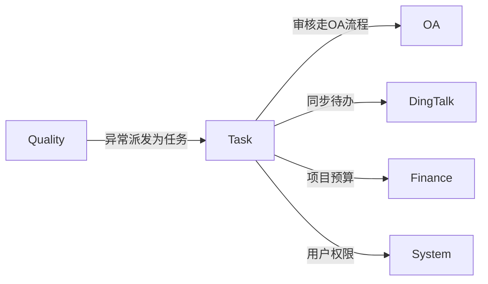
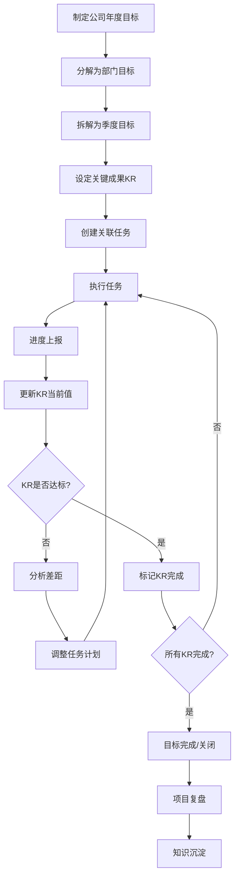
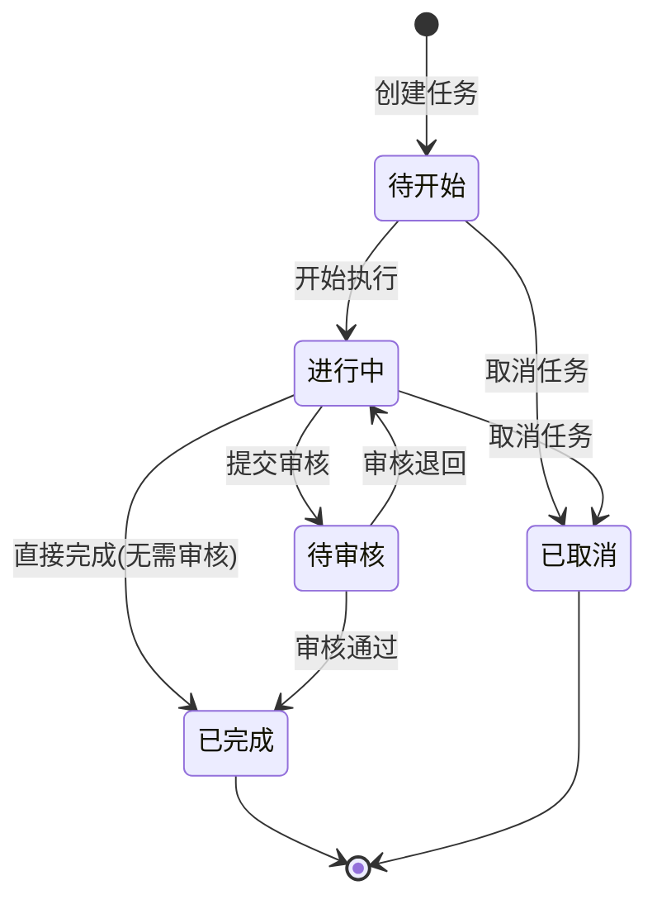
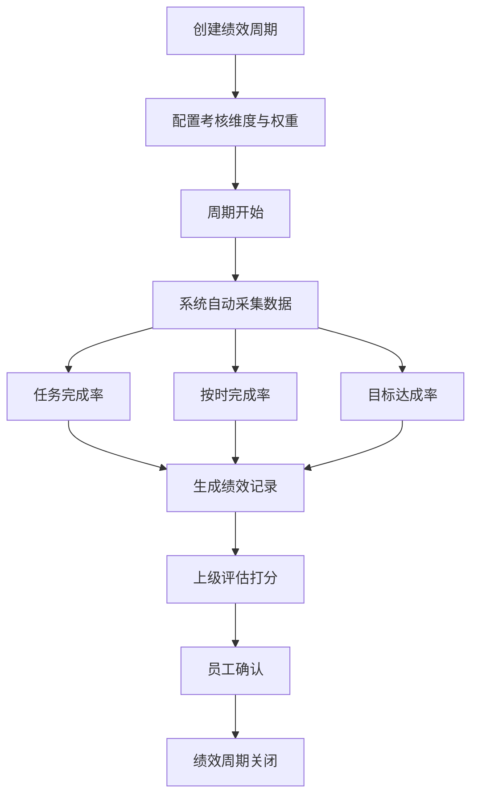

# Task 目标与任务管理模块设计文档

## 1. 模块职责与边界

### 1.1 核心职责

- **OKR目标管理**：公司/部门/个人多层级目标拆解，关键成果(KR)量化跟踪
- **项目任务管理**：项目→任务树形管理，支持看板/甘特图视图，任务依赖与优先级
- **绩效评估**：基于目标完成率、任务及时率的多维度绩效考核
- **团队协作**：任务评论、进度上报、活动日志、实时通知
- **知识积累**：项目复盘与知识库沉淀

### 1.2 不负责的内容（明确边界）

| 边界外内容 | 归属模块 |
|---|---|
| 审批流程管理 | OA |
| 异常检测与质量监控 | Quality |
| 员工薪资与考勤 | Finance / OA |
| 用户权限、角色、菜单管理 | System |
| 部门组织架构管理 | System |

### 1.3 与其他模块的依赖关系



- **OA**：任务审核流程走OA审批
- **Quality**：异常派发为Task任务，关联跟踪
- **DingTalk**：任务待办同步至钉钉、消息推送
- **Finance**：项目预算管理关联
- **System**：用户权限与组织架构查询

### 1.4 目录结构

```
src/Modules/Task/
├── Configurations/      # EF Core实体配置（28个）
├── Controllers/         # API控制器（15个）
├── Dtos/                # 数据传输对象（15个）
├── Entities/            # 领域实体（28个）
├── EventHandlers/       # 领域事件处理器
├── Events/              # 领域事件定义
├── Hubs/                # SignalR实时通知Hub
├── Jobs/                # 后台任务（6个：提醒/同步/统计等）
└── Services/            # 业务服务（32个）
    └── DingTalk/        # 钉钉集成服务
```

---

## 2. 数据库表设计

### 2.1 OKR体系（2张表）

#### TmGoal — 目标表

| 字段名 | 类型 | 说明 |
|---|---|---|
| FID | BIGINT PK | 主键 |
| FTitle | NVARCHAR(200) | 目标标题 |
| FDescription | NVARCHAR(1000) | 目标描述 |
| FLevel | NVARCHAR(20) | 级别：yearly/quarterly/monthly |
| FParentGoalId | BIGINT | 父目标ID（自引用，支持多层级拆解） |
| FOwnerId | BIGINT | 目标负责人ID |
| FDepartmentId | BIGINT | 所属部门ID |
| FStartDate | DATE | 开始日期 |
| FEndDate | DATE | 结束日期 |
| FStatus | INT | 状态：0=草稿, 1=进行中, 2=已完成, 3=已关闭 |
| FProgress | DECIMAL(5,2) | 整体进度（0-100） |
| FSortOrder | INT | 排序号 |
| FOrgId | BIGINT | 组织ID |
| FCreatorId | BIGINT | 创建人ID |
| FCreatedTime | DATETIME2 | 创建时间 |
| FModifiedTime | DATETIME2 | 修改时间 |
| FIsDeleted | BIT | 软删除标记 |

#### TmKeyResult — 关键成果表

| 字段名 | 类型 | 说明 |
|---|---|---|
| FID | BIGINT PK | 主键 |
| FGoalId | BIGINT FK | 关联目标 |
| FTitle | NVARCHAR(200) | KR标题 |
| FDescription | NVARCHAR(500) | KR描述 |
| FMeasureType | INT | 度量类型：1=定性, 2=定量 |
| FTargetValue | DECIMAL(18,2) | 目标值 |
| FCurrentValue | DECIMAL(18,2) | 当前值 |
| FStartValue | DECIMAL(18,2) | 起始值（默认0） |
| FUnit | NVARCHAR(20) | 单位（%/个/万元等） |
| FWeight | DECIMAL(5,2) | 权重（0-100） |
| FProgress | DECIMAL(5,2) | 进度（自动计算） |
| FOwnerId | BIGINT | 负责人ID |
| FStatus | INT | 状态：0=未开始, 1=进行中, 2=已完成 |
| FSortOrder | INT | 排序号 |
| FCreatedTime | DATETIME2 | 创建时间 |
| FModifiedTime | DATETIME2 | 修改时间 |

> **KR进度计算公式**：`FProgress = (FCurrentValue - FStartValue) / (FTargetValue - FStartValue) * 100`

### 2.2 项目与任务核心（7张表）

#### TmProject — 项目表

| 字段名 | 类型 | 说明 |
|---|---|---|
| FID | BIGINT PK | 主键 |
| FProjectName | NVARCHAR(200) | 项目名称 |
| FDescription | NVARCHAR(1000) | 项目描述 |
| FStatus | INT | 状态：0=规划中, 1=进行中, 2=已完成, 3=已归档 |
| FStartDate | DATE | 开始日期 |
| FEndDate | DATE | 结束日期 |
| FOwnerId | BIGINT | 项目负责人ID |
| FGoalId | BIGINT FK | 关联目标（可空） |
| FBudget | DECIMAL(18,2) | 项目预算 |
| FOrgId | BIGINT | 组织ID |
| FCreatorId | BIGINT | 创建人ID |
| FCreatedTime | DATETIME2 | 创建时间 |
| FModifiedTime | DATETIME2 | 修改时间 |
| FIsDeleted | BIT | 软删除 |

#### TmProjectMember — 项目成员表

| 字段名 | 类型 | 说明 |
|---|---|---|
| FID | BIGINT PK | 主键 |
| FProjectId | BIGINT FK | 关联项目 |
| FUserId | BIGINT | 成员用户ID |
| FRole | NVARCHAR(20) | 角色：owner=负责人, member=成员 |
| FJoinedTime | DATETIME2 | 加入时间 |

#### TmTask — 任务表

| 字段名 | 类型 | 说明 |
|---|---|---|
| FID | BIGINT PK | 主键 |
| FTitle | NVARCHAR(200) | 任务标题 |
| FDescription | NVARCHAR(MAX) | 任务描述（富文本） |
| FProjectId | BIGINT FK | 关联项目（可空） |
| FGoalId | BIGINT FK | 关联目标（可空） |
| FKeyResultId | BIGINT FK | 关联KR（可空） |
| FParentTaskId | BIGINT | 父任务ID（树形父子结构） |
| FStatus | INT | 状态：0=待开始, 1=进行中, 2=已完成, 3=已取消, 4=待审核 |
| FPriority | INT | 优先级：1=低, 2=中, 3=高, 4=紧急 |
| FProgress | DECIMAL(5,2) | 进度（0-100） |
| FStartDate | DATE | 计划开始日期 |
| FDueDate | DATE | 截止日期 |
| FCompletedDate | DATE | 实际完成日期 |
| FEstimatedHours | DECIMAL(8,2) | 预估工时 |
| FActualHours | DECIMAL(8,2) | 实际工时 |
| FCreatorId | BIGINT | 创建人ID |
| FOrgId | BIGINT | 组织ID |
| FCreatedTime | DATETIME2 | 创建时间 |
| FModifiedTime | DATETIME2 | 修改时间 |
| FIsDeleted | BIT | 软删除 |

#### TmTaskMember — 任务成员表

| 字段名 | 类型 | 说明 |
|---|---|---|
| FID | BIGINT PK | 主键 |
| FTaskId | BIGINT FK | 关联任务 |
| FUserId | BIGINT | 成员用户ID |
| FRole | INT | 角色：0=创建者, 1=执行人, 2=协作者, 3=审核人 |
| FAssignedTime | DATETIME2 | 分配时间 |

#### TmTaskDependency — 任务依赖表

| 字段名 | 类型 | 说明 |
|---|---|---|
| FID | BIGINT PK | 主键 |
| FTaskId | BIGINT FK | 当前任务 |
| FDependsOnTaskId | BIGINT FK | 依赖的任务 |
| FDependencyType | INT | 类型：0=前置(FS), 1=后置(SF), 2=阻塞(SS) |

#### TmTaskTag — 任务标签关联表

| 字段名 | 类型 | 说明 |
|---|---|---|
| FID | BIGINT PK | 主键 |
| FTaskId | BIGINT FK | 关联任务 |
| FTagId | BIGINT FK | 关联标签 |

#### TmTag — 标签表

| 字段名 | 类型 | 说明 |
|---|---|---|
| FID | BIGINT PK | 主键 |
| FName | NVARCHAR(50) | 标签名称 |
| FColor | NVARCHAR(20) | 标签颜色 |
| FOrgId | BIGINT | 组织ID |
| FCreatedTime | DATETIME2 | 创建时间 |

### 2.3 协作评论（5张表）

#### TmTaskComment — 任务评论表

| 字段名 | 类型 | 说明 |
|---|---|---|
| FID | BIGINT PK | 主键 |
| FTaskId | BIGINT FK | 关联任务 |
| FContent | NVARCHAR(MAX) | 评论内容 |
| FParentCommentId | BIGINT | 父评论ID（嵌套评论） |
| FUserId | BIGINT | 评论人ID |
| FCreatedTime | DATETIME2 | 评论时间 |
| FIsDeleted | BIT | 软删除 |

#### TmCommentReaction — 评论反应表

| 字段名 | 类型 | 说明 |
|---|---|---|
| FID | BIGINT PK | 主键 |
| FCommentId | BIGINT FK | 关联评论 |
| FUserId | BIGINT | 用户ID |
| FReactionType | NVARCHAR(20) | 反应类型：like/heart/thumbsup等 |
| FCreatedTime | DATETIME2 | 创建时间 |

#### TmAttachment — 任务附件表

| 字段名 | 类型 | 说明 |
|---|---|---|
| FID | BIGINT PK | 主键 |
| FTaskId | BIGINT FK | 关联任务 |
| FFileName | NVARCHAR(200) | 文件名 |
| FFilePath | NVARCHAR(500) | 文件路径 |
| FFileSize | BIGINT | 文件大小（字节） |
| FContentType | NVARCHAR(100) | MIME类型 |
| FUploaderId | BIGINT | 上传人ID |
| FCreatedTime | DATETIME2 | 上传时间 |

#### TmProgressReport — 进度上报表

| 字段名 | 类型 | 说明 |
|---|---|---|
| FID | BIGINT PK | 主键 |
| FTaskId | BIGINT FK | 关联任务 |
| FProjectId | BIGINT FK | 关联项目（可空） |
| FReporterId | BIGINT | 上报人ID |
| FContent | NVARCHAR(MAX) | 上报内容 |
| FProgressBefore | DECIMAL(5,2) | 上报前进度 |
| FProgressAfter | DECIMAL(5,2) | 上报后进度 |
| FHoursSpent | DECIMAL(8,2) | 本次耗时 |
| FReportDate | DATE | 上报日期 |
| FCreatedTime | DATETIME2 | 创建时间 |

#### TmActivityLog — 活动日志表

| 字段名 | 类型 | 说明 |
|---|---|---|
| FID | BIGINT PK | 主键 |
| FTaskId | BIGINT FK | 关联任务（可空） |
| FProjectId | BIGINT FK | 关联项目（可空） |
| FGoalId | BIGINT FK | 关联目标（可空） |
| FUserId | BIGINT | 操作人ID |
| FActionType | NVARCHAR(50) | 操作类型：create/update/status_change/comment/assign... |
| FDescription | NVARCHAR(500) | 操作描述 |
| FChanges | NVARCHAR(MAX) | 变更详情JSON |
| FCreatedTime | DATETIME2 | 操作时间 |

### 2.4 计划提醒（3张表）

#### TmTaskReminder — 任务提醒表

| 字段名 | 类型 | 说明 |
|---|---|---|
| FID | BIGINT PK | 主键 |
| FTaskId | BIGINT FK | 关联任务 |
| FUserId | BIGINT | 提醒对象ID |
| FRemindTime | DATETIME2 | 提醒时间 |
| FRemindType | INT | 提醒类型：0=一次性, 1=每日, 2=自定义 |
| FIsNotified | BIT | 是否已通知 |
| FCreatedTime | DATETIME2 | 创建时间 |

#### TmTaskSchedule — 任务定时计划表

| 字段名 | 类型 | 说明 |
|---|---|---|
| FID | BIGINT PK | 主键 |
| FTaskId | BIGINT FK | 关联任务 |
| FCronExpression | NVARCHAR(100) | Cron表达式 |
| FNextRunTime | DATETIME2 | 下次执行时间 |
| FIsEnabled | BIT | 是否启用 |
| FCreatedTime | DATETIME2 | 创建时间 |

#### TmNotification — 通知表

| 字段名 | 类型 | 说明 |
|---|---|---|
| FID | BIGINT PK | 主键 |
| FUserId | BIGINT | 接收人ID |
| FTitle | NVARCHAR(200) | 通知标题 |
| FContent | NVARCHAR(500) | 通知内容 |
| FType | INT | 类型：0=任务分配, 1=截止提醒, 2=评论@, 3=状态变更 |
| FRelatedId | BIGINT | 关联对象ID |
| FRelatedType | NVARCHAR(50) | 关联对象类型：task/goal/project |
| FIsRead | BIT | 是否已读 |
| FCreatedTime | DATETIME2 | 创建时间 |

### 2.5 绩效评估（4张表）

#### TmPerformancePeriod — 绩效周期表

| 字段名 | 类型 | 说明 |
|---|---|---|
| FID | BIGINT PK | 主键 |
| FPeriodName | NVARCHAR(100) | 周期名称 |
| FType | NVARCHAR(20) | 类型：monthly/quarterly/yearly |
| FStartDate | DATE | 开始日期 |
| FEndDate | DATE | 结束日期 |
| FStatus | INT | 状态：0=未开始, 1=评估中, 2=已完成 |
| FOrgId | BIGINT | 组织ID |
| FCreatedTime | DATETIME2 | 创建时间 |

#### TmPerformanceRecord — 绩效记录表

| 字段名 | 类型 | 说明 |
|---|---|---|
| FID | BIGINT PK | 主键 |
| FPeriodId | BIGINT FK | 关联绩效周期 |
| FUserId | BIGINT | 被评估人ID |
| FCompletionRate | DECIMAL(5,2) | 任务完成率 |
| FOnTimeRate | DECIMAL(5,2) | 按时完成率 |
| FOverallScore | DECIMAL(5,2) | 综合得分 |
| FEvaluatorId | BIGINT | 评估人ID |
| FComment | NVARCHAR(1000) | 评语 |
| FStatus | INT | 状态：0=待评估, 1=已评估, 2=已确认 |
| FOrgId | BIGINT | 组织ID |
| FCreatedTime | DATETIME2 | 创建时间 |

#### TmPerformanceDimension — 绩效维度表

| 字段名 | 类型 | 说明 |
|---|---|---|
| FID | BIGINT PK | 主键 |
| FPeriodId | BIGINT FK | 关联绩效周期 |
| FDimensionName | NVARCHAR(100) | 维度名称（如：目标完成、任务及时率、协作评价） |
| FWeight | DECIMAL(5,2) | 权重 |
| FDataSource | NVARCHAR(100) | 数据来源：auto_task/auto_goal/manual |
| FDescription | NVARCHAR(500) | 维度描述 |
| FSortOrder | INT | 排序号 |

#### TmPerformanceScore — 绩效维度得分表

| 字段名 | 类型 | 说明 |
|---|---|---|
| FID | BIGINT PK | 主键 |
| FRecordId | BIGINT FK | 关联绩效记录 |
| FDimensionId | BIGINT FK | 关联绩效维度 |
| FScore | DECIMAL(5,2) | 得分 |
| FRemark | NVARCHAR(500) | 评分说明 |

### 2.6 复盘知识（4张表）

#### TmReviewRecord — 复盘记录表

| 字段名 | 类型 | 说明 |
|---|---|---|
| FID | BIGINT PK | 主键 |
| FProjectId | BIGINT FK | 关联项目（可空） |
| FGoalId | BIGINT FK | 关联目标（可空） |
| FTitle | NVARCHAR(200) | 复盘标题 |
| FContent | NVARCHAR(MAX) | 复盘内容 |
| FConclusion | NVARCHAR(MAX) | 结论与改进 |
| FReviewerId | BIGINT | 复盘人ID |
| FReviewDate | DATE | 复盘日期 |
| FOrgId | BIGINT | 组织ID |
| FCreatedTime | DATETIME2 | 创建时间 |
| FIsDeleted | BIT | 软删除 |

#### TmKnowledge — 知识库表

| 字段名 | 类型 | 说明 |
|---|---|---|
| FID | BIGINT PK | 主键 |
| FTitle | NVARCHAR(200) | 知识标题 |
| FCategory | NVARCHAR(50) | 分类 |
| FContent | NVARCHAR(MAX) | 知识内容（富文本） |
| FTags | NVARCHAR(500) | 标签（逗号分隔） |
| FAuthorId | BIGINT | 作者ID |
| FReviewId | BIGINT FK | 关联复盘记录（可空） |
| FViewCount | INT | 浏览次数 |
| FLikeCount | INT | 点赞数 |
| FOrgId | BIGINT | 组织ID |
| FCreatedTime | DATETIME2 | 创建时间 |
| FModifiedTime | DATETIME2 | 修改时间 |
| FIsDeleted | BIT | 软删除 |

#### TmKnowledgeComment — 知识评论表

| 字段名 | 类型 | 说明 |
|---|---|---|
| FID | BIGINT PK | 主键 |
| FKnowledgeId | BIGINT FK | 关联知识 |
| FContent | NVARCHAR(MAX) | 评论内容 |
| FUserId | BIGINT | 评论人ID |
| FCreatedTime | DATETIME2 | 评论时间 |

#### TmKnowledgeInteraction — 知识互动表

| 字段名 | 类型 | 说明 |
|---|---|---|
| FID | BIGINT PK | 主键 |
| FKnowledgeId | BIGINT FK | 关联知识 |
| FUserId | BIGINT | 用户ID |
| FType | INT | 互动类型：0=点赞, 1=收藏 |
| FCreatedTime | DATETIME2 | 互动时间 |

### 2.7 钉钉集成（2张表）

#### TmDingTalkTodo — 钉钉待办同步表

| 字段名 | 类型 | 说明 |
|---|---|---|
| FID | BIGINT PK | 主键 |
| FTaskId | BIGINT FK | 关联任务 |
| FDingTalkTodoId | NVARCHAR(100) | 钉钉待办ID |
| FDingTalkUserId | NVARCHAR(100) | 钉钉用户ID |
| FSyncStatus | INT | 同步状态：0=待同步, 1=已同步, 2=同步失败 |
| FLastSyncTime | DATETIME2 | 最后同步时间 |
| FCreatedTime | DATETIME2 | 创建时间 |

#### TmDingTalkMessage — 钉钉消息记录表

| 字段名 | 类型 | 说明 |
|---|---|---|
| FID | BIGINT PK | 主键 |
| FTaskId | BIGINT FK | 关联任务（可空） |
| FMessageType | NVARCHAR(50) | 消息类型：task_assign/remind/status_change |
| FRecipientId | BIGINT | 接收人ID |
| FDingTalkMsgId | NVARCHAR(100) | 钉钉消息ID |
| FSendStatus | INT | 发送状态：0=待发送, 1=已发送, 2=发送失败 |
| FContent | NVARCHAR(500) | 消息内容 |
| FCreatedTime | DATETIME2 | 创建时间 |

### 2.8 其他（1张表）

#### TmTaskVisibility — 任务可见性表

| 字段名 | 类型 | 说明 |
|---|---|---|
| FID | BIGINT PK | 主键 |
| FTaskId | BIGINT FK | 关联任务 |
| FVisibilityType | INT | 可见类型：0=公开, 1=仅成员, 2=仅创建者 |
| FDepartmentIds | NVARCHAR(500) | 可见部门ID列表 |
| FUserIds | NVARCHAR(500) | 可见用户ID列表 |

---

## 3. OKR目标分解体系

### 3.1 目标层级

| 层级 | FLevel | 说明 | 周期 |
|---|---|---|---|
| 公司级 | yearly | 公司年度战略目标 | 1年 |
| 部门年度 | yearly | 部门年度目标（FParentGoalId→公司级） | 1年 |
| 季度目标 | quarterly | 部门/个人季度目标 | 1季度 |
| 月度目标 | monthly | 个人月度目标 | 1月 |

### 3.2 分解路径

```
公司年度目标(yearly)
├── 部门A年度目标(yearly, FParentGoalId→公司)
│   ├── Q1目标(quarterly)
│   │   ├── KR1(FTargetValue=100, FWeight=40)
│   │   ├── KR2(FTargetValue=50, FWeight=30)
│   │   └── KR3(FTargetValue=80, FWeight=30)
│   │       └── Task1(FKeyResultId→KR3)
│   ├── Q2目标(quarterly)
│   └── ...
└── 部门B年度目标(yearly)
    └── ...
```

---

## 4. API接口清单（15个Controller）

### 4.1 任务管理

- `GET /api/task/tasks` — 获取任务列表（支持筛选/分页）
- `GET /api/task/tasks/{id}` — 获取任务详情
- `POST /api/task/tasks` — 创建任务
- `PUT /api/task/tasks/{id}` — 更新任务
- `DELETE /api/task/tasks/{id}` — 删除任务
- `PUT /api/task/tasks/{id}/status` — 更新任务状态
- `PUT /api/task/tasks/{id}/priority` — 更新任务优先级
- `PUT /api/task/tasks/{id}/assign` — 分配任务成员
- `POST /api/task/tasks/{id}/comment` — 添加评论
- `POST /api/task/tasks/{id}/attachment` — 上传附件

### 4.2 目标管理

- `GET /api/task/goals` — 获取目标列表
- `GET /api/task/goals/tree` — 获取目标树形结构
- `POST /api/task/goals` — 创建目标
- `PUT /api/task/goals/{id}` — 更新目标
- `DELETE /api/task/goals/{id}` — 删除目标
- `POST /api/task/goals/{id}/decompose` — 目标分解（创建子目标）
- `POST /api/task/goals/{id}/close` — 关闭目标

### 4.3 关键成果

- `GET /api/task/key-results` — 获取KR列表
- `POST /api/task/key-results` — 创建KR
- `PUT /api/task/key-results/{id}` — 更新KR
- `DELETE /api/task/key-results/{id}` — 删除KR
- `PUT /api/task/key-results/{id}/progress` — 更新KR进度（FCurrentValue）

### 4.4 项目管理

- `GET /api/task/projects` — 获取项目列表
- `POST /api/task/projects` — 创建项目
- `PUT /api/task/projects/{id}` — 更新项目
- `DELETE /api/task/projects/{id}` — 删除项目
- `POST /api/task/projects/{id}/member` — 添加项目成员
- `DELETE /api/task/projects/{id}/member/{userId}` — 移除项目成员

### 4.5 看板与视图

- `GET /api/task/kanban` — 获取看板视图数据（按状态分组）
- `GET /api/task/gantt` — 获取甘特图视图数据（时间轴）

### 4.6 绩效管理

- `GET /api/task/performance/periods` — 获取绩效周期列表
- `POST /api/task/performance/periods` — 创建绩效周期
- `PUT /api/task/performance/periods/{id}` — 更新绩效周期
- `GET /api/task/performance/records` — 获取绩效记录列表
- `GET /api/task/performance/records/{userId}` — 获取个人绩效记录
- `PUT /api/task/performance/records/{id}` — 更新绩效评分

### 4.7 复盘与知识

- `POST /api/task/reviews` — 创建复盘记录
- `GET /api/task/reviews` — 获取复盘列表
- `GET /api/task/knowledge` — 获取知识库列表
- `POST /api/task/knowledge` — 创建知识文章
- `PUT /api/task/knowledge/{id}` — 更新知识文章
- `DELETE /api/task/knowledge/{id}` — 删除知识文章

### 4.8 提醒通知

- `GET /api/task/reminders` — 获取提醒列表
- `POST /api/task/reminders` — 创建提醒
- `PUT /api/task/reminders/{id}` — 更新提醒
- `DELETE /api/task/reminders/{id}` — 删除提醒
- `GET /api/task/notifications` — 获取通知列表
- `PUT /api/task/notifications/{id}/read` — 标记通知已读
- `PUT /api/task/notifications/read-all` — 全部标记已读

### 4.9 标签

- `GET /api/task/tags` — 获取标签列表
- `POST /api/task/tags` — 创建标签
- `PUT /api/task/tags/{id}` — 更新标签
- `DELETE /api/task/tags/{id}` — 删除标签

### 4.10 进度上报

- `POST /api/task/progress-reports` — 提交进度上报
- `GET /api/task/progress-reports` — 获取进度上报列表
- `GET /api/task/progress-reports/task/{taskId}` — 获取任务的进度上报记录

---

## 5. 业务流程图

### 5.1 OKR目标执行流程



### 5.2 任务状态转移图



### 5.3 绩效考核周期流程



---

## 6. 模块关联总览

| 关联模块 | 关联方式 | 说明 |
|---|---|---|
| OA | 任务审核→OA审批流程 | 任务状态"待审核"时触发OA审批 |
| Quality | QlException→TmTask | 异常可派发为任务，关联跟踪处理 |
| DingTalk | TmDingTalkTodo/TmDingTalkMessage | 任务待办同步钉钉、消息推送 |
| Finance | TmProject.FBudget | 项目预算与财务模块关联 |
| System | 用户/角色/组织架构依赖 | 任务分配、权限控制、部门数据 |
