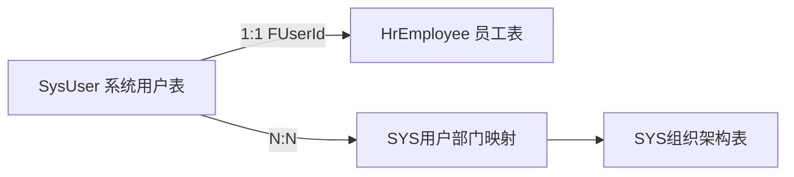
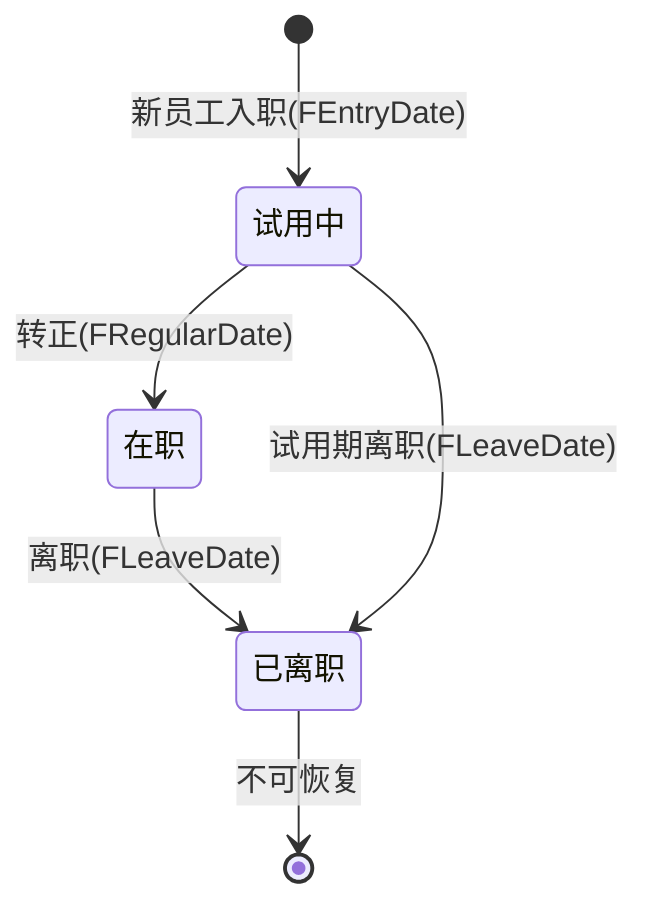
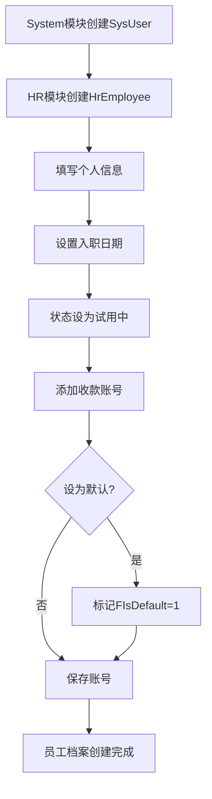
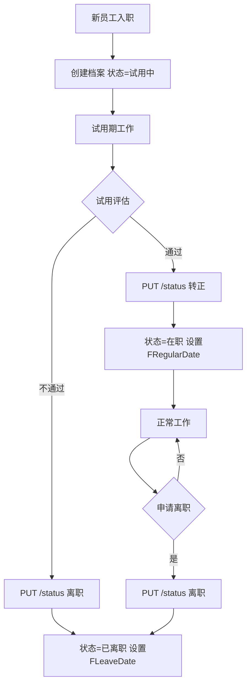

# HR 人力资源模块设计文档

## 1. 模块职责与边界

### 1.1 核心职责

- **员工基本信息管理**：员工个人档案维护（姓名、性别、身份证、联系方式、学历、婚姻状况、地址、紧急联系人等）
- **员工生命周期**：试用→转正→在职→离职状态流转管理
- **收款账号管理**：员工银行卡、支付宝、微信等收款账号维护，支持默认账号设置

> **当前阶段说明**：HR模块目前处于基础阶段，仅包含员工信息和收款账号两张表，后续将逐步扩展考勤、薪资等功能。

### 1.2 不负责的内容（明确边界）

| 边界外内容 | 归属模块 |
|---|---|
| 用户账号/密码/权限/登录 | System（SysUser） |
| 部门组织架构管理 | System（SYS组织架构表） |
| 考勤打卡（未来可能在OA） | OA |
| 薪资核算与发放 | Finance |
| 审批流程 | OA |
| 钉钉用户/部门同步 | System/DingTalk（未来规划） |

### 1.3 与System模块的关系



**核心设计原则**：
- **SysUser** 负责：账号、密码、权限、角色、登录信息
- **HrEmployee** 负责：个人信息、联系方式、学历、在职状态
- 两者通过 `HrEmployee.FUserId → SysUser.FID` 建立 **1:1唯一** 关联
- 组织架构由System模块统一管理，HR通过关联路径查询：`HrEmployee.FUserId → SysUser → SysUserDept → SysOrg`

### 1.4 目录结构

```
src/Modules/HR/
├── Configurations/      # EF Core实体配置（2个）
├── Controllers/         # API控制器（1个）
├── Dtos/                # 数据传输对象（1个）
├── Entities/            # 领域实体（2个）
└── Services/            # 业务服务（2个）
```

---

## 2. 数据库表设计

### 2.1 HrEmployee — HR员工表

| 字段名 | 类型 | 说明 |
|---|---|---|
| FID | BIGINT PK | 主键 |
| FUID | NVARCHAR(50) | 员工唯一编号（业务编码，唯一） |
| FUserId | BIGINT FK | 关联SysUser（1:1唯一，FK→SysUser.FID） |
| FName | NVARCHAR(50) | 姓名 |
| FGender | INT | 性别：0=未知, 1=男, 2=女 |
| FBirthDate | DATE | 出生日期 |
| FIdCard | NVARCHAR(20) | 身份证号 |
| FPhone | NVARCHAR(20) | 手机号 |
| FEthnicity | NVARCHAR(20) | 民族 |
| FEducation | NVARCHAR(20) | 学历：高中/大专/本科/硕士/博士 |
| FMaritalStatus | INT | 婚姻状况：0=未婚, 1=已婚, 2=离异 |
| FHomeAddress | NVARCHAR(500) | 家庭住址 |
| FRegisteredAddress | NVARCHAR(500) | 户籍地址 |
| FEmergencyContactName | NVARCHAR(50) | 紧急联系人姓名 |
| FEmergencyContactPhone | NVARCHAR(20) | 紧急联系人电话 |
| FEmergencyContactRelation | NVARCHAR(20) | 紧急联系人关系 |
| FEntryDate | DATE | 入职日期 |
| FRegularDate | DATE | 转正日期 |
| FLeaveDate | DATE | 离职日期 |
| FEmploymentStatus | INT | 在职状态：1=在职, 2=试用, 3=离职 |
| FRemark | NVARCHAR(1000) | 备注 |
| FOrgId | BIGINT | 组织ID |
| FCreatorId | BIGINT | 创建人ID |
| FCreatedTime | DATETIME2 | 创建时间 |
| FModifierId | BIGINT | 修改人ID |
| FModifiedTime | DATETIME2 | 修改时间 |
| FIsDeleted | BIT | 软删除标记 |

**索引**：

| 索引名 | 类型 | 字段 | 说明 |
|---|---|---|---|
| IX_HrEmployee_FUID | UNIQUE | FUID | 员工唯一编号唯一索引 |
| IX_HrEmployee_FUserId | UNIQUE | FUserId | 关联用户唯一索引（确保1:1） |

### 2.2 HrPaymentAccount — HR收款账号表

| 字段名 | 类型 | 说明 |
|---|---|---|
| FID | BIGINT PK | 主键 |
| FEmployeeId | BIGINT FK | 员工ID（FK→HrEmployee.FID） |
| FAccountType | NVARCHAR(20) | 账号类型：bank_card=银行卡, alipay=支付宝, wechat=微信 |
| FAccountName | NVARCHAR(50) | 户名 |
| FAccountNo | NVARCHAR(100) | 账号 |
| FBankName | NVARCHAR(200) | 开户银行 |
| FBankBranch | NVARCHAR(200) | 开户支行 |
| FIsDefault | BIT | 是否默认：0=否, 1=是 |
| FRemark | NVARCHAR(500) | 备注 |
| FCreatedTime | DATETIME2 | 创建时间 |
| FModifiedTime | DATETIME2 | 修改时间 |

**索引**：

| 索引名 | 类型 | 字段 | 说明 |
|---|---|---|---|
| IX_HrPaymentAccount_FEmployeeId | NONCLUSTERED | FEmployeeId | 按员工查询收款账号 |

---

## 3. 员工生命周期

### 3.1 状态定义

| FEmploymentStatus | 含义 | 说明 |
|---|---|---|
| 2 | 试用中 | 新员工入职默认状态 |
| 1 | 在职 | 试用期通过转正 |
| 3 | 已离职 | 办理离职手续后，不可恢复 |

### 3.2 状态流转规则



**关键业务规则**：
- 入职时状态为 `试用中(2)`，设置 `FEntryDate`
- 转正时状态变为 `在职(1)`，设置 `FRegularDate`
- 离职时状态变为 `已离职(3)`，设置 `FLeaveDate`，**状态不可恢复**
- 离职后不删除记录，仅标记状态，保留历史档案

---

## 4. API接口清单（1个Controller）

### 4.1 员工管理

- `GET /api/hr/employees` — 获取员工列表（支持姓名/状态/部门筛选、分页）
- `GET /api/hr/employees/{id}` — 获取员工详情
- `POST /api/hr/employees` — 创建员工档案
- `PUT /api/hr/employees/{id}` — 更新员工信息
- `DELETE /api/hr/employees/{id}` — 删除员工（软删除）
- `PUT /api/hr/employees/{id}/status` — 更新员工在职状态（试用→在职→离职）

### 4.2 收款账号管理

- `GET /api/hr/employees/{employeeId}/payment-accounts` — 获取员工收款账号列表
- `POST /api/hr/employees/{employeeId}/payment-accounts` — 添加收款账号
- `PUT /api/hr/payment-accounts/{id}` — 更新收款账号
- `DELETE /api/hr/payment-accounts/{id}` — 删除收款账号
- `PUT /api/hr/payment-accounts/{id}/set-default` — 设为默认账号

---

## 5. 业务流程图

### 5.1 员工信息创建流程



### 5.2 员工状态流转流程



---

## 6. 与System模块的数据模型对比

| 维度 | SysUser（System模块） | HrEmployee（HR模块） |
|---|---|---|
| **定位** | 系统账号 | 员工档案 |
| **核心数据** | 用户名、密码、邮箱 | 姓名、身份证、手机、地址 |
| **权限相关** | 角色、菜单、权限 | 无 |
| **组织相关** | 通过SysUserDept关联部门 | 通过FUserId间接关联 |
| **登录功能** | 是 | 否 |
| **联系信息** | 邮箱（基础） | 手机、地址、紧急联系人 |
| **生命周期** | 启用/禁用 | 试用/在职/离职 |

---

## 7. 未来规划

| 功能方向 | 说明 | 可能归属 |
|---|---|---|
| 钉钉同步 | 部门/用户/打卡数据从钉钉同步 | System/DingTalk |
| 考勤管理 | 打卡记录、请假、加班、出差 | OA（审批驱动） |
| 薪资核算 | 薪资结构、计薪、发放 | Finance |
| 培训管理 | 培训计划、记录、证书 | HR（扩展） |
| 合同管理 | 劳动合同、续签提醒 | HR/Contract |
| 职级体系 | 职级、晋升通道 | HR（扩展） |
