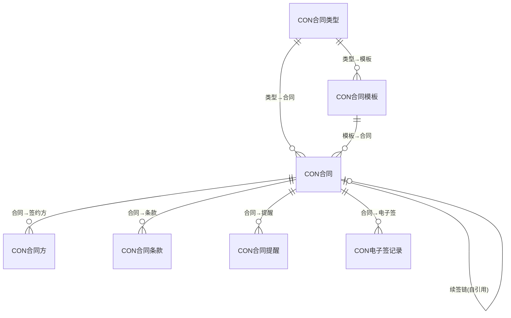
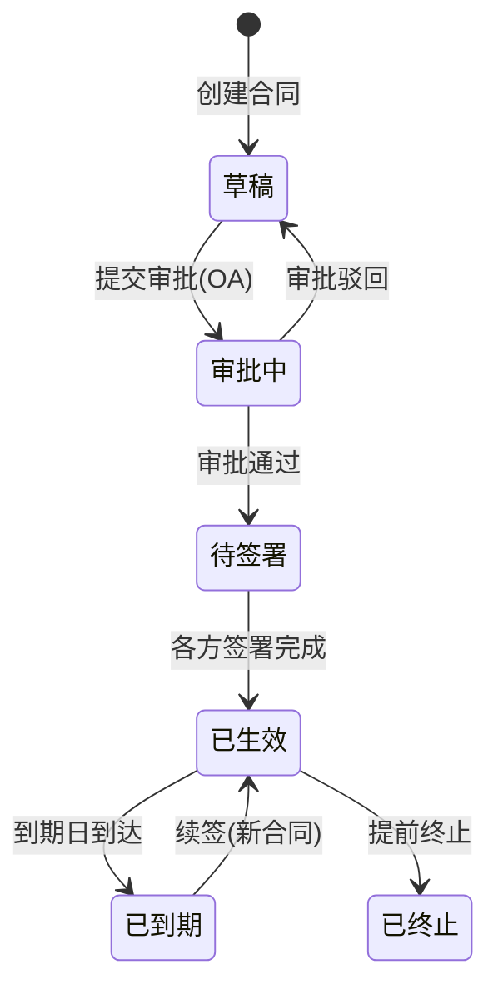

# 合同管理模块 设计文档

## 1. 模块职责与边界

### 核心职责
- 合同全生命周期管理（草稿→审批中→待签署→已生效→已到期→已终止）
- 合同续签链支持（新签/续签/变更/补充）
- 多方管理（甲乙丙方，关联客户/员工/供应商）
- 电子签章集成（签署状态追踪）
- 到期自动提醒（Hangfire定时任务 + 事件通知）
- 合同模板管理与版本控制

### 不负责的内容
- 具体审批流程执行（由 OA 模块负责）
- 合同方主数据维护（由 CRM/HR/Supplier 模块负责）
- 财务结算与开票（由 Finance 模块负责）

### 依赖关系
- **System** → 基础权限与组织
- **OA** → 审批流程（通过 FOA流程实例ID 关联）
- **CRM/HR/Supplier** → 合同方主数据来源

## 2. 数据库表设计

### 表清单

| 表名 | 中文说明 | 主键 | 关键字段 |
|------|---------|------|---------|
| CON合同类型 | 合同类型字典 | FID (BIGINT IDENTITY) | F名称, F编码(UNIQUE), F状态 |
| CON合同模板 | 合同模板 | FID (BIGINT IDENTITY) | F类型ID(FK), F模板名称, F模板内容(MAX), F版本号, F状态 |
| CON合同 | 合同主表 | FID (BIGINT IDENTITY) | F合同号(UNIQUE), F标题, F类型ID(FK), F金额, F开始/结束日期, F关联合同ID(自引用FK), F合同性质, F状态, FOA流程实例ID |
| CON合同方 | 合同签约方 | FID (BIGINT IDENTITY) | F合同ID(FK CASCADE), F方角色, F关联业务类型, F关联业务ID, F方名称 |
| CON合同条款 | 合同条款明细 | FID (BIGINT IDENTITY) | F合同ID(FK CASCADE), F条款序号, F条款标题, F条款内容, F是否关键条款 |
| CON合同提醒 | 到期/续签提醒 | FID (BIGINT IDENTITY) | F合同ID(FK CASCADE), F提醒类型, F提醒日期, F接收人ID, F是否已处理 |
| CON电子签记录 | 电子签章记录 | FID (BIGINT IDENTITY) | F合同ID(FK CASCADE), F签署人, F签署状态, F签署时间, F第三方流水号 |

### ER关系



## 3. API 接口清单

### 合同管理 (ContractController)

| 方法 | 路径 | 功能 |
|------|------|------|
| GET | /api/contract/contracts | 合同列表（分页） |
| GET | /api/contract/contracts/{id} | 合同详情 |
| POST | /api/contract/contracts | 创建合同 |
| PUT | /api/contract/contracts/{id} | 更新合同 |
| DELETE | /api/contract/contracts/{id} | 删除合同 |
| PUT | /api/contract/contracts/{id}/status | 变更合同状态 |
| POST | /api/contract/contracts/{id}/renew | 续签合同 |

### 合同类型 (ContractTypeController)

| 方法 | 路径 | 功能 |
|------|------|------|
| GET | /api/contract/types | 类型列表 |
| GET | /api/contract/types/{id} | 类型详情 |
| POST | /api/contract/types | 创建类型 |
| PUT | /api/contract/types/{id} | 更新类型 |
| DELETE | /api/contract/types/{id} | 删除类型 |

### 合同模板 (ContractTemplateController)

| 方法 | 路径 | 功能 |
|------|------|------|
| GET | /api/contract/templates | 模板列表 |
| GET | /api/contract/templates/{id} | 模板详情 |
| POST | /api/contract/templates | 创建模板 |
| PUT | /api/contract/templates/{id} | 更新模板 |
| DELETE | /api/contract/templates/{id} | 删除模板 |

### 合同提醒 (ContractReminderController)

| 方法 | 路径 | 功能 |
|------|------|------|
| GET | /api/contract/reminders | 提醒列表 |
| GET | /api/contract/reminders/{id} | 提醒详情 |
| POST | /api/contract/reminders | 创建提醒 |
| PUT | /api/contract/reminders/{id} | 更新提醒 |
| DELETE | /api/contract/reminders/{id} | 删除提醒 |

### 电子签章 (ESignController)

| 方法 | 路径 | 功能 |
|------|------|------|
| GET | /api/contract/esign | 签署记录列表 |
| GET | /api/contract/esign/{id} | 签署详情 |
| POST | /api/contract/esign | 创建签署记录 |
| PUT | /api/contract/esign/{id} | 更新签署状态 |

## 4. 业务流程

### 合同生命周期状态机



### 到期提醒流程

```mermaid
flowchart TD
    A[Hangfire定时扫描] --> B{合同即将到期?}
    B -->|是| C[创建提醒记录]
    C --> D[发布ContractExpiryEvent]
    D --> E[EventHandler发送通知]
    E --> F[接收人处理]
    F --> G{续签/终止?}
    G -->|续签| H[POST /contracts/{id}/renew]
    G -->|终止| I[PUT /contracts/{id}/status]
    B -->|否| J[跳过]
```
