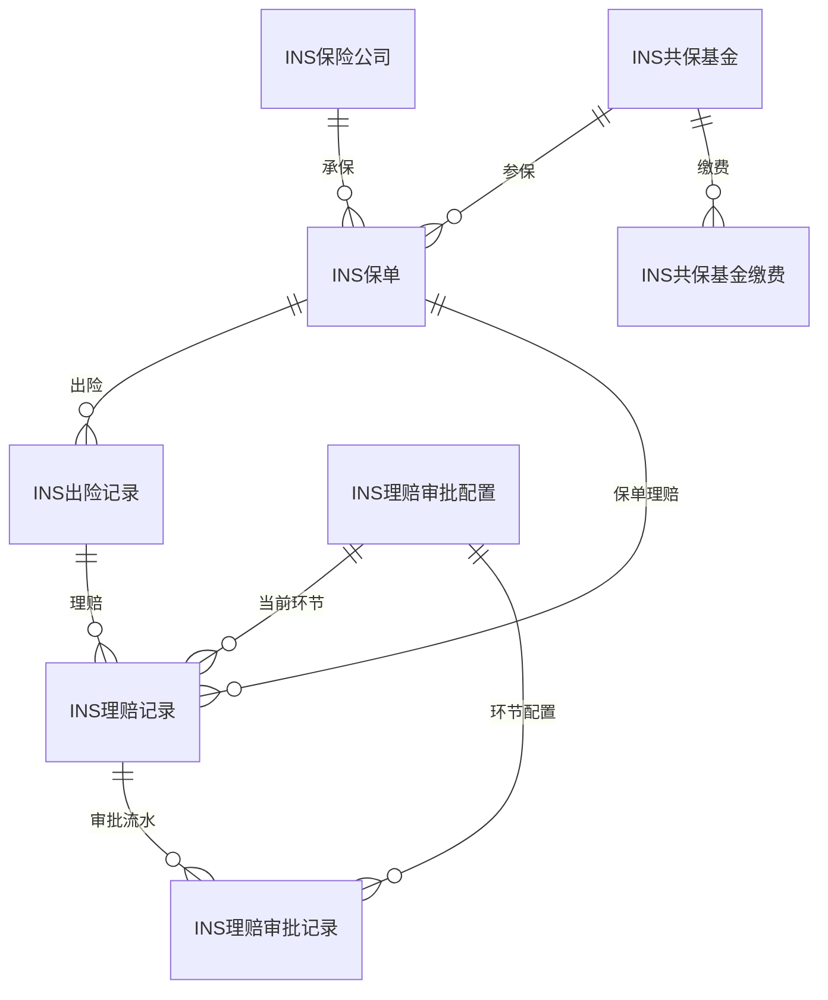
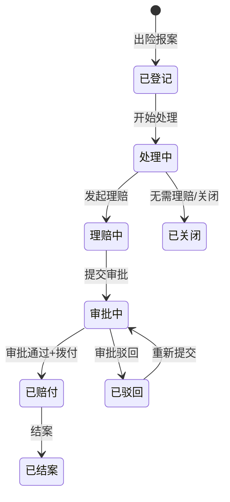

# 保险管理模块 设计文档

## 1. 模块职责与边界

### 核心职责
- 双引擎保险管理（商业保险 + 共保基金）
- 多业务对象关联（三轮车、人员、机动车、财产）— 通过 BusinessType + RelatedObjectId 通用关联
- 保单全生命周期（有效→过期→退保）
- 完整理赔流程（出险登记→理赔申请→审批→赔付）
- 共保基金缴费管理（生成→催缴→确认）
- 自定义审批工作流（多环节配置，与OA整合）
- 到期预警

### 不负责的内容
- 车辆主数据管理（由 Vehicle 模块负责）
- 人员主数据管理（由 HR 模块负责）
- 具体审批流执行（由 OA 模块负责）
- 财务付款结算（由 Finance 模块负责）

### 依赖关系
- **System** → 基础权限与多租户
- **OA** → 理赔审批流程
- **Vehicle** → 车辆保险关联（BusinessType=1/3）
- **HR** → 人员保险关联（BusinessType=2）

## 2. 数据库表设计

### 表清单

| 表名 | 中文说明 | 主键 | 关键字段 |
|------|---------|------|---------|
| INS保险公司 | 保险公司主数据 | FID (BIGINT IDENTITY) | FUID, F组织ID, F公司名称, F公司编码(组织内UNIQUE), F公司类型 |
| INS保单 | 保单核心表 | FID (BIGINT IDENTITY) | FUID, F业务类型, F关联对象ID, F保险大类(1商业/2共保), F保险公司ID(FK), F共保基金ID(FK), F保单号, F保费, F保额, F生效/到期日期, F保险状态 |
| INS出险记录 | 出险事故登记 | FID (BIGINT IDENTITY) | FUID, F保单ID(FK), F出险编号(UNIQUE), F出险日期, F事故类型, F预估/实际损失金额, F责任划分, F出险状态 |
| INS理赔记录 | 理赔流程表 | FID (BIGINT IDENTITY) | FUID, F出险ID(FK), F保单ID(FK), F理赔编号(UNIQUE), F理赔类型, F定损/理赔/自付金额, F理赔状态, F当前环节ID(FK) |
| INS共保基金 | 共保基金主表 | FID (BIGINT IDENTITY) | FUID, F组织ID, F基金名称, F基金编码(组织内UNIQUE), F累计缴费/赔付/余额, F缴费标准, F免赔额, F赔付上限 |
| INS共保基金缴费 | 基金缴费明细 | FID (BIGINT IDENTITY) | FUID, F基金ID(FK), F保单ID(FK), F缴费编号, F缴费金额, F缴费周期, F缴费状态 |
| INS理赔审批配置 | 审批环节配置 | FID (BIGINT IDENTITY) | FUID, F组织ID, F环节序号(组织内UNIQUE), F环节名称, F环节编码, F审批人类型, F可驳回 |
| INS理赔审批记录 | 审批流水记录 | FID (BIGINT IDENTITY) | FUID, F理赔ID(FK), F环节配置ID(FK), F审批人ID, F审批动作, F审批意见 |

### ER关系



## 3. API 接口清单

### 保单管理 (InsPolicyController)

| 方法 | 路径 | 功能 |
|------|------|------|
| GET | /api/insurance/policies | 保单列表（分页） |
| GET | /api/insurance/policies/{id} | 保单详情 |
| POST | /api/insurance/policies | 创建保单 |
| PUT | /api/insurance/policies/{id} | 更新保单 |
| GET | /api/insurance/policies/expiring | 即将到期保单（默认30天） |
| GET | /api/insurance/policies/by-object | 按业务对象查保单 |

### 出险管理 (InsClaimController)

| 方法 | 路径 | 功能 |
|------|------|------|
| GET | /api/insurance/claims | 出险记录列表 |
| GET | /api/insurance/claims/{id} | 出险记录详情 |
| POST | /api/insurance/claims | 创建出险记录 |
| PUT | /api/insurance/claims/{id} | 更新出险记录 |
| PUT | /api/insurance/claims/{id}/close | 结案 |

### 保险公司 (InsCompanyController)

| 方法 | 路径 | 功能 |
|------|------|------|
| GET | /api/insurance/companies | 保险公司列表 |
| GET | /api/insurance/companies/{id} | 保险公司详情 |
| POST | /api/insurance/companies | 创建保险公司 |
| PUT | /api/insurance/companies/{id} | 更新保险公司 |

### 共保基金 (InsCoInsuranceFundController)

| 方法 | 路径 | 功能 |
|------|------|------|
| GET | /api/insurance/funds | 基金列表 |
| GET | /api/insurance/funds/{id} | 基金详情 |
| POST | /api/insurance/funds | 创建基金 |
| PUT | /api/insurance/funds/{id} | 更新基金 |
| POST | /api/insurance/funds/{id}/contributions/generate | 生成缴费记录 |
| PUT | /api/insurance/funds/contributions/{id}/confirm | 确认缴费 |
| GET | /api/insurance/funds/{fundId}/contributions | 缴费记录列表 |

### 审批配置 (InsApprovalConfigController)

| 方法 | 路径 | 功能 |
|------|------|------|
| GET | /api/insurance/approval-config | 审批环节配置列表 |
| POST | /api/insurance/approval-config | 创建审批环节 |
| PUT | /api/insurance/approval-config/{id} | 更新审批环节 |

### 理赔结算 (InsSettlementController)

| 方法 | 路径 | 功能 |
|------|------|------|
| GET | /api/insurance/settlements | 理赔记录列表 |
| POST | /api/insurance/settlements | 发起理赔 |
| PUT | /api/insurance/settlements/{id}/approve | 审批通过 |
| PUT | /api/insurance/settlements/{id}/reject | 审批驳回 |

### 报表 (InsReportController)

| 方法 | 路径 | 功能 |
|------|------|------|
| GET | /api/insurance/reports/summary | 保险汇总统计 |
| GET | /api/insurance/reports/claims | 出险统计 |

## 4. 业务流程

### 理赔审批流程



### 共保基金缴费流程

```mermaid
flowchart TD
    A[管理员创建共保基金] --> B[设定缴费标准/周期]
    B --> C[生成缴费记录 POST funds/{id}/contributions/generate]
    C --> D[待缴费状态]
    D --> E{按期缴费?}
    E -->|是| F[确认缴费 PUT contributions/{id}/confirm]
    F --> G[更新基金余额]
    E -->|否| H[逾期标记]
    H --> I[催缴通知]
```
