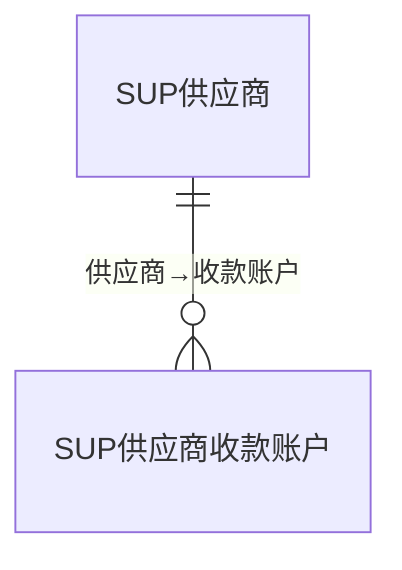
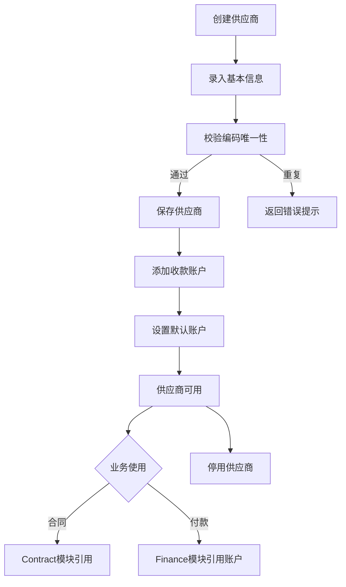

# 供应商管理模块 设计文档

## 1. 模块职责与边界

### 核心职责
- 供应商主数据管理（基本信息、联系方式、资质信息）
- 供应商编码唯一性保障
- 多收款账户管理（支持默认账户）
- 供应商启用/停用状态管理

### 不负责的内容
- 采购订单管理（由采购/合同模块负责）
- 供应商付款结算（由 Finance 模块负责）
- 供应商合同管理（由 Contract 模块负责）
- 供应商评价与考核

### 依赖关系
- **System** → 基础权限与组织
- 被依赖：**Contract** → 合同方关联供应商
- 被依赖：**Finance** → 付款时引用供应商收款账户

## 2. 数据库表设计

### 表清单

| 表名 | 中文说明 | 主键 | 关键字段 |
|------|---------|------|---------|
| SUP供应商 | 供应商主表 | FID (BIGINT IDENTITY) | FUID, F编码(UNIQUE), F全称, F简称, F统一社会信用代码, F纳税人识别号, F联系人, F电话, F状态 |
| SUP供应商收款账户 | 收款银行账户 | FID (BIGINT IDENTITY) | F供应商ID(FK CASCADE), F账户名称, F银行名称, F银行账号, F开户行, F是否默认 |

### ER关系

## 3. API 接口清单

### 供应商管理 (SupplierController)

| 方法 | 路径 | 功能 |
|------|------|------|
| GET | /api/supplier/suppliers | 供应商列表（分页） |
| GET | /api/supplier/suppliers/{id} | 供应商详情 |
| POST | /api/supplier/suppliers | 创建供应商 |
| PUT | /api/supplier/suppliers/{id} | 更新供应商 |
| DELETE | /api/supplier/suppliers/{id} | 删除供应商 |

### 收款账户管理 (SupplierBankAccountController)

| 方法 | 路径 | 功能 |
|------|------|------|
| GET | /api/supplier/suppliers/{supplierId}/accounts | 供应商账户列表 |
| POST | /api/supplier/suppliers/{supplierId}/accounts | 添加收款账户 |
| PUT | /api/supplier/accounts/{id} | 更新收款账户 |
| DELETE | /api/supplier/accounts/{id} | 删除收款账户 |

## 4. 业务流程

### 供应商管理流程

