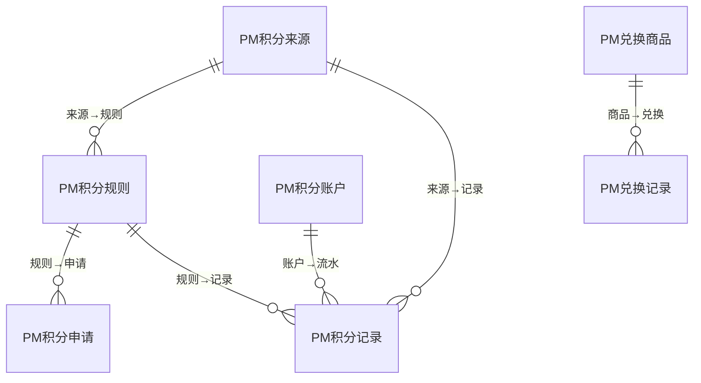
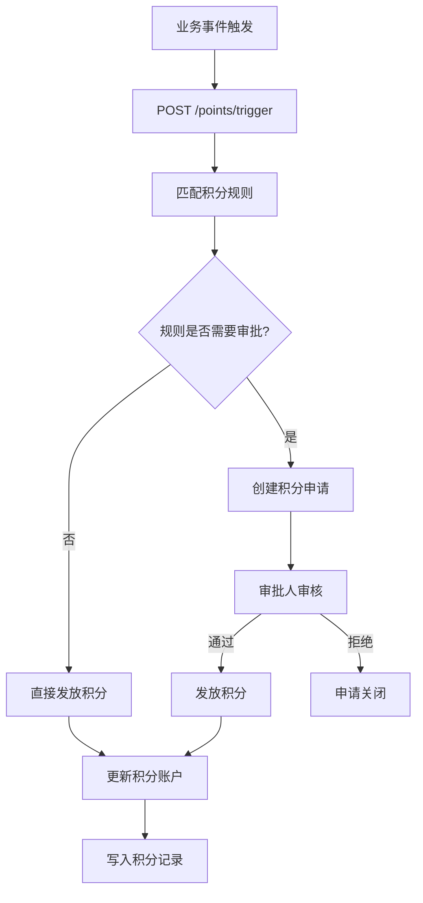
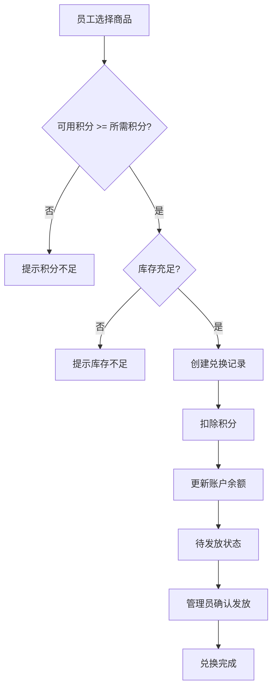

# 积分管理模块 设计文档

## 1. 模块职责与边界

### 核心职责
- 事件驱动积分规则引擎（积分来源→规则匹配→自动发放）
- 动态条件表达式与倍率规则支持
- 手动奖扣分（管理层配额机制）
- 积分申请审批流程（员工申请→审批→到账）
- 积分账户管理（实时余额、月/年统计）
- 兑换中心（商品上架、库存管理、兑换发放）
- 多维度排名系统（月度/季度/年度快照）
- 统计看板

### 不负责的内容
- 具体业务事件产生（由各业务模块触发）
- 财务结算（兑换实物的采购由 Finance 负责）
- 人员组织架构（由 HR/System 模块负责）

### 依赖关系
- **System** → 基础权限与多租户、用户信息
- **HR** → 员工/部门信息（排名、配额分配）
- 被依赖：各业务模块通过事件触发积分

## 2. 数据库表设计

### 表清单

| 表名 | 中文说明 | 主键 | 关键字段 |
|------|---------|------|---------|
| PM积分来源 | 积分来源字典 | FID (BIGINT IDENTITY) | F组织ID, F来源名称, F来源编码(组织内UNIQUE), F图标, F颜色 |
| PM积分规则 | 积分发放规则 | FID (BIGINT IDENTITY) | F组织ID, F来源ID(FK), F规则名称, F规则编码(组织内UNIQUE), F事件类型, F积分值, F条件表达式, F倍率规则, F周期上限, F需要审批 |
| PM积分申请 | 员工积分申请 | FID (BIGINT IDENTITY) | F组织ID, F申请人ID, F规则ID, F申请说明, F状态(0待审/1通过/2拒绝), F审批人ID |
| PM积分记录 | 积分流水明细 | FID (BIGINT IDENTITY) | F组织ID, F用户ID, F来源ID, F规则ID, F类型(0~5), F积分值, F余额, F关联模块/实体 |
| PM积分账户 | 用户积分账户 | FID (BIGINT IDENTITY) | F组织ID, F用户ID(组织内UNIQUE), F总积分, F已用积分, F可用积分, F本月奖/扣分 |
| PM兑换商品 | 兑换商品目录 | FID (BIGINT IDENTITY) | FUID, F组织ID, F名称, F分类, F所需积分, F库存(-1无限), F已兑换数, F状态 |
| PM兑换记录 | 兑换流水 | FID (BIGINT IDENTITY) | F组织ID, F用户ID, F商品ID, F扣除积分, F状态(0待发放/1已发放/2已取消) |
| PM管理层奖扣任务 | 管理层月度配额 | FID (BIGINT IDENTITY) | F组织ID, F管理者ID, F年月(组织+管理者+年月UNIQUE), F奖/扣分配额, F已用奖/扣分 |
| PM积分排名快照 | 排名定期快照 | FID (BIGINT IDENTITY) | F组织ID, F用户ID, F部门ID, F维度(0月/1季/2年), F周期, F总积分, F排名 |

### ER关系

## 3. API 接口清单

### 积分操作 (PointController)

| 方法 | 路径 | 功能 |
|------|------|------|
| POST | /api/points/award | 手动奖分 |
| POST | /api/points/deduct | 手动扣分 |
| POST | /api/points/trigger | 事件触发积分 |
| GET | /api/points/records | 积分流水列表 |
| GET | /api/points/records/my | 我的积分明细 |
| GET | /api/points/account | 查询用户账户 |
| GET | /api/points/account/my | 我的账户 |
| GET | /api/points/statistics | 统计看板 |

### 积分来源 (PointSourceController)

| 方法 | 路径 | 功能 |
|------|------|------|
| GET | /api/points/sources | 来源列表 |
| POST | /api/points/sources | 创建来源 |
| PUT | /api/points/sources/{id} | 更新来源 |
| DELETE | /api/points/sources/{id} | 删除来源 |

### 积分规则 (PointRuleController)

| 方法 | 路径 | 功能 |
|------|------|------|
| GET | /api/points/rules | 规则列表 |
| POST | /api/points/rules | 创建规则 |
| PUT | /api/points/rules/{id} | 更新规则 |
| DELETE | /api/points/rules/{id} | 删除规则 |

### 积分申请 (PointApplicationController)

| 方法 | 路径 | 功能 |
|------|------|------|
| GET | /api/points/applications | 申请列表 |
| POST | /api/points/applications | 提交申请 |
| PUT | /api/points/applications/{id}/approve | 审批通过 |
| PUT | /api/points/applications/{id}/reject | 审批拒绝 |

### 兑换中心 (RedeemController)

| 方法 | 路径 | 功能 |
|------|------|------|
| GET | /api/points/products | 商品列表 |
| POST | /api/points/products | 创建商品 |
| PUT | /api/points/products/{id} | 更新商品 |
| POST | /api/points/redeem | 兑换商品 |
| GET | /api/points/redeem/records | 兑换记录 |
| PUT | /api/points/redeem/{id}/deliver | 确认发放 |

### 管理层配额 (ManagerQuotaController)

| 方法 | 路径 | 功能 |
|------|------|------|
| GET | /api/points/quotas | 配额列表 |
| POST | /api/points/quotas | 创建/更新配额 |

### 排名 (RankingController)

| 方法 | 路径 | 功能 |
|------|------|------|
| GET | /api/points/rankings | 排名列表 |
| POST | /api/points/rankings/generate | 生成排名快照 |

## 4. 业务流程

### 事件驱动积分发放

### 兑换流程

