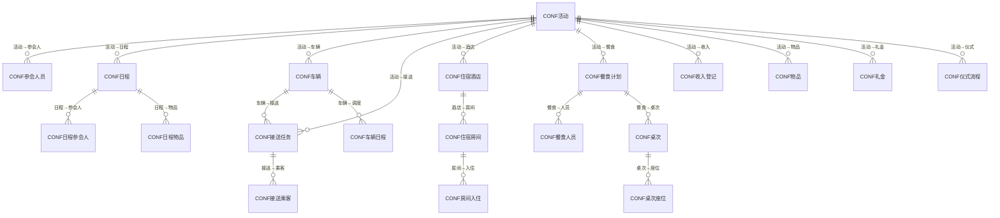
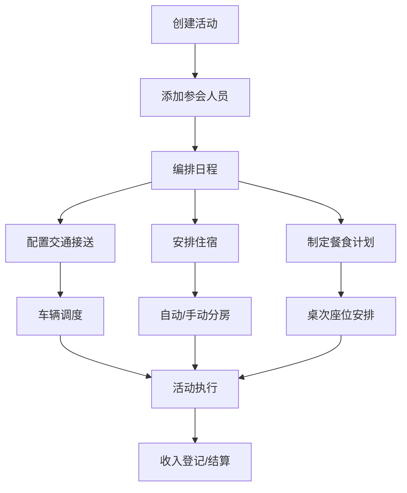
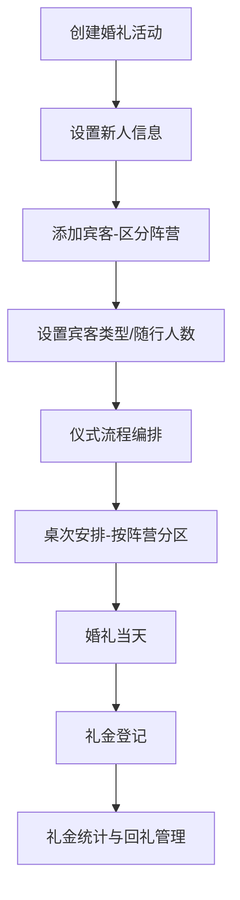

# 会务管理模块 设计文档

## 1. 模块职责与边界

### 核心职责
- 活动（会议/婚礼）创建与全生命周期管理
- 参会人员管理（报名、确认、行程信息）
- 日程编排与物品管理
- 交通接送管理（车辆调度、接送任务、乘客分配）
- 住宿管理（酒店、房间、分房）
- 餐食计划与桌次座位安排
- 收入登记（会务费/礼金）
- 婚礼增强功能（新人信息、宾客阵营、礼金登记、仪式流程编排）
- SaaS 多租户支持

### 不负责的内容
- 财务结算与对账（由 Finance 模块负责）
- 人员档案管理（由 HR 模块负责）
- 车辆台账管理（由 Vehicle 模块负责，会务车辆为临时资源）

### 依赖关系
- **System** → 基础权限与多租户
- 独立SaaS部署，可脱离其他模块运行

## 2. 数据库表设计

### 表清单（20张表）

| 表名 | 中文说明 | 主键 | 关键字段 |
|------|---------|------|---------|
| CONF活动 | 活动主表 | FID (INT IDENTITY) | F名称, F开始/结束日期, F地点, F状态, F负责人, F预算, F活动类型, F新郎/新娘姓名 |
| CONF参会人员 | 参会人 | FID (INT IDENTITY) | F活动ID(FK), F姓名, F性别, F单位, F角色, F来/回程信息, F状态, F阵营, F宾客类型, F随行人数 |
| CONF日程 | 日程安排 | FID (INT IDENTITY) | F活动ID(FK), F日期, F开始/结束时间, F标题, F类型, F排序 |
| CONF日程参会人 | 日程-参会人关联 | FID (INT IDENTITY) | F日程ID(FK), F参会人ID(FK) |
| CONF日程物品 | 日程物品需求 | FID (INT IDENTITY) | F日程ID(FK), F物品名称, F数量, F状态 |
| CONF车辆 | 活动车辆 | FID (INT IDENTITY) | F活动ID(FK), F车牌号, F车型, F座位数, F司机姓名/电话 |
| CONF接送任务 | 接送调度任务 | FID (INT IDENTITY) | F活动ID(FK), F车辆ID(FK), F类型, F日期/时间, F出发地, F目的地, F状态 |
| CONF接送乘客 | 接送任务-乘客关联 | FID (INT IDENTITY) | F接送任务ID(FK), F参会人ID(FK) |
| CONF住宿酒店 | 住宿酒店 | FID (INT IDENTITY) | F活动ID(FK), F酒店名称, F地址, F联系人/电话, F协议价格 |
| CONF住宿房间 | 酒店房间 | FID (INT IDENTITY) | F酒店ID(FK), F房间号, F房型, F入住/退房日期, F状态 |
| CONF房间入住 | 房间-入住人关联 | FID (INT IDENTITY) | F房间ID(FK), F参会人ID(FK) |
| CONF餐食计划 | 餐食计划 | FID (INT IDENTITY) | F活动ID(FK), F日期, F餐次, F用餐方式, F地点, F预计/实际人数 |
| CONF餐食人员 | 餐食-人员关联 | FID (INT IDENTITY) | F餐食计划ID(FK), F参会人ID(FK), F饮食备注 |
| CONF桌次 | 宴席桌次 | FID (INT IDENTITY) | F餐食计划ID(FK), F桌号, F桌名, F座位数 |
| CONF桌次座位 | 桌次座位分配 | FID (INT IDENTITY) | F桌次ID(FK), F参会人ID(FK), F座位号 |
| CONF收入登记 | 收入/费用登记 | FID (INT IDENTITY) | F活动ID(FK), F参会人ID(FK), F类型, F金额, F支付方式, F收据编号 |
| CONF物品 | 活动物品总管 | FID (INT IDENTITY) | F活动ID(FK), F名称, F类别, F需求/已到位数量, F单价/总价, F供应商, F状态 |
| CONF车辆日程 | 车辆调度日程 | FID (INT IDENTITY) | F活动ID(FK), F车辆ID(FK), F日期, F任务类型, F接送任务ID(FK) |
| CONF礼金 | 婚礼礼金登记 | FID (INT IDENTITY) | F活动ID(FK), F宾客ID(FK), F金额, F登记方式, F是否已回礼 |
| CONF仪式流程 | 婚礼仪式环节 | FID (INT IDENTITY) | F活动ID(FK), F环节名称, F开始时间, F时长分钟, F负责人, F背景音乐, F灯光方案, F阶段, F排序 |

### ER关系

## 3. API 接口清单

### 活动管理 (EventController)

| 方法 | 路径 | 功能 |
|------|------|------|
| GET | /api/conference/events | 活动列表 |
| GET | /api/conference/events/{id} | 活动详情 |
| POST | /api/conference/events | 创建活动 |
| PUT | /api/conference/events/{id} | 更新活动 |
| DELETE | /api/conference/events/{id} | 删除活动 |

### 参会人员 (AttendeeController)

| 方法 | 路径 | 功能 |
|------|------|------|
| GET | /api/conference/attendees | 参会人列表 |
| GET | /api/conference/attendees/{id} | 参会人详情 |
| POST | /api/conference/attendees | 添加参会人 |
| PUT | /api/conference/attendees/{id} | 更新参会人 |
| DELETE | /api/conference/attendees/{id} | 删除参会人 |
| POST | /api/conference/attendees/import | 批量导入 |

### 日程 (ScheduleController)

| 方法 | 路径 | 功能 |
|------|------|------|
| GET | /api/conference/schedules | 日程列表 |
| POST | /api/conference/schedules | 创建日程 |
| PUT | /api/conference/schedules/{id} | 更新日程 |
| DELETE | /api/conference/schedules/{id} | 删除日程 |

### 交通管理 (TransportController)

| 方法 | 路径 | 功能 |
|------|------|------|
| GET | /api/conference/transport/tasks | 接送任务列表 |
| POST | /api/conference/transport/tasks | 创建接送任务 |
| PUT | /api/conference/transport/tasks/{id} | 更新接送任务 |
| POST | /api/conference/transport/tasks/{id}/passengers | 分配乘客 |
| POST | /api/conference/transport/auto-assign | 自动调度 |

### 住宿管理 (AccommodationController)

| 方法 | 路径 | 功能 |
|------|------|------|
| GET | /api/conference/accommodation/hotels | 酒店列表 |
| POST | /api/conference/accommodation/hotels | 添加酒店 |
| GET | /api/conference/accommodation/rooms | 房间列表 |
| POST | /api/conference/accommodation/rooms | 添加房间 |
| POST | /api/conference/accommodation/rooms/{id}/checkin | 分配入住 |
| POST | /api/conference/accommodation/auto-assign | 自动分房 |

### 餐食 (MealController)

| 方法 | 路径 | 功能 |
|------|------|------|
| GET | /api/conference/meals | 餐食计划列表 |
| POST | /api/conference/meals | 创建餐食计划 |
| PUT | /api/conference/meals/{id} | 更新餐食计划 |

### 桌次安排 (TableArrangementController)

| 方法 | 路径 | 功能 |
|------|------|------|
| GET | /api/conference/tables | 桌次列表 |
| POST | /api/conference/tables | 创建桌次 |
| POST | /api/conference/tables/{id}/seats | 分配座位 |
| POST | /api/conference/tables/auto-arrange | 自动排桌 |

### 物品管理 (MaterialController)

| 方法 | 路径 | 功能 |
|------|------|------|
| GET | /api/conference/materials | 物品列表 |
| POST | /api/conference/materials | 创建物品 |
| PUT | /api/conference/materials/{id} | 更新物品 |

### 财务/收入 (FinanceController)

| 方法 | 路径 | 功能 |
|------|------|------|
| GET | /api/conference/finance/incomes | 收入列表 |
| POST | /api/conference/finance/incomes | 登记收入 |
| GET | /api/conference/finance/summary | 财务汇总 |

### 礼金管理 (GiftController)

| 方法 | 路径 | 功能 |
|------|------|------|
| GET | /api/conference/gifts | 礼金列表 |
| POST | /api/conference/gifts | 登记礼金 |
| PUT | /api/conference/gifts/{id} | 更新礼金 |
| GET | /api/conference/gifts/statistics | 礼金统计 |

### 仪式流程 (CeremonyController)

| 方法 | 路径 | 功能 |
|------|------|------|
| GET | /api/conference/ceremonies | 仪式环节列表 |
| POST | /api/conference/ceremonies | 创建环节 |
| PUT | /api/conference/ceremonies/{id} | 更新环节 |
| DELETE | /api/conference/ceremonies/{id} | 删除环节 |

### 车辆调度 (VehicleScheduleController)

| 方法 | 路径 | 功能 |
|------|------|------|
| GET | /api/conference/vehicle-schedules | 车辆日程列表 |
| POST | /api/conference/vehicle-schedules | 创建调度 |
| PUT | /api/conference/vehicle-schedules/{id} | 更新调度 |

## 4. 业务流程

### 活动筹备全流程

### 婚礼场景增强流程

