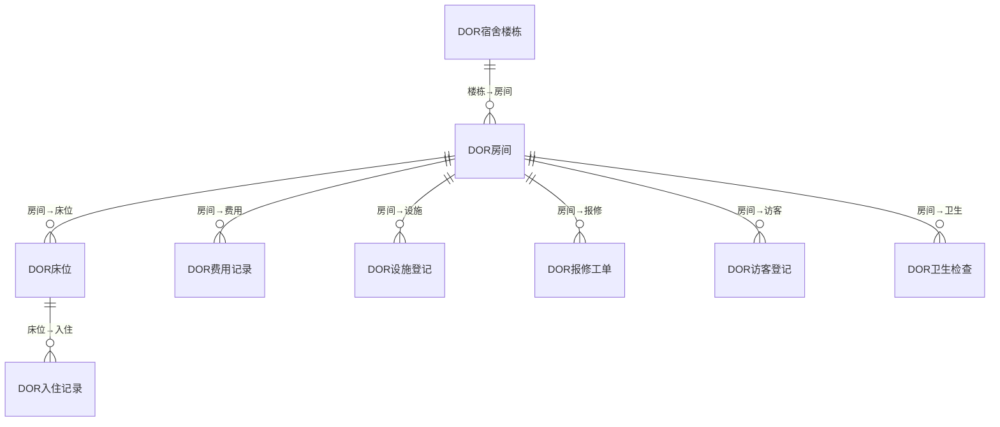
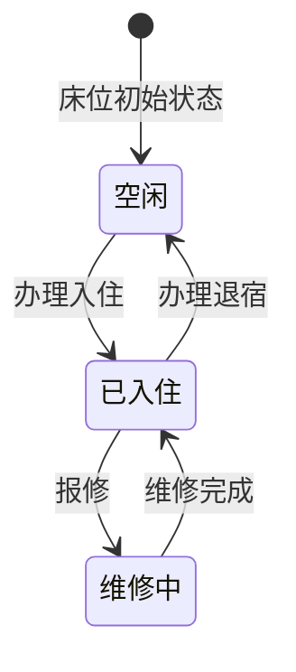
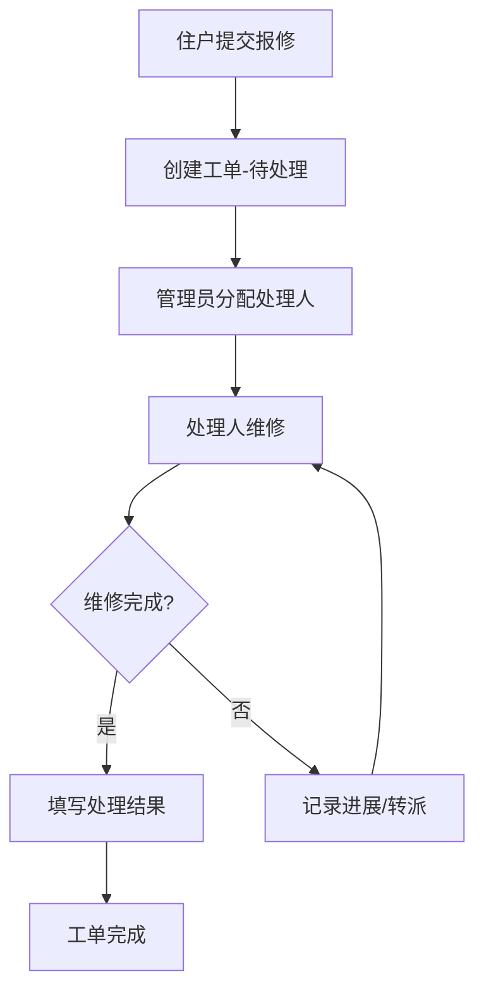
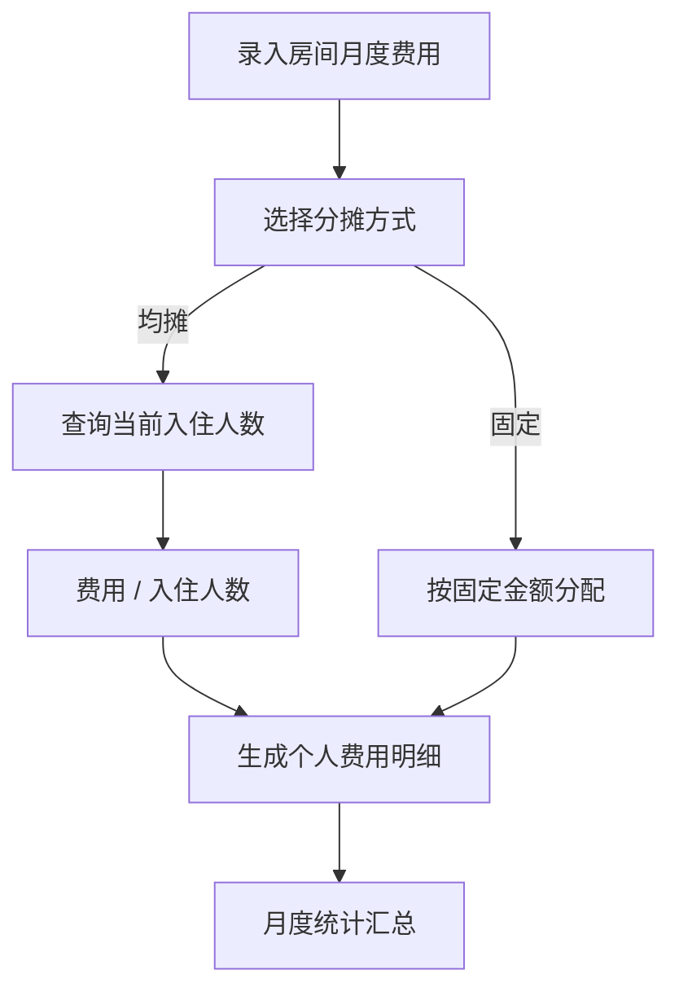

# 宿舍管理模块 设计文档

## 1. 模块职责与边界

### 核心职责
- 层级化资源管理（楼栋→房间→床位）
- 入住/退宿全流程管理
- 费用记录与按房间分摊
- 设施资产登记与盘点
- 报修工单管理（提交→处理→完成）
- 访客登记与管理
- 卫生检查与评分

### 不负责的内容
- 员工人事信息管理（由 HR 模块负责）
- 费用财务结算（由 Finance 模块负责）
- 维修物资采购（由采购/供应商模块负责）

### 依赖关系
- **System** → 基础权限与组织
- **HR** → 员工信息（入住人、报修人）

## 2. 数据库表设计

### 表清单

| 表名 | 中文说明 | 主键 | 关键字段 |
|------|---------|------|---------|
| DOR宿舍楼栋 | 楼栋主表 | FID (BIGINT IDENTITY) | FUID, F编码(UNIQUE), F名称, F地址, F总楼层, F管理员ID, F宿舍类型, F状态 |
| DOR房间 | 房间 | FID (BIGINT IDENTITY) | F楼栋ID(FK CASCADE), F楼层, F房号(楼栋内UNIQUE), F床位数, F房间类型, F状态 |
| DOR床位 | 床位 | FID (BIGINT IDENTITY) | F房间ID(FK CASCADE), F床位号(房间内UNIQUE), F状态 |
| DOR入住记录 | 入住/退宿记录 | FID (BIGINT IDENTITY) | F床位ID(FK), F员工ID, F入住日期, F退宿日期, F状态 |
| DOR费用记录 | 房间费用 | FID (BIGINT IDENTITY) | F房间ID(FK), F费用类型, F金额, F月份, F分摊方式, F状态 |
| DOR设施登记 | 房间设施资产 | FID (BIGINT IDENTITY) | F房间ID(FK CASCADE), F设施名称, F数量, F状态 |
| DOR报修工单 | 报修单 | FID (BIGINT IDENTITY) | F房间ID(FK), F报修人ID, F描述, F紧急程度, F处理人ID, F处理结果, F状态 |
| DOR访客登记 | 访客来访记录 | FID (BIGINT IDENTITY) | F房间ID(FK), F访客姓名, F访客电话, F被访人ID, F到访/离开时间, F状态 |
| DOR卫生检查 | 卫生检查记录 | FID (BIGINT IDENTITY) | F房间ID(FK), F检查人ID, F检查日期, F评分, F检查结果 |

### ER关系

## 3. API 接口清单

### 楼栋管理 (BuildingController)

| 方法 | 路径 | 功能 |
|------|------|------|
| GET | /api/dormitory/buildings | 楼栋列表 |
| GET | /api/dormitory/buildings/{id} | 楼栋详情 |
| POST | /api/dormitory/buildings | 创建楼栋 |
| PUT | /api/dormitory/buildings/{id} | 更新楼栋 |
| DELETE | /api/dormitory/buildings/{id} | 删除楼栋 |

### 房间管理 (RoomController)

| 方法 | 路径 | 功能 |
|------|------|------|
| GET | /api/dormitory/rooms | 房间列表 |
| GET | /api/dormitory/rooms/{id} | 房间详情 |
| POST | /api/dormitory/rooms | 创建房间 |
| PUT | /api/dormitory/rooms/{id} | 更新房间 |
| DELETE | /api/dormitory/rooms/{id} | 删除房间 |

### 床位管理 (BedController)

| 方法 | 路径 | 功能 |
|------|------|------|
| GET | /api/dormitory/beds | 床位列表 |
| GET | /api/dormitory/beds/{id} | 床位详情 |
| POST | /api/dormitory/beds | 创建床位 |
| PUT | /api/dormitory/beds/{id} | 更新床位 |
| DELETE | /api/dormitory/beds/{id} | 删除床位 |

### 入住管理 (ResidenceController)

| 方法 | 路径 | 功能 |
|------|------|------|
| GET | /api/dormitory/residences | 入住记录列表 |
| GET | /api/dormitory/residences/{id} | 入住记录详情 |
| POST | /api/dormitory/residences | 办理入住 |
| PUT | /api/dormitory/residences/{id} | 更新入住记录 |
| PUT | /api/dormitory/residences/{id}/checkout | 办理退宿 |

### 费用管理 (ExpenseController)

| 方法 | 路径 | 功能 |
|------|------|------|
| GET | /api/dormitory/expenses | 费用记录列表 |
| POST | /api/dormitory/expenses | 录入费用 |
| PUT | /api/dormitory/expenses/{id} | 更新费用 |

### 设施管理 (FacilityController)

| 方法 | 路径 | 功能 |
|------|------|------|
| GET | /api/dormitory/facilities | 设施列表 |
| POST | /api/dormitory/facilities | 登记设施 |
| PUT | /api/dormitory/facilities/{id} | 更新设施 |

### 报修工单 (RepairOrderController)

| 方法 | 路径 | 功能 |
|------|------|------|
| GET | /api/dormitory/repairs | 工单列表 |
| GET | /api/dormitory/repairs/{id} | 工单详情 |
| POST | /api/dormitory/repairs | 提交报修 |
| PUT | /api/dormitory/repairs/{id} | 处理工单 |

### 访客管理 (VisitorController)

| 方法 | 路径 | 功能 |
|------|------|------|
| GET | /api/dormitory/visitors | 访客记录列表 |
| POST | /api/dormitory/visitors | 登记访客 |
| PUT | /api/dormitory/visitors/{id} | 更新访客记录 |
| PUT | /api/dormitory/visitors/{id}/leave | 登记离开 |

### 卫生检查 (HygieneCheckController)

| 方法 | 路径 | 功能 |
|------|------|------|
| GET | /api/dormitory/hygiene-checks | 检查记录列表 |
| POST | /api/dormitory/hygiene-checks | 创建检查记录 |

### 统计 (StatisticsController)

| 方法 | 路径 | 功能 |
|------|------|------|
| GET | /api/dormitory/statistics | 宿舍统计概览 |

## 4. 业务流程

### 入住/退宿流程

### 报修工单流程

### 费用分摊流程

