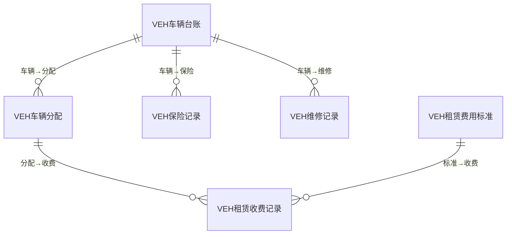
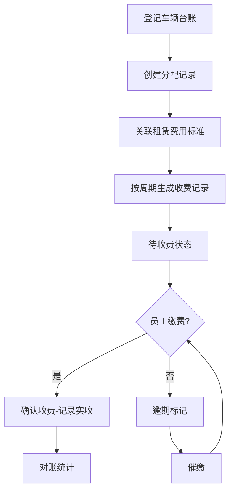
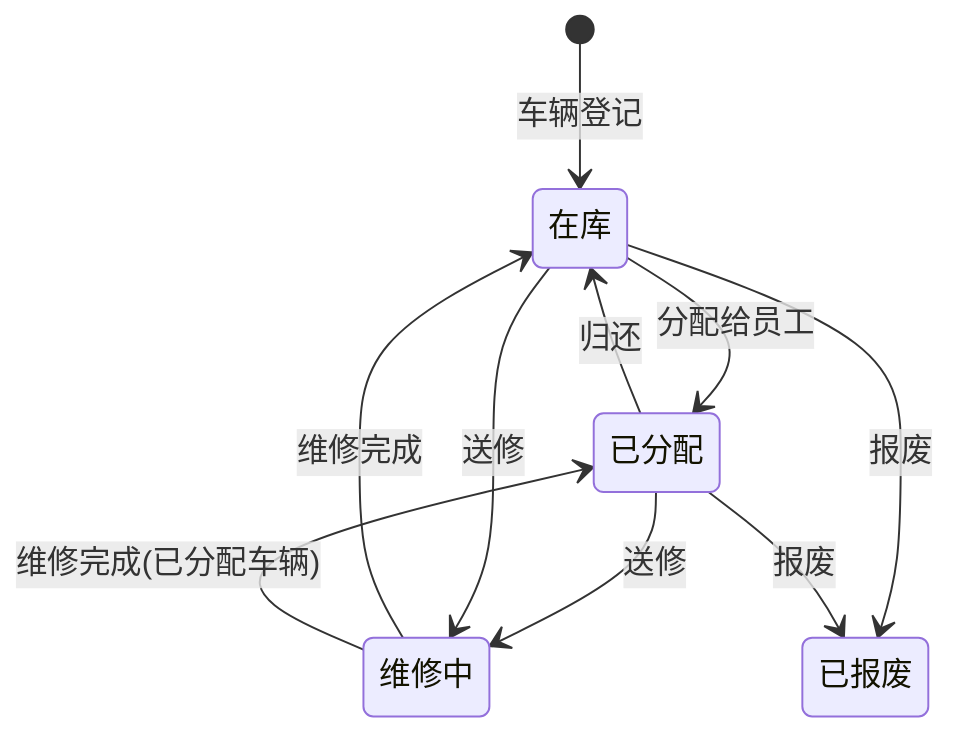
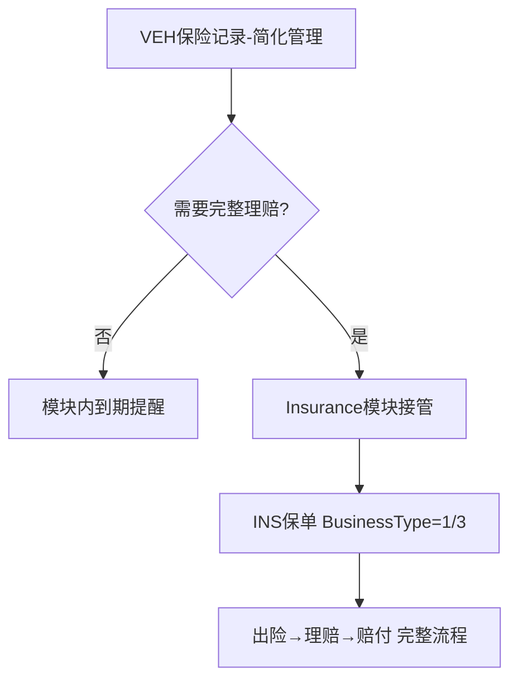

# 车辆管理模块 设计文档

## 1. 模块职责与边界

### 核心职责
- 车辆台账管理（登记、权属、状态追踪）
- 员工车辆分配与历史记录
- 租赁费用标准管理
- 租赁收费管理（周期计费、应收/实收对账）
- 车辆保险记录（模块内简化版，与Insurance模块联动）
- 维修保养追踪
- GPS设备关联
- 车辆统计看板

### 不负责的内容
- 完整保险理赔流程（由 Insurance 模块负责）
- 员工人事信息（由 HR 模块负责）
- 费用财务核算（由 Finance 模块负责）

### 依赖关系
- **System** → 基础权限与组织
- **HR** → 员工信息（分配对象）
- **Insurance** → 车辆保险联动（Insurance通过 BusinessType=1/3 关联车辆）
- 被依赖：**Insurance** → 通过关联对象ID引用车辆

## 2. 数据库表设计

### 表清单

| 表名 | 中文说明 | 主键 | 关键字段 |
|------|---------|------|---------|
| VEH车辆台账 | 车辆主表 | FID (BIGINT IDENTITY) | FUID, F编码(UNIQUE), F车牌号, F品牌, F车架号, F权属类型, F所有人ID/姓名, F购入日期/价格, F车辆状态, FGPS设备号 |
| VEH车辆分配 | 分配记录 | FID (BIGINT IDENTITY) | FUID, F车辆ID(FK CASCADE), F员工ID, F员工姓名, F分配类型, F开始/结束日期, F分配状态 |
| VEH租赁费用标准 | 租赁费率 | FID (BIGINT IDENTITY) | FUID, F名称, F金额, F收费周期, F生效/失效日期, F状态 |
| VEH租赁收费记录 | 租赁收费明细 | FID (BIGINT IDENTITY) | FUID, F车辆ID, F分配ID(FK CASCADE), F员工ID, F费用标准ID(FK SET NULL), F收费周期开始/结束, F应收/实收金额, F收费状态 |
| VEH保险记录 | 车辆保险（简化） | FID (BIGINT IDENTITY) | FUID, F车辆ID(FK CASCADE), F保险类型, F保险公司, F保单号, F保费, F生效/到期日期, F保险状态 |
| VEH维修记录 | 维修保养 | FID (BIGINT IDENTITY) | FUID, F车辆ID(FK CASCADE), F维修日期, F维修类型, F维修项目, F维修单位, F维修费用, F承担方, F维修状态 |

### ER关系

## 3. API 接口清单

### 车辆台账 (VehicleController)

| 方法 | 路径 | 功能 |
|------|------|------|
| GET | /api/vehicle/vehicles | 车辆列表（分页） |
| GET | /api/vehicle/vehicles/{id} | 车辆详情 |
| POST | /api/vehicle/vehicles | 创建车辆 |
| PUT | /api/vehicle/vehicles/{id} | 更新车辆 |
| DELETE | /api/vehicle/vehicles/{id} | 删除车辆 |
| GET | /api/vehicle/vehicles/statistics | 车辆统计 |

### 车辆分配 (VehicleAssignmentController)

| 方法 | 路径 | 功能 |
|------|------|------|
| GET | /api/vehicle/assignments | 分配记录列表 |
| GET | /api/vehicle/assignments/{id} | 分配详情 |
| POST | /api/vehicle/assignments | 创建分配 |
| PUT | /api/vehicle/assignments/{id} | 更新分配 |
| PUT | /api/vehicle/assignments/{id}/return | 归还车辆 |

### 租赁费用标准 (RentalStandardController)

| 方法 | 路径 | 功能 |
|------|------|------|
| GET | /api/vehicle/rental-standards | 费用标准列表 |
| GET | /api/vehicle/rental-standards/{id} | 标准详情 |
| POST | /api/vehicle/rental-standards | 创建标准 |
| PUT | /api/vehicle/rental-standards/{id} | 更新标准 |
| DELETE | /api/vehicle/rental-standards/{id} | 删除标准 |

### 租赁收费 (RentalChargeController)

| 方法 | 路径 | 功能 |
|------|------|------|
| GET | /api/vehicle/rental-charges | 收费记录列表 |
| GET | /api/vehicle/rental-charges/{id} | 收费记录详情 |
| POST | /api/vehicle/rental-charges | 创建收费记录 |
| PUT | /api/vehicle/rental-charges/{id} | 更新收费记录 |
| PUT | /api/vehicle/rental-charges/{id}/confirm | 确认收费 |
| POST | /api/vehicle/rental-charges/generate | 批量生成收费 |

### 车辆维修 (VehicleMaintenanceController)

| 方法 | 路径 | 功能 |
|------|------|------|
| GET | /api/vehicle/maintenance | 维修记录列表 |
| GET | /api/vehicle/maintenance/{id} | 维修记录详情 |
| POST | /api/vehicle/maintenance | 创建维修记录 |
| PUT | /api/vehicle/maintenance/{id} | 更新维修记录 |

### GPS (VehicleGpsController)

| 方法 | 路径 | 功能 |
|------|------|------|
| GET | /api/vehicle/gps/{vehicleId} | 获取车辆GPS信息 |

## 4. 业务流程

### 车辆分配与租赁收费

### 车辆生命周期

### 与Insurance模块联动

