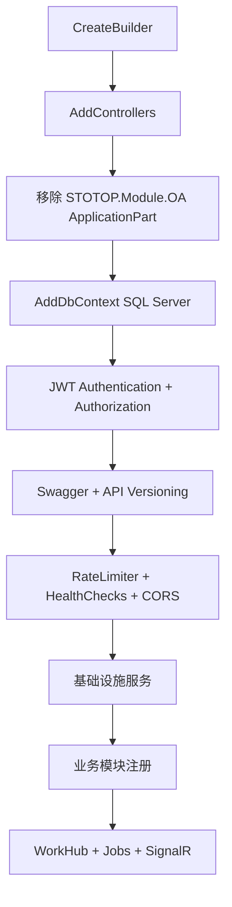
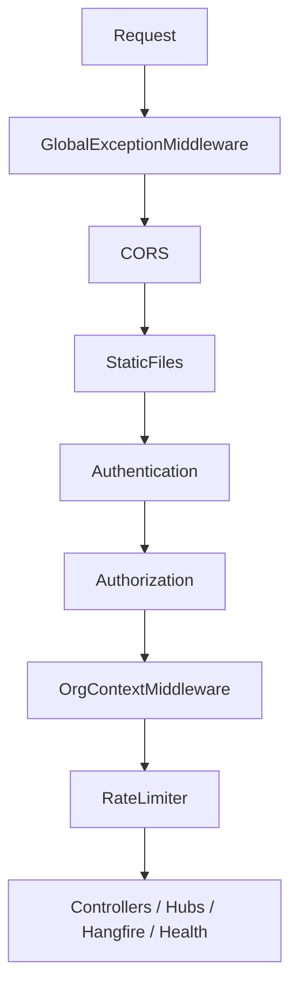

# WebAPI 启动层设计文档（STOTOP.WebAPI）

## 1. 职责边界

`STOTOP.WebAPI` 是应用入口和组合根，负责：

- 读取运行配置和系统数据库连接；
- 注册控制器、认证、授权、Swagger、API Versioning、限流、健康检查；
- 注册基础设施服务、业务模块、后台任务和 SignalR；
- 组装中间件管道；
- 在启动阶段执行数据库初始化和基线校验。

WebAPI 层不承载业务规则，业务逻辑应保留在各模块 Service 中。

## 2. 启动前置能力

启动参数 `--export-baseline <path>` 会在创建 WebApplication 前直接导出数据库 baseline 快照并退出，用于发布前后对比。

系统数据库连接通过 `DbConnectionsHelper.GetSystemConnectionString(...)` 读取，运行时以 `db-connections.json` 为准。

## 3. 服务注册流程

### 控制器注册

`AddControllers()` 使用 camelCase JSON。注册时会移除 `STOTOP.Module.OA` 的 MVC ApplicationPart，因此历史 OA Controller 不再暴露为 API。

### 基础设施服务

| 服务 | 生命周期 | 说明 |
|------|----------|------|
| `STOTOPDbContext` | Scoped | SQL Server、重试策略、NoTrackingWithIdentityResolution |
| `IDatabaseSeeder` / `DatabaseMigrator` | Singleton | 统一调度模块迁移与基线检查 |
| `IDynamicDbContextFactory` | Singleton | 运行时创建动态 DbContext |
| `IHttpContextAccessor` | Singleton | 请求上下文 |
| `IOrgContextAccessor` / `HttpOrgContextAccessor` | Scoped | 当前组织上下文 |

## 4. 模块注册顺序

| 顺序 | 注册调用 | 说明 |
|------|----------|------|
| 1 | `AddSystemModule()` | 用户、角色、权限、组织、菜单 |
| 2 | `AddFinanceModule()` | 财务、预算、报表、账套 |
| 3 | `AddSupplierModule()` | 供应商 |
| 4 | `AddHrModule()` | 人事 |
| 5 | `AddDormitoryModule()` | 宿舍 |
| 6 | `AddVehicleModule()` | 车辆 |
| 7 | `AddInsuranceModule()` | 保险 |
| 8 | `AddCardFlowModule(configuration)` | 卡片流转、审批、导入校验、自动插件 |
| 9 | `AddExpressModule()` | 快递计费、报价、运单 |
| 10 | `PricingPlugin` / `CostPlugin` | Express 计费插件 |
| 11 | `AddPointsModule()` | 积分 |
| 12 | `AddKsfModule()` | KSF |
| 13 | `AddPpvModule()` | PPV |
| 14 | `AddSalaryModule()` | 薪酬 |
| 15 | `AddTaskModule()` | 目标、项目、任务 |
| 16 | `AddCrmModule()` | CRM |
| 17 | `AddContractModule()` | 合同 |
| 18 | `AddQualityModule()` | 质量 |
| 19 | `AddConferenceModule()` | 会议 |
| 20 | `AddWorkflowModule()` | 事件、派发、底层协作能力 |
| 21 | `IWorkHubService` / `IWorkHubNotifier` | 跨模块工作台 |

CardFlow 必须先于 Express 注册，因为 Express 依赖 CardFlow 提供的导入服务和自动插件进度能力。

## 5. 中间件与端点

关键端点：

| 端点 | 用途 |
|------|------|
| `/health` | 后端健康检查 |
| `/api/version` | 版本信息 |
| `/hangfire` | Hangfire 面板 |
| `/hubs/*` | SignalR 实时通道 |

默认开发监听地址为 `http://localhost:9000`。

## 6. 数据库初始化

启动初始化由 `DatabaseMigrator` 统一调度。核心职责包括：

- 按模块执行版本化迁移；
- 检查系统、财务、快递、Workflow、CardFlow、菜单等基线数据；
- 执行 `BaselineReferenceDataSeeder.Seed(ctx)`；
- 调用 `OASeeder.PurgeRetiredReferenceData(ctx)` 清理已退役 OA 引用数据。

旧 `EnsureOAProcessPermissions()` 流程已不再作为启动步骤存在。新审批、动态表单和卡片待办应接入 CardFlow。
