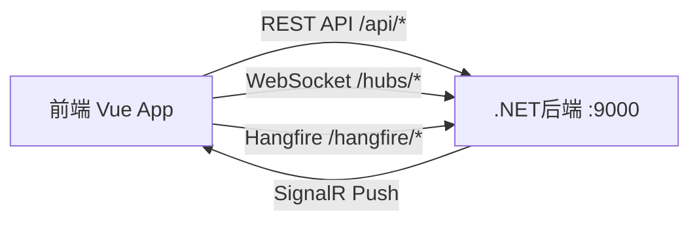
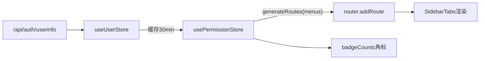
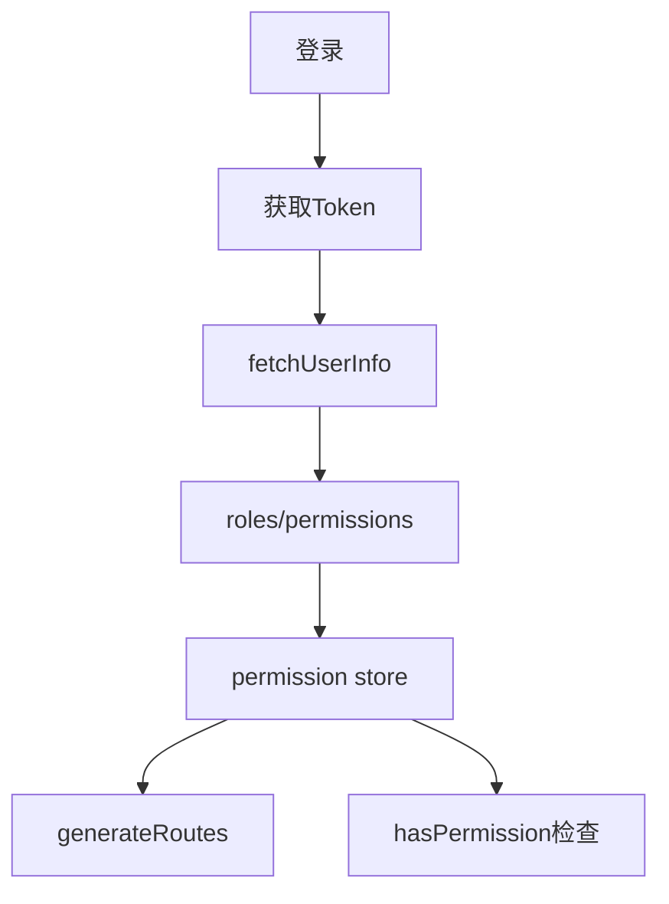
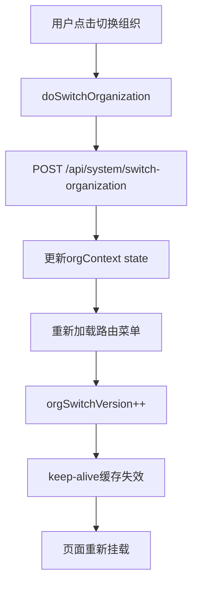
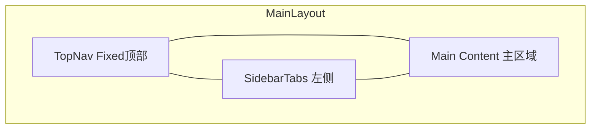

# Frontend 前端设计文档

## 1. 模块职责与边界

### 1.1 核心职责

- 提供企业级多业务模块的Web管理界面（PC端 + 移动端轻量审批）
- 实现基于角色权限的动态菜单与路由系统
- 支持多组织隔离的数据展示与操作
- 提供实时数据推送（SignalR）、图表可视化（ECharts）、流程编辑（Vue Flow）等高级交互能力

### 1.2 技术栈总览

| 组件 | 版本 | 说明 |
|------|------|------|
| Vue | 3.5.30 | Composition API + `<script setup>` |
| Vue Router | 4.6.4 | History模式，动态路由注入 |
| Pinia | 3.0.4 | 状态管理 |
| Vite | 8.0.8 | 构建工具，开发端口9001 |
| TypeScript | 5.9.3 | 严格模式 |
| Ant Design Vue | 4.2.6 | PC端主UI库 |
| Vant | 4.9.24 | 移动端UI |
| form-create | 3.2.38 | 动态表单引擎 |
| antd-designer | 3.4.0 | 可视化表单设计器 |
| axios | 1.14.0 | HTTP客户端 |
| echarts | 6.0.0 | 图表可视化 |
| @microsoft/signalr | 10.0.0 | 实时通信 |
| @antv/g6 | 5.1.0 | 关系图可视化 |
| @vue-flow/core | 1.48.2 | 流程图编辑器 |

### 1.3 与后端的交互方式



- **REST API**：所有业务数据通过 `/api/*` 前缀访问后端
- **WebSocket**：通过 `/hubs/*` 建立SignalR长连接，接收实时进度/通知
- **Hangfire**：通过 `/hangfire/*` 访问后台任务面板

---

## 2. 项目结构与构建配置

### 2.1 目录结构

```
web/src/
├── main.ts                    # 应用入口
├── App.vue                    # 根组件
├── router/                    # 路由配置
│   ├── index.ts               # Router实例、导航守卫
│   └── routes.ts              # 路由表定义
├── stores/                    # Pinia状态管理（11个模块）
├── layouts/                   # 布局组件
│   ├── MainLayout.vue         # 主布局框架
│   ├── TopNav.vue             # 顶部导航
│   ├── SidebarTabs.vue        # 侧栏标签页
│   ├── SideMenu.vue           # 侧边菜单
│   └── MegaMenu.vue           # 大菜单
├── views/                     # 业务页面（按模块分目录）
├── api/                       # API封装
│   ├── request.ts             # axios实例与拦截器
│   └── [module].ts            # 各业务API模块（20+）
├── components/                # 公共组件
│   ├── AppBreadcrumb.vue      # 面包屑
│   ├── PageHeader.vue         # 页面头部
│   ├── OrgSwitcher.vue        # 组织切换器
│   ├── form-widgets/          # 表单组件
│   ├── charts/                # 图表组件
│   └── workflow/              # 流程组件
├── types/                     # TypeScript类型定义
├── utils/                     # 工具函数
├── composables/               # 组合式函数
├── styles/                    # 全局样式
├── assets/                    # 静态资源
├── forms/                     # 表单配置
└── config/                    # 应用配置
```

### 2.2 构建工具配置（Vite）

| 配置项 | 值 | 说明 |
|--------|------|------|
| 路径别名 | `@/` → `src/` | 简化import路径 |
| 开发端口 | 9001 | HMR WebSocket同端口 |
| 代理 `/api/*` | `localhost:9000` | 超时15s |
| 代理 `/hangfire/*` | `localhost:9000` | 超时30s |
| 代理 `/hubs/*` | `localhost:9000` | WebSocket，超时60s |
| 自动导入 | unplugin-auto-import | Vue/Router/Pinia API无需显式import |
| 组件自动注册 | unplugin-vue-components | Ant Design Vue组件按需导入 |

### 2.3 TypeScript配置

- 严格模式（`strict: true`）
- 路径映射：`@/*` → `src/*`
- 目标：ESNext

### 2.4 依赖列表

> 核心运行时依赖按文件大小排序（API模块体积反映业务复杂度）：

| API模块 | 文件大小 | 覆盖业务 |
|---------|----------|----------|
| express.ts | 45.7KB | 快递业务（报价/运单/计费/网点） |
| conference.ts | 41.1KB | 会议管理 |
| finance.ts | 34.7KB | 财务（凭证/报表/账套） |
| crm.ts | 24.1KB | 客户关系管理 |
| oa.ts | 22.5KB | OA办公（审批/待办） |
| task.ts | 18.8KB | 任务管理 |
| datacenter.ts | 15.4KB | 数据中心 |
| insurance.ts | 15KB | 保险 |
| dormitory.ts | 14KB | 宿舍管理 |
| vehicle.ts | 9.5KB | 车辆管理 |
| contract.ts | 9.1KB | 合同管理 |
| points.ts | 8KB | 积分 |
| quality.ts | 5.8KB | 质量管理 |
| supplier.ts | 4.1KB | 供应商管理 |

---

## 3. 路由与菜单系统

### 3.1 路由分类（静态/动态/移动端）

```mermaid
graph TB
    R[路由系统] --> S[静态路由]
    R --> D[动态路由]
    R --> M[移动端路由]
    S --> S1[/login]
    S --> S2[/setup]
    S --> S3[/404]
    D --> D1[主布局路由 需认证]
    M --> M1[/m/oa/todo]
    M --> M2[/m/oa/approve/:taskId]
```

### 3.2 动态路由生成机制


1. 登录成功后调用 `/api/auth/userinfo` 获取用户信息（含菜单树）
2. `useUserStore.fetchUserInfo()` 缓存用户数据（30分钟有效）
3. `usePermissionStore.generateRoutes(menus)` 根据菜单权限过滤路由表
4. 通过 `router.addRoute()` 动态注入可访问路由
5. `SidebarTabs` 组件渲染最终菜单

### 3.3 导航守卫

守卫逻辑按优先级执行：

| 步骤 | 条件 | 动作 |
|------|------|------|
| 1 | 目标为免登录页（/setup, /login） | 放行 |
| 2 | 无token | 重定向 → /login |
| 3 | 有token且目标为/login | 重定向 → / |
| 4 | 动态路由未加载 | 加载用户信息 → 生成路由 → 注入 → 获取角标 → 重新导航 |
| 5 | 其他 | 放行 |

### 3.4 菜单数据流



### 3.5 完整路由表

| 路由前缀 | 模块 | 认证 | 布局 |
|----------|------|------|------|
| `/login` | 登录 | 否 | 无 |
| `/setup` | 初始化设置 | 否 | 无 |
| `/404` | 异常页 | 否 | 无 |
| `/m/oa/*` | 移动端OA | 是 | 移动端布局(Vant) |
| `/dashboard` | 仪表盘 | 是 | MainLayout |
| `/system/*` | 系统管理 | 是 | MainLayout |
| `/finance/*` | 财务 | 是 | MainLayout |
| `/express/*` | 快递 | 是 | MainLayout |
| `/dataimport/*` | 数据导入 | 是 | MainLayout |
| `/datacenter/*` | 数据中心 | 是 | MainLayout |
| `/conference/*` | 会议 | 是 | MainLayout |
| `/crm/*` | CRM | 是 | MainLayout |
| `/task/*` | 任务 | 是 | MainLayout |
| `/oa/*` | OA办公 | 是 | MainLayout |
| `/hr/*` | 人力资源 | 是 | MainLayout |
| `/dormitory/*` | 宿舍 | 是 | MainLayout |
| `/vehicle/*` | 车辆 | 是 | MainLayout |
| `/points/*` | 积分 | 是 | MainLayout |
| `/quality/*` | 质量 | 是 | MainLayout |
| `/insurance/*` | 保险 | 是 | MainLayout |
| `/contract/*` | 合同 | 是 | MainLayout |
| `/supplier/*` | 供应商 | 是 | MainLayout |
| `/workhub` | 工作台 | 是 | MainLayout |
| `/report/*` | 报表 | 是 | MainLayout |

---

## 4. 状态管理

### 4.1 Store模块划分

| Store | 职责 | 关键State | 持久化 |
|-------|------|-----------|--------|
| user | 认证与用户信息 | token, userInfo, roles, permissions | token持久化 |
| permission | 权限与菜单 | menus, routes, sidebarMenus, badgeCounts | 否 |
| app | 全局应用状态 | device, loading, version, currentModule | 否 |
| sidebar | 侧栏UI状态 | collapsed, pinnedEntries, openTabs | localStorage |
| theme | 主题配置 | themeConfig, antdTheme | 否 |
| orgContext | 组织隔离 | currentOrgId, organizations, orgRoles, orgPermissions, orgSwitchVersion | 否 |
| accountSet | 账套管理 | accountSets, currentAccountSetId | 否 |
| conversation | 会话 | - | 否 |
| enterpriseInfo | 企业信息 | - | 否 |
| recommendation | 推荐 | - | 否 |
| todo | 待办 | - | 否 |

### 4.2 认证与权限



- Token存储于 `useUserStore`，请求时通过拦截器注入 `Authorization: Bearer {token}`
- 权限检查方法：`hasPermission(code)` / `hasAnyPermission(codes[])`

### 4.3 组织隔离机制



核心要点：
- 所有API请求头注入：`X-Org-Context: {currentOrgId}`
- 组织切换后 `orgSwitchVersion` 自增，触发 `keep-alive` 的 `key` 变化，强制组件重新渲染
- 组织级权限独立：`orgRoles`、`orgPermissions` 随切换刷新

### 4.4 UI状态（侧栏/主题）

**侧栏**：
- `collapsed`：展开(180px) / 折叠(48px)，宽度通过CSS变量控制
- `pinnedEntries`：用户固定的快捷菜单
- `openTabs`：已打开标签页，持久化到 `localStorage`

**主题**：
- 通过 Ant Design Vue `ConfigProvider` 注入全局主题变量
- 支持动态CSS注入实现运行时主题切换

---

## 5. 布局与组件体系

### 5.1 主布局结构



| 区域 | 组件 | 说明 |
|------|------|------|
| 顶部 | TopNav | Fixed定位，包含Logo、搜索、通知、用户头像、组织切换 |
| 左侧 | SidebarTabs | 模块标签 + 子菜单，展开180px / 折叠48px |
| 主区域 | RouterView + KeepAlive | 业务页面，缓存上限20个组件 |

### 5.2 UI组件库

| 场景 | 组件库 | 用途 |
|------|--------|------|
| PC端 | Ant Design Vue 4.2.6 | 表格、表单、弹窗、布局等 |
| 移动端 | Vant 4.9.24 | OA审批、待办等移动页面 |
| 表单设计 | form-create + antd-designer | 动态表单渲染与可视化设计 |
| 图表 | ECharts 6.0.0 | 业务数据可视化 |
| 关系图 | @antv/g6 5.1.0 | 组织关系、网络拓扑 |
| 流程图 | @vue-flow/core 1.48.2 | 工作流/审批流编辑器 |

### 5.3 自定义公共组件

| 组件 | 路径 | 职责 |
|------|------|------|
| AppBreadcrumb | `src/components/AppBreadcrumb.vue` | 面包屑导航 |
| PageHeader | `src/components/PageHeader.vue` | 统一页面头部（标题+操作区） |
| OrgSwitcher | `src/components/OrgSwitcher.vue` | 组织切换下拉 |
| form-widgets/ | `src/components/form-widgets/` | 自定义表单控件集 |
| charts/ | `src/components/charts/` | 封装的图表组件 |
| workflow/ | `src/components/workflow/` | 流程设计器组件 |

### 5.4 响应式设计

| 断点 | 宽度 | 适配策略 |
|------|------|----------|
| sm | 768px | 侧栏折叠，表格横向滚动 |
| md | 1024px | 标准PC布局 |
| lg | 1280px | 宽屏优化 |
| xl | 1440px | 超宽屏多列布局 |

---

## 6. API对接模式

### 6.1 HTTP客户端封装

文件：`src/api/request.ts`

```typescript
// 核心配置
const instance = axios.create({
  baseURL: '/api',
  timeout: 15000
})
```

### 6.2 请求/响应拦截器

**请求拦截器**：
- 注入 `Authorization: Bearer {token}`
- 注入 `X-Org-Context: {currentOrgId}`

**响应拦截器**：

| 状态码 | 处理 |
|--------|------|
| 200 + code判断 | 解包data返回 / 业务错误提示 |
| 401 | 清除token，重定向 /login |
| 403 | 提示无权限 |
| 404 | 提示资源不存在 |
| 500+ | 提示服务器错误 |
| 超时 | 提示请求超时 |
| 网络异常 | 提示网络连接失败 |
| Blob响应 | 直接返回（文件下载） |

### 6.3 API模块组织

```
src/api/
├── request.ts          # axios实例+拦截器
├── express.ts          # 快递业务
├── conference.ts       # 会议
├── finance.ts          # 财务
├── crm.ts             # CRM
├── oa.ts              # OA
├── task.ts            # 任务
├── datacenter.ts      # 数据中心
├── insurance.ts       # 保险
├── dormitory.ts       # 宿舍
├── vehicle.ts         # 车辆
├── contract.ts        # 合同
├── points.ts          # 积分
├── quality.ts         # 质量
├── supplier.ts        # 供应商
└── ...                # 其他模块
```

每个模块导出该业务域全部API函数，统一使用 `request` 实例发起请求。

### 6.4 Token管理

- 存储位置：`useUserStore.token`（内存 + 持久化）
- 注入方式：请求拦截器自动添加 `Authorization` 头
- 失效处理：401响应时清除token并跳转登录页
- 刷新策略：`fetchUserInfo` 缓存30分钟，超时重新获取

---

## 7. 各业务模块页面清单

| 模块 | 路由前缀 | 页面目录 | 核心功能 |
|------|----------|----------|----------|
| 系统管理 | /system | `views/system/` | 用户、角色、权限、菜单、组织、日志 |
| 财务 | /finance | `views/finance/` | 凭证、报表（利润表/资产负债表）、账套、期间 |
| 快递 | /express | `views/express/` | 报价、运单、计费、网点、质量、仪表盘 |
| 数据导入 | /dataimport | `views/dataimport/` | 文件上传、数据映射、导入进度 |
| 数据中心 | /datacenter | `views/datacenter/` | 数据调度、配置管理 |
| CRM | /crm | `views/crm/` | 客户、店铺、业务员、跟进 |
| 任务 | /task | `views/task/` | 任务分配、进度跟踪 |
| OA | /oa | `views/oa/` | 审批流、待办、通知 |
| 会议 | /conference | `views/conference/` | 会议室、预约、纪要 |
| 人力资源 | /hr | `views/hr/` | 员工、考勤、薪资 |
| 宿舍 | /dormitory | `views/dormitory/` | 房间、入住、费用 |
| 车辆 | /vehicle | `views/vehicle/` | 车辆档案、调度、维保 |
| 积分 | /points | `views/points/` | 积分规则、兑换 |
| 质量 | /quality | `views/quality/` | 质量检查、问题跟踪 |
| 保险 | /insurance | `views/insurance/` | 保单、理赔 |
| 合同 | /contract | `views/contract/` | 合同管理、到期提醒 |
| 供应商 | /supplier | `views/supplier/` | 供应商档案、评价 |
| 工作台 | /workhub | `views/workhub/` | 个人工作聚合页 |
| 报表 | /report | `views/reports/` | 业务报表、数据分析 |
| 仪表盘 | /dashboard | `views/dashboard/` | 首页看板、数据概览 |
| 登录 | /login | `views/login/` | 登录、钉钉SSO |
| 移动端OA | /m/oa | `views/oa/` | 移动审批、待办(Vant) |
