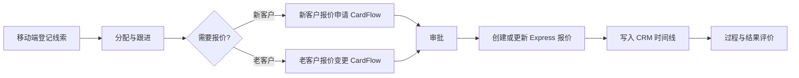

# CRM 移动端线索跟进与报价 CardFlow 一期设计

## 状态

- 状态：方向已确认，待实施计划
- 日期：2026-06-07
- 范围：一期只做“移动端线索/跟进 + 快递报价申请/变更 CardFlow”核心闭环
- 不做：大而全 CRM 后台重建、预付款重构、号段池迁移、合同模块扩展、财务回款流程改造
- v2 修订重点：补齐 CardFlow 发起上下文、审批完成回写、Express 报价版本、客户主数据转化、ID 类型口径和流程可用性保障

## 背景问题

当前业务痛点集中在业务人员每天实际发生的动作上：

- 客户线索不能在移动端快速登记。
- 跟进进展登记不够顺手，容易变成事后补录。
- 新客户快递报价申请没有自然嵌入销售过程。
- 老客户报价变更缺少新旧差异、毛利影响、审批意见的闭环记录。
- 对业务人员的评价容易只看结果，缺少过程质量依据。

现有 CRM 已有客户、联系人、拜访、工单、毛利、奖金、预付款、号段池等能力。一期缺的不是更大的后台，而是一层轻量的“移动端业务过程层”，把线索、跟进、报价申请、审批结果沉淀成 CRM 时间线，并把审批通过的报价请求落到 Express 报价体系。

## 一期产品方向

一期只围绕一条闭环建设：

第一版应该像“业务员移动工作台”，而不是“管理员数据维护后台”。

## 设计原则

1. 移动端优先  
   线索登记和跟进上报必须足够短，业务人员能在客户沟通间隙完成。

2. CRM 记录业务过程  
   CRM 负责线索、跟进、商机、报价请求引用、客户时间线和评价快照。

3. CardFlow 负责审批  
   CardFlow 负责草稿、提交、审批节点、待办、催办、审批意见、退回、审计日志和移动端动态表单。

4. Express 负责报价执行  
   审批通过后创建或更新 Express 报价。CRM 不复制报价矩阵，不再造一套报价系统。

5. 评价过程质量，不鼓励刷记录  
   过程指标要看及时性、完整性、报价响应、转化、毛利和客户结果，避免简单按跟进条数排名。

## 模块边界

| 模块 | 负责内容 | 一期关系 |
| --- | --- | --- |
| CRM | 线索、跟进、商机、客户时间线、报价请求引用、评价快照 | 新增一期过程实体和接口 |
| CardFlow | 移动表单、保存提交、审批节点、待办、审计 | 承接新客户报价和老客户报价变更 |
| Express | 报价方案、报价矩阵、店铺、别名、佣金、报价变更日志 | 接收审批通过后的报价创建/变更指令 |
| Finance | 回款、应收、凭证、预付款核算 | 一期不改造 |
| Contract | 合同生命周期和签署 | 一期只在客户时间线中预留关联入口 |

CRM 里现有的预付款和号段池功能一期不扩展。可以在客户视图里保留入口，但不要继续加深 CRM 对财务和快递库存行为的所有权。

## 用户角色

| 角色 | 核心工作 |
| --- | --- |
| 业务员 | 登记线索、记录跟进、发起新客户报价、发起老客户报价变更、查看自己的进展和审批状态 |
| 业务主管 | 分配线索、查看跟进质量、审批报价请求、关注停滞商机 |
| 报价/运营人员 | 审核报价信息、补充或确认价格、确认生效日期和执行说明 |
| 财务风控人员 | 在后付、账期、信用风险场景下审核付款条件和风险 |
| 系统管理员 | 配置 CardFlow 定义、移动端菜单、权限和角色映射 |

## 移动端体验

### 移动 CRM 首页

建议路由：`/m/crm`

首页优先展示操作入口，而不是数据大屏：

- 登记线索
- 上报跟进
- 新客户报价
- 报价变更
- 我的线索
- 今日跟进
- 我发起的报价
- 我的审批，适用于审批人

### 登记线索

目标：先把潜在客户抓住，不要求一开始就填完整客户档案。

必填字段：

- 客户或店铺名称
- 联系人
- 手机或微信
- 线索来源
- 业务类型
- 区域或寄件地
- 预估日单量
- 当前使用快递，未知可空
- 下次跟进日期

选填字段：

- 平台/店铺信息
- 货品类型
- 当前痛点
- 期望合作方式
- 附件或聊天截图

行为：

- 保存前按名称、电话、店铺别名做疑似重复检测。
- 如果存在疑似重复，展示候选线索/客户，允许绑定到已有记录或填写原因后继续新建。
- 自动生成线索编号。
- 自动写入 CRM 时间线事件。
- 根据配置自动分配负责人，或进入待分配状态。

### 上报跟进

目标：让进展可见，但不把普通跟进变成审批流程。

必填字段：

- 线索或客户
- 跟进方式：电话、微信、拜访、试发货、报价沟通、投诉、其他
- 跟进结果：未联系上、有兴趣、需要报价、安排试发、不考虑、延期、流失
- 内容摘要
- 下一步动作
- 下次跟进日期

行为：

- 跟进记录不审批。
- 跟进结果可以推动线索/商机阶段变化。
- 当下一步是报价时，可以直接跳到对应报价 CardFlow。
- 到期未跟进时进入提醒和主管可见列表。

## CardFlow 流程

### 新客户报价申请

建议流程编码：`CRM_NEW_CUSTOMER_QUOTE`

适用场景：线索或潜在客户需要第一份快递报价。

移动表单分区：

1. 客户摘要
   - 线索/客户引用
   - 客户名称
   - 联系方式
   - 业务类型
   - 业务员和组织

2. 发货画像
   - 寄件区域
   - 目的地范围
   - 预估日单量/月单量
   - 重量结构
   - 货品类型
   - 平台/店铺名称
   - 当前使用快递

3. 商务条款
   - 品牌
   - 付款方式
   - 账单周期
   - 期望生效日期
   - 期望价格说明
   - 竞品价格或客户目标价

4. 风险与佐证
   - 客户资质说明
   - 附件
   - 特殊要求

推荐节点：

1. 业务员提交
2. 业务主管审核
3. 报价/运营审核
4. 财务风控审核，仅在后付、账期或风险条件命中时进入
5. 自动回写 Express 报价草稿或已审批报价
6. 通知业务员并写入 CRM 时间线

审批结果：

- 通过：创建 Express 报价，并记录 CardFlow 卡片和 CRM 报价请求引用。
- 驳回：保留 CRM 报价请求，记录驳回原因和下一步动作。
- 退回：业务员修改同一张卡片，不创建重复报价请求。

### 老客户报价变更

建议流程编码：`CRM_QUOTE_CHANGE`

适用场景：已有 Express 报价的客户需要调整价格、范围、付款方式、店铺、别名或生效日期。

移动表单分区：

1. 客户与当前报价
   - 客户引用
   - 当前报价 ID
   - 当前生效日期
   - 当前状态

2. 变更请求
   - 变更类型：价格矩阵、增加店铺、移除店铺、付款条款、账单周期、品牌/网点、加收、生效日期
   - 变更原因
   - 期望生效日期

3. 影响摘要
   - 旧条款摘要
   - 新条款摘要
   - 预计单量变化
   - 预计毛利影响
   - 客户风险说明

4. 佐证材料
   - 客户沟通截图或文件
   - 主管备注

推荐节点：

1. 业务员提交
2. 业务主管审核
3. 报价/运营审核并确认矩阵
4. 财务风控审核，仅在付款或毛利风险命中时进入
5. 自动创建新的 Express 报价版本
6. 按生效规则停用或替代旧报价
7. 通知业务员并写入 CRM 时间线

审批结果：

- 通过：创建新的报价版本。价格矩阵或商务条款变化时，不直接覆盖旧报价。
- 驳回：旧报价保持不变，记录驳回原因。
- 退回：修改同一张 CardFlow 卡片。

## CardFlow 发起上下文契约

一期不能让 CRM 移动页直接裸跳 `/m/cardflow/fill/:flowId`。CRM 必须先建立业务上下文，再进入 CardFlow 填报页。

### 发起顺序

新客户报价：

1. 业务员从 `/m/crm/quotation/new` 选择线索或客户。
2. CRM 执行线索/客户校验、重复检查、必填上下文检查。
3. CRM 创建 `CRM报价请求`，状态为“草稿”，请求类型为“新客户报价”。
4. CRM 调用 CardFlow 创建卡片，传入 `sourceModule=CRM`、`sourceType=quotationRequest`、`sourceId=CRM报价请求.FID` 和初始化表单数据。
5. CardFlow 返回 `cardId` 后，CRM 回填 `FCardFlow卡片ID`。
6. 移动端进入 CardFlow 填报页，保存和提交仍由 CardFlow 负责。

老客户报价变更：

1. 业务员从 `/m/crm/quotation/change` 选择客户和当前 Express 报价。
2. CRM 校验当前报价是否允许变更，检查同客户/店铺/品牌是否已有审批中的变更请求。
3. CRM 创建 `CRM报价请求`，状态为“草稿”，请求类型为“老客户变更”，写入 `F原Express报价ID`。
4. CRM 调用 CardFlow 创建卡片，初始化数据中包含当前报价摘要、新旧差异空模板、客户和报价引用。
5. CardFlow 返回 `cardId` 后，CRM 回填 `FCardFlow卡片ID`。
6. 移动端进入 CardFlow 填报页。

### CardFlow 创建请求扩展

现有 CardFlow 创建卡片请求需要在一期扩展或增加包装 API，避免移动端硬编码组织或丢失业务上下文。

建议字段：

- `flowDefinitionId: long`
- `orgId: long`，来自登录态当前组织，不允许移动端固定写 `1`
- `accountSetId: long?`，需要跨账套时传入
- `dataJson: string?`
- `sourceModule: string`，一期固定为 `CRM`
- `sourceType: string`，一期为 `quotationRequest`
- `sourceId: string`，一期为 `CRM报价请求.FID` 的字符串形式
- `sourceNo: string?`，一期为 `CRM报价请求.F请求编号`
- `returnUrl: string?`
- `initialData: object?`，服务端合并到 `dataJson`，用于预填客户、线索、报价摘要

幂等约束：

- 同一个 `sourceModule + sourceType + sourceId + flowDefinitionId` 只能创建一张未作废 CardFlow 卡片。
- 重复发起时返回已有卡片，而不是创建新卡片。

## CardFlow 审批完成回写契约

报价回写不能依赖人工调用 `POST /api/crm/quotation-requests/{id}/writeback`。审批最终通过后必须由系统自动触发，并且失败可恢复。

### 触发点

- 只在 CardFlow 卡片最终完成且最终动作为通过时触发。
- 普通节点 approve、会签中的单人 approve、退回、撤回、重提都不能触发 Express 回写。
- 触发点可以落在 CardFlow 自动节点、流程完成事件或 outbox 事件中；实施计划中优先选择对现有 `FlowEngineService` 侵入最小且可测试的方式。

### 回写处理器

建议新增 CRM 侧处理器：

- `CrmQuotationCardWritebackHandler`
- 输入：`cardId`、`flowCode`、`finalAction`、`sourceModule`、`sourceType`、`sourceId`
- 输出：写回结果、目标 Express 报价 ID、错误信息、时间线事件

处理流程：

1. 根据 `sourceId` 获取 `CRM报价请求`。
2. 校验请求状态允许回写。
3. 校验 CardFlow 卡片最终状态为完成且最终动作为通过。
4. 根据请求类型执行新客户报价或老客户变更逻辑。
5. 成功后写入 `FExpress报价ID`、`F状态=已回写`、`F审批通过时间`。
6. 写入 `CRM客户时间线事件`。
7. 失败时写入 `F状态=回写失败` 和 `F回写错误`，生成运营待办。

### 幂等键

回写幂等键：

`CRM_QUOTATION_WRITEBACK:{flowCode}:{cardId}:{sourceId}:{requestType}`

规则：

- 同一幂等键成功回写后再次执行，直接返回已有结果。
- 同一幂等键失败后允许重试，但每次重试必须记录尝试时间和错误。
- 同一 `CRM报价请求` 不允许成功写回多个 Express 报价，除非先人工作废原写回结果。

### 回写状态

`CRM报价请求.F状态` 增加可执行状态口径：

- `草稿`：CRM 已创建业务请求，CardFlow 尚未提交
- `已提交`：CardFlow 卡片已提交
- `审批中`：CardFlow 卡片处于 active
- `已退回`：CardFlow 卡片 returned，可继续修改同一请求
- `已驳回`：CardFlow 最终不通过，不能自动回写
- `待回写`：CardFlow 最终通过，等待系统回写
- `回写中`：系统正在执行 Express 写回
- `已回写`：Express 报价创建或变更成功
- `回写失败`：审批结果保留，等待人工处理或重试

## 客户主数据转化规则

新客户报价不能在没有客户主数据的情况下直接写入 Express 报价。

### 新客户报价通过后的客户处理

审批通过后，回写处理器先处理客户主数据：

1. 如果 `CRM报价请求.F客户ID` 已存在，直接使用该客户。
2. 如果只有 `F线索ID`，先按线索名称、电话、店铺别名再次查重。
3. 如果命中唯一已有客户，将线索绑定到该客户，并写入转化时间线。
4. 如果未命中客户，创建 `CRM客户`，主键为 `CrmCustomer.FCode`。
5. 如果命中多个疑似客户，停止自动回写，状态置为“回写失败”，错误原因写“客户主数据需人工确认”。

### Express 客户引用

新客户报价写入 Express 时必须设置：

- `FClientType = "KH"`
- `FClientId = CrmCustomer.FCode`
- `FOrgId = CRM报价请求.F组织ID`
- `FPlanName` 使用客户简称、品牌、生效日期生成，允许报价/运营在审批节点补充

如果后续需要绑定 EXP 业务对象，实施计划中必须明确 `CRM客户.FServiceObjectId` 的生成或同步规则；一期不能让 Express 报价出现空客户引用。

## Express 报价版本策略

老客户报价变更不能简单复制报价后修改。系统必须保留旧版本，并让新旧报价的生效关系可追溯。

### 新版本创建规则

审批通过后创建新的 Express 报价版本：

- 新报价 `F上一版本ID = 原报价.FID`
- 新报价 `F版本 = 原报价.F版本 + 1`
- 复制原报价的客户、品牌、网点、付款方式、账单周期、抛比、保价费率、含税、税率、重量进位方式
- 复制原报价的矩阵、店铺、别名、佣金配置
- 按 CardFlow 审批数据覆盖变更字段
- 写入 `FOaProcessId` 或 CardFlow 卡片引用字段，实施计划需确认字段名；现有 `FOaProcessId` 名称不准确时可新增 `FCardFlow卡片ID`
- 写入审批人和审批时间

### 旧版本处理规则

- 如果新版本立即生效，旧版本状态更新为“已被新版本替代”。
- 如果新版本未来生效，旧版本保持生效到新版本生效前；需要定时任务或生效检查在到期时替代。
- 如果审批驳回或回写失败，旧版本保持不变。

### 冲突规则

同一组织、客户、品牌、网点、店铺范围和生效区间内，不允许存在多个有效报价。

出现以下情况必须阻止自动回写：

- 原报价已作废或已被其他版本替代。
- 同一原报价已有审批中或待回写的变更请求。
- 新版本生效日期早于原报价生效日期，且没有人工确认。
- 变更涉及店铺，但店铺已关联其它有效报价且冲突未解决。

## CardFlow 流程可用性保障

两个报价流程必须按“能发起、能填写、能保存、能提交、能审批、能回写”验收，不能只验证流程名称存在。

### 流程定义落库要求

每个流程必须具备：

- `flowCode`：`CRM_NEW_CUSTOMER_QUOTE` 或 `CRM_QUOTE_CHANGE`
- `flowName`
- `status=published`
- `triggerConfig` 包含人工发起标记，不能被文件上传流程过滤逻辑误隐藏
- 流程分组：建议为 `CRM业务流程`
- 当前发布版本
- card schema
- 必要时的 detail schema
- 至少一个人工审批节点
- 最终自动回写节点或流程完成事件绑定
- 处理人策略和兜底处理人

### 移动端可发起要求

- `GetAvailableFlowsAsync` 必须返回这两个人工发起流程。
- 移动端不能显示 fileUpload-only 流程。
- 移动端发起时必须使用当前组织上下文。
- 如果流程没有发布版本、没有节点、没有 schema 或处理人解析失败，移动端应显示明确错误，不能让用户提交后才发现流程不可走。

### 表单保存要求

- Card schema 字段进入 `dataJson`。
- Detail schema 字段必须通过 `UpdateCardRequest.details` 持久化，不能只塞进 `dataJson.__details`。
- 退回后修改同一张卡片和同一条 `CRM报价请求`。
- 重提后保持原业务引用不变。

### Seed 和迁移要求

实施计划中必须设置专门的 CRM CardFlow seed/migration 点位，用于：

- 创建或修复流程定义。
- 创建或修复发布版本。
- 创建或修复节点。
- 创建或修复流程分组。
- 绑定自动回写处理器或流程完成事件。
- 补齐处理人策略。
- 避免重复 seed 产生多套同编码流程。

## CRM 数据模型新增

一期新增实体保持克制，只围绕过程闭环。

### CRM线索

用于表示还未正式成为客户的潜在线索。

关键字段：

- FID
- F组织ID
- F线索编号
- F线索名称
- F联系人
- F联系电话
- F微信
- F来源类型
- F业务类型
- F区域
- F预估日单量
- F当前快递
- F状态：新建、待分配、已联系、已确认需求、报价中、试发、已转客户、已流失、沉睡
- F负责员工ID
- F分配人ID
- F分配时间
- F下次跟进日期
- F转化客户ID，string，可空，对应 `CrmCustomer.FCode`
- F流失原因
- F创建时间
- F更新时间

### CRM跟进记录

用于表示一次明确的业务推进动作。

关键字段：

- FID
- F组织ID
- F线索ID，long，可空
- F客户ID，string，可空，对应 `CrmCustomer.FCode`
- F商机ID，long，可空
- F跟进方式
- F跟进结果
- F内容
- F下一步动作
- F下次跟进日期
- F关联卡片ID，可空
- F附件JSON
- F创建人ID
- F创建时间

约束：`F线索ID` 和 `F客户ID` 至少一个有值。

### CRM商机

用于表示已经明确需求、值得持续推进的销售机会。

关键字段：

- FID
- F组织ID
- F线索ID，long，可空
- F客户ID，string，可空，对应 `CrmCustomer.FCode`
- F阶段：需求了解、已确认需求、报价中、谈判中、试发中、赢单、输单
- F预估日单量
- F预估收入
- F预计成交日期
- F竞品
- F成交概率
- F负责员工ID
- F最后跟进时间
- F下次跟进日期

### CRM报价请求

用于连接 CRM、CardFlow 和 Express 报价。

关键字段：

- FID
- F组织ID
- F请求编号
- F请求类型：新客户报价、老客户变更
- F线索ID，long，可空
- F客户ID，string，可空，对应 `CrmCustomer.FCode`
- F商机ID，long，可空
- FCardFlow卡片ID
- FExpress报价ID，long，可空
- F原Express报价ID，long，可空
- F状态：草稿、已提交、审批中、已退回、已驳回、待回写、回写中、已回写、回写失败
- F回写幂等键
- F回写尝试次数
- F最后回写时间
- F期望生效日期
- F审批通过时间
- F驳回原因
- F回写错误
- F创建人ID
- F创建时间
- F更新时间

### CRM客户时间线事件

用于客户 360 视图混排展示线索、跟进、报价、审批、工单、合同等事件。

关键字段：

- FID
- F组织ID
- F线索ID，long，可空
- F客户ID，string，可空，对应 `CrmCustomer.FCode`
- F事件类型
- F事件标题
- F事件摘要
- F来源模块
- F来源ID
- F发生时间
- F操作员工ID

### CRM业务评价快照

用于按月固化业务人员过程与结果指标。

关键字段：

- FID
- F组织ID
- F期间
- F员工ID
- F线索数
- F有效跟进数
- F逾期跟进数
- F报价申请数
- F报价通过数
- F报价平均周期小时
- F转客户数
- F活跃发货客户数
- F收入
- F毛利
- F毛利率
- F过程分
- F结果分
- F综合分
- F快照时间

## 接口范围

CRM 移动端接口：

- `GET /api/crm/mobile/home`
- `POST /api/crm/leads`
- `GET /api/crm/leads/my`
- `GET /api/crm/leads/{id}`
- `POST /api/crm/leads/duplicate-check`
- `POST /api/crm/follow-ups`
- `GET /api/crm/follow-ups/today`
- `GET /api/crm/customers/{id}/timeline`
- `GET /api/crm/quotation-requests/my`
- `GET /api/crm/quotation-requests/{id}`

CRM 回写接口或内部服务：

- `POST /api/crm/quotation-requests/from-card`
- `POST /api/crm/quotation-requests/{id}/writeback`
- `POST /api/crm/quotation-requests/{id}/retry-writeback`
- `POST /api/crm/timeline-events`

Express 集成服务：

- `CreateQuotationFromApprovedRequestAsync`
- `CreateQuotationVersionFromApprovedChangeAsync`
- `GetQuotationChangeImpactAsync`

CardFlow 集成服务：

- `BuildNewCustomerQuoteCardDataAsync`
- `BuildQuoteChangeCardDataAsync`
- `HandleQuotationCardApprovedAsync`
- `HandleQuotationCardRejectedAsync`
- `HandleQuotationCardReturnedAsync`
- `HandleQuotationCardCompletedAsync`
- `CrmQuotationCardWritebackHandler`

## UI 与导航

### 移动端路由

- `/m/crm`：移动 CRM 首页
- `/m/crm/leads/new`：登记线索
- `/m/crm/leads/:id`：线索详情
- `/m/crm/follow-ups/new`：上报跟进
- `/m/crm/quotation/new`：带 CRM 上下文发起新客户报价 CardFlow
- `/m/crm/quotation/change`：带当前报价上下文发起报价变更 CardFlow

CardFlow 移动端页面继续负责动态表单渲染。CRM 移动页负责准备上下文，在需要审批时跳转到 CardFlow 填报页。

移动端发起限制：

- CRM 移动页必须先创建或获取 `CRM报价请求`。
- CRM 移动页必须通过包装 API 或扩展后的 CardFlow 创建接口传入 `sourceModule/sourceType/sourceId/initialData`。
- CardFlow 填报页必须能读取预填数据并保存同一张卡片。
- `orgId` 必须来自当前登录组织上下文，不能硬编码。
- 提交成功后返回 `returnUrl` 或报价请求详情页。

### PC 端范围

PC 一期保持轻量：

- 在现有 CRM 区域增加线索列表，或作为客户管理的 Tab。
- 在客户详情增加时间线 Tab。
- 增加报价请求列表，供主管、报价/运营人员查看。
- 增加团队逾期跟进视图。

一期不重建完整 CRM 看板。

## 权限与数据范围

建议权限：

- `crm:lead:view`
- `crm:lead:create`
- `crm:lead:assign`
- `crm:followup:create`
- `crm:followup:view-team`
- `crm:quote-request:create`
- `crm:quote-request:view`
- `crm:evaluation:view`

数据范围：

- 业务员只能看自己的线索、客户和报价请求。
- 主管可以看团队线索、团队客户和团队报价请求。
- 报价/运营人员可以看 CardFlow 分配给自己的报价卡片和必要客户上下文。
- 财务人员只在报价流程需要风控节点时看到相关付款与风险字段。

## 状态口径

实施前必须治理报价状态口径。

推荐 Express 报价状态：

- `0 草稿`
- `1 待审批`
- `2 已通过`
- `3 已驳回`
- `4 已作废`
- `5 已生效`
- `6 已被新版本替代`
- `7 已过期`

如果直接改枚举影响过大，一期必须先增加显式映射层，避免 CRM/CardFlow 依赖前后端不一致的状态注释或页面标签。

CRM 报价请求状态与 Express 报价状态分离。CardFlow 可以已通过，但 Express 回写仍可能待处理或失败。

实施计划必须先治理现有前后端报价状态不一致问题：后端实体注释、前端列表标签、服务层写入值、查询筛选值必须通过同一个枚举或映射函数解释。

## 异常处理

- 线索重复：展示候选记录，允许绑定已有线索/客户，或填写原因继续新建。
- 报价上下文缺失：阻止提交 CardFlow，并给出字段级错误。
- CardFlow 通过但 Express 回写失败：`CRM报价请求` 标记为“回写失败”，生成运营待办，保留审批结果。
- 重复回写：按幂等键返回已有写回结果，不创建第二个报价。
- 新客户主数据冲突：停止自动回写，提示运营确认客户绑定。
- 老客户报价变更存在版本冲突：阻止回写，展示当前生效报价冲突，要求运营处理。
- CardFlow 退回：继续修改同一张卡片和同一条报价请求，不能产生重复请求。

## 评价模型

一期评价要可解释、克制，不做复杂绩效系统。

过程分候选指标：

- 线索资料完整度
- 首次跟进及时率
- 跟进逾期率
- 有效跟进数，设置上限，避免刷记录
- 报价申请资料完整度
- 报价流程参与和响应
- 流失原因质量

结果分候选指标：

- 转化客户数
- 活跃发货客户数
- 新增月票量
- 收入
- 毛利
- 毛利率
- 客户留存或复发货

展示原则：

- UI 上分开展示过程分和结果分。
- 综合分权重等管理层确认后再启用。
- 每月生成快照，避免指标定义变化后历史分数漂移。

## 报表范围

一期只做支撑闭环的轻报表：

- 我的线索状态分布
- 今日跟进
- 逾期跟进
- 报价请求状态与平均周期
- 团队从线索到报价到活跃客户的转化
- 月度业务员过程/结果快照

不在一期做大型 CRM BI 仪表盘。

## 验收标准

一期成功的判断标准：

- 业务员能在移动端 3 分钟内登记一条线索。
- 业务员能上报跟进并看到下一步提醒。
- 业务员能从移动端发起新客户报价申请。
- 业务员能从移动端基于已有报价发起老客户报价变更。
- 主管、报价/运营、财务风控能通过 CardFlow 审批报价卡片。
- 新客户报价审批通过后，系统先创建或绑定 `CRM客户`，再创建带客户引用的 Express 报价或报价草稿。
- 老客户报价变更审批通过后，系统创建新报价版本，设置上一版本、复制店铺/别名/佣金/商务条款，并按生效规则处理旧版本。
- CardFlow 最终通过后能自动触发回写；普通节点 approve 不触发回写。
- CRM 线索/客户时间线能展示线索、跟进、报价请求、审批结果和回写结果。
- 回写失败可见、可重试，不丢失已通过的 CardFlow 审批记录。
- 重复触发回写不会产生重复 Express 报价。
- 两个报价流程在移动端可发起，且能保存、提交、退回、重提。
- 能按业务员和期间生成基础过程/结果评价快照。

## 测试策略

后端测试：

- 线索疑似重复检测。
- 跟进记录创建和今日/逾期跟进查询。
- 从 CardFlow 卡片创建 CRM 报价请求。
- CardFlow 审批通过后回写 Express 报价。
- CardFlow 非最终节点 approve 不触发 Express 回写。
- 回写幂等键重复执行不创建重复报价。
- 新客户报价通过后创建或绑定 `CRM客户` 并写入 `FClientType/FClientId`。
- 报价变更创建新版本，不意外覆盖旧报价。
- 报价变更复制店铺、别名、佣金、商务条款，并设置上一版本。
- 回写失败保持可恢复状态。
- 业务员与主管的数据范围过滤。

前端测试：

- 移动端线索登记必填项和重复提示。
- 移动端跟进表单保存。
- 带 CRM 上下文发起新客户报价 CardFlow。
- 带当前报价上下文发起老客户报价变更 CardFlow。
- 移动端发起 CardFlow 时不硬编码组织，能带入当前组织和预填数据。
- 客户时间线混排展示。

集成检查：

- 已发布的 CardFlow 定义必须有节点，并出现在移动端可发起流程中。
- 使用明细表单时，CardFlow 保存/提交必须持久化明细行。
- Express 报价状态映射在前后端一致。
- 一张审批通过的 CardFlow 卡片只产生一条 CRM 时间线回写事件和一条报价回写结果。
- 两个 CRM 报价流程的 seed/migration 可重复执行，且不会产生重复流程定义。

## 实施备注

- 优先扩展 `STOTOP.Module.CRM`，新增过程实体和服务。
- 报价审批表单复用现有 CardFlow 移动端动态表单，不另造审批页面。
- 报价矩阵维护仍留在 Express，CRM 只传上下文和保存引用。
- CardFlow action log 和 CRM 时间线配合使用：CardFlow 是审批审计，CRM 时间线是客户业务历史。
- PC 端保持轻量，一期价值在移动端采集和 CardFlow 报价闭环。
